# 内存模型

## 代码区

## 全局区

## 栈区

栈区的数据由编译器自动管理开辟和释放。**存放函数的参数值和局部变量等。**

## 堆区

由程序员分配释放，若程序员不程放程序结束时由操作系统回收
在C++中主要利用new在堆区开辟内存

```cpp
#include<iostream>
using namespace std;
int * func(){
    // 利用new关键字 可以将数据开辟到堆区
    // 指针本质上也是局部变量，放在栈区，指针保存的数据放在栈区
    int *p = new int (10);
    return p;
}
int main(){
    int *p = func();
    cout << *p << endl;
}
```

# 输入输出

`<<`输出运算符

接受两个运算对象，左侧运算对象必须是一个`ostream`对象，右侧是要打印的值。此运算法符将给定的值写到给定的`ostream`对象中，**输出运算符的结果就是其左侧运算对象（`ostream`对象）**。

```cpp
std::cout << "Enter two number:" << std::endl;
```

上述代码等于`(std::cout << "Enter two number:") << std::endl `

`endl`操纵符

写入`endl`的效果是结束当前行，并将与设备关联的缓冲区（buffer）中的内容刷到设备中。缓冲刷新操作可以保证到目前为止程序所产生的所有输出都真正写入输出流中，而不是仅停留在内存中等待写入流。

`>>`输入运算符

接受一个`istream`对象作为其左侧运算对象。

# 基本类型

## 复合类型

### 引用

引用即别名，引用并非对象，他只是为一个已经存在的对象所起的另外一个名字。

**引用必须初始化，初始化后不可改变**

```cpp
int ival = 1024;
int &refVal = ival;
int &refVal12;

refVal = 2;
int ii = refVal;
int &refVal13=refVal;    //refVal13绑定到了那个refVal绑定的对象上，这里就是绑定到ival上。
```

```c++
//引用的定义
int i = 1024, i2 = 2048;
int &r = i, r2 =i2;        //r是一个引用，与i绑定在一起，r2是int
int i3 = 1024, &ri = i3;//ri是一个引用，与i3绑定在一起
int &r3 = i3, &r4 = i2;    //r3和r4都是引用

//错误的定义
int &refVal4 = 10;    //错误：引用类型的初始值必须是一个对象
doubel dval = 3.14;
int &refVal5 = dval;//错误：此处引用类型的初始值必须为是int型对象
```

### 指针

#### 获取对象的地址

指针存放某个对象的地址，要想获取该地址，需要使用取地址符(操作符`&`)

```c++
int ival = 42;
int *p = &ival;    //p存放变量ival的地址，或者说p是指向变量的指针    
```

```c++
double dval;
double *pd = &dval;    //    正确：初始值是double型对象的地址
double *pd2 =pd;    //    正确：初始值是指向double对象的指针

int *pi = pd;        //    错误：指针pi的类型和pd的类型不匹配
```

#### 指针占用内存

4个字节

#### 指针值

指针的值(地址)应属于下列4种状态：

1. 指向一个对象；
2. 指向紧邻对象所占空间的下一个位置；
3. 空指针，指针没有指向任何对象；
4. 无效指针，上述情况之外的其他值；

#### 利用指针访问对象

如果指针指向了一个对象，则允许使用解引用符(操作符*)来访问该对象:

```c++
int ival = 42;
int *p = &ival;    //    p存放者ival的地址，或者说p是指向变量ival的指针
cout << *p;        //    由符号*得到指针p所指向的对象，输出42
```

对指针解引用会得出所指的对象，因此如果给解引用的结果赋值，实际上也就是给指针所指的对象赋值；

```c++
*p = 0;        //    由符号*得到指针p所指向的对象，即可经由p为变量ival赋值
cout << *p;    //    由符号*得到指针p所指的对象，输出42
```

**`&`和`*`的多重含义**

像`&`和`*`既能做表达式里的运算符，也能作为声明的一部分出现：

```c++
int i = 42;
int &r = i;        //    &紧随类型名出现，是声明的一部分，r是一个引用
int *p;            //    *紧随类型名出现，是神明的一部分，p是一个指针
p = &i;            //    &出现在表达式中，取地址符
*p = i;            //    *出现在表达式中，解引用符
int &r2 = *p;    //    &是声明的一部分，*是一个解引用符
```

#### 空指针

生成空指针的方法：

```c++
int *p1 = nullptr;    //    等效于int *p1 = 0;
int *p2    = 0;        //    直接将p2初始化为字面常量0;
```

把`int`变量直接复制给指针是错误的操作，即使`int`变量的值恰好等于0也不行。

```c++
int zero = 0;
pi = zero;        //    错误：不能把int变量直接赋值给指针
```

#### 野指针

野指针就是**指针指向的位置是不可知的**。**没有被初始化的指针**。

```cpp
int *p;	//未初始化，野指针
```


#### 悬空指针

指针指向的内存已经被释放了的一种指针。

```cpp
int *p = nullptr;
int *p2= new int;
p = p2;
delete p2;
```


#### 赋值和指针

```c++
int i = 42;
int *pi = 0;        //    pi被初始化，但没有指向任何对象
int *pi2 = &i;        //    pi2被初始化，存有i的地址
int *pi3;            //    如果pi3定义于块内，则pi3的值是无法确定的

pi3 = pi2;            //    pi3和pi2指向同一个对象i
pi2 = 0;            //    现在pi2不指向任何对象

pi = ival;            //    pi的值被改变，现在pi指向了ival
*pi = 0;            //    ival的值被改变，指针pi并没有改变
```

#### void* 指针

`void*`是一种特殊的指针类型，可用于存放任意对象的地址。

#### 指向指针的指针

```c++
int ival = 1024;
int *pi = &ival;    //    pi指向一个int的数
int **ppi = π    //    ppi指向一个int的指针
```

#### 指向指针的引用

```c++
int i = 42;
int *p;            //    p是一个int型指针
int *&r = p;    //    r是一个对指针p的引用

r = &i;            //    r引用了一个指针，因此给r赋值&i
*r = 0;
```

### `const`限定符

定义一个变量，他的值不能被改变。默认状态下，const对象仅在文件内有效。

在多个文件间共享，在声明和定义之前添加`extern`关键字。

#### const的引用(常量引用)

用来修饰形参，防止误操作，防止形参改变实参

```cpp
const int & ref = 10;
ref = 20;    //错误：ref为只读状态，不可修改

void showValue(const int & a){
    a = 1000; //错误，a不可修改
    cout<< a << endl;
}
```

```cpp
const int ci = 1024;
const int &r1 = ci;        //    正确：引用及其对应的对象都是常量
r1 = 42;                //    错误：r1是对常量的引用，常量
int &r2 = ci;            //    错误：试图让一个非常量引用指向一个常量对象
```

**允许一个常量引用绑定非常量的对象、字面值，甚至是个一般表达式：**

```cpp
int i = 42;                
const int &r1 = i;        //允许将const int&绑定到一个普通int对象上
const int &r2 = 42;        //正确：r2是一个常量引用
const int &r3 = r1 * 2;    //正确：r3是一个常量引用
int &r4 = r1 * 2;        //错误：r4是一个普通的非常量引用
```

**常量引用如果引用一个并非const的对象，不能通过常量引用改变绑定对象的值。**

```cpp
int i = 42;
int &r1 = i;        //    引用ri绑定对象i
const int &r2 = i;    //    r2也绑定对象i,但是不允许通过r2修改i的值
r1 = 0;                //    r1也并非常量，i的值修改为0
r2 = 0;                //    错误：r2是一个常量引用
```

#### 指针和const

与引用一样，也可以令指针指向常量或非常量。类似于常量引用，**指向常量的指针**不能用于改变其所指对象的值。**要想存放常量对象的地址，只能使用指向常量的指针**：

```c++
const double pi = 3.14;        //    pi是个常量，它的值不能改变
double *ptr = π            //    错误：ptr是一个普通指针
const double *cptr = π    //    正确：cptr可以指向一个双精度常量
*cptr = 42;                    //    错误：不能给*cptr赋值
```

#### 常量指针

**常量指针**必须初始化，而且一旦初始化完成，则它的值（也就是存放指针地址的内容）就不能再改变。

- 指针指向的值不能改

- 指针的指向可以改

```cpp
int a = 10;
int b = 10;
const int * p1 = &a;
p1 = &b;
*p1 = 20;  //操作错误，指针所指的值不能改变
```

#### 指针常量

- 指针指向的值能改

- 指针的指向不可以改

```cpp
int * const p2 = &a;
*p2 = 100;
p2 = &b;    //错误
```

#### 顶层const

指针本身是一个对象，它又可以指向另外一个对象。因此，**指针本身是不是常量以及指针所指的是不是一个常量就是两个相互独立的问题**。

**顶层`const`**(top-level const)表示指针本身是个常量，**底层`const`**(low- level const)表示指针所指的对象是一个常量。

更一般的，顶层`const`可以表示任意的对象是常量，这一点对任何数据类型都适用，如算术类型、类、指针等。底层`const`则与指针和引用等复合类型的基本类型部分有关。
比较特殊的是，指针类型既可以是顶层`const`也可以是底层`const`,这一点和其他类型相比区别明显：

```c++
int i = 0;
int *const p1 = &i;        //    不能改变p1的值，这是一个顶层const
const int ci = 42;        //    不能改变ci的值，这是一个顶层const
const int *p2 = &ci;    //    允许改变p2的值，这是一个底层const
const int *const p3 = p2;    //    靠右的const是顶层const，靠左的是底层
const int &r = ci;        //    用于声明引用的const都是底层const
```

### 处理类型

#### 类型别名`typedef`

#### `auto`类型说明符

自动分析表达式所属的类型。

```c++
auto item = val1 + val2;    //item初始化为val1和val2相加的结果，item类型与他俩一致。
```

#### `decltype`类型指示符

从表达式的类型自动推出要定义的变量的类型，但是不想用该表达式的值初始化变量。

```c++
decltype(f()) sum = x;    //    sum的类型就是函数f的返回类型
```

编译器并不实际调用函数`f`,而是使用当调用发生时`f`的返回值作为sum的类型。换句话说，编译器为`sum`指定的类型是什么呢？就是假如`f`被调用的话将会返回的那个类型。

# 字符串、向量和数组

## 命名空间的`using`声明

```c++
using namespce::name;
```

## 标准库类型String

```c++
#include <string>
using std::string;
```

### 定义和初始化`string`对象

```c++
string s1;
string s2 = s1;
string s3 = "hiya";
string s4(10,'c');        //s4的内容是cccccccccc
```

### string对象的操作

```c++
os<<s
is>>s
getline(is,s) 
s.empty()
s.size()
s[n]
s1+s2
s1=s2
s1==s2  
```

### 读写string对象

```c++
int main()
{
    string s;            //    空字符串
    cin >> s;            //    将string对象读入s，遇到空白停止
    cout << s << endl;    //    输出s
    return 0;
}
```

## 标准库类型vector

`vector`表示对象的集合，其中所有对象的类型都相同。也被称作容器。

功能：

- vector数据结构和数组非常相似，也称为单端数组

vector与普通数组区别：

- 不同之处在于数组是静态空间，而vectori可以动态扩展

动态扩展：

- **并不是在原空间之后续接新空间，而是找更大的内存空间，然后将原数据拷贝新空间，释放原空间**

### 定义和初始化`vetor`对象

```c++
vector<T> v1;        //v1是一个空vector，他潜在的元素是T类型
vector<T> v2(v1);    //v2中包含有v1所有元素的副本
vector<T> V2 = V1;    //等价于v2(v1),v2中包含有v1所有元素的副本
vector<T> v3(n,val);//v3包含了n个重复的元素val
```

### vector容量和大小

```cpp
empty()    //判断容器是否为空
capacity()    //容器的容量
size()    //返回容器中的个数    capacity()大于等于size()
```

### ⭐vector的扩容机制

为了支持快速随机访问，vector是连续存储的。

当添加一个新元素时，如果没有空间容纳新元素，为了保持连续存储，容器必须分配新的内存空间保存已有元素和新元素。

为了避免每次添加元素都需要转移一次空间，当需要扩容时，vector会申请一个比需求更大的内存空间，即预留一部分空间作为备用。


当向vector中插入元素时，如果元素有效个数size与空间容量capacity相等时，vector内部会触发扩容机制：

1. 开辟新空间。
2. 拷贝元素。
3. 释放旧空间。

**为什么选择1.5倍或者2倍方式扩容，而不是3倍、4倍**
扩容原理为：申请新空间，拷贝元素，释放旧空间，理想的分配方案是**在第N次扩容时能复用之前N-1次释放的空间**。

> 如果按照2倍方式扩容，第i次扩容空间大小如下：可以看到，每次扩容时，前面释放的空间都不能使用。比如：第4次扩容时，前2次空间已经释放，第3次空间还没有释放(开辟新空间、拷贝元素、释放旧空间)，即前面释放的空间只有1 + 2 = 3，假设第3次空间已经释放才只有1+2+4=7，而第四次需要8个空间，因此无法使用之前已释放的空间，但是按照小于2倍方式扩容，多次扩容之后就可以复用之前释放的空间了。如果倍数超过2倍(包含2倍)方式扩容会存在：空间浪费可能会比较高，比如：扩容后申请了64个空间，但只存了33个元素，有接近一半的空间没有使用。

**采用成倍方式扩容，可以保证常数的时间复杂度。但是2倍扩容的问题在于，每次扩展的新尺寸必然刚好大于之前分配的总和，也就是说，之前分配的内存空间不可能被使用。这样对内存不友好，最好把增长因子设为(1, 2)，也就是1-2之间的某个数值。**

[(79条消息) c++：vector的push_back时间复杂度分析_live4m的博客-CSDN博客](https://blog.csdn.net/weixin_44178736/article/details/113831401)

### vector的插入和删除

```cpp
v.push_back(t);                       //向v的尾端添加一个值为t的元素
v.pop_back();                          //删除最后一个元素
v.insert(const_iterator pos, ele);    //迭代器指向位置pos插入元素ele
v.insert(const_iterator pos, int count, ele); //位置pos插入count个元素ele
v.erase(const_iterator pos, int count, ele);  //删除迭代器指向位置pos
v.erase(const_iterator start, const_iterator end);  //删除迭代器从start到end之间的元素
v.clear();                            //删除容器中所有元素
```

```cpp
void printVector(vector<int>&v){
    for(vector<int>::iterator it = v.begin(); it != v.end(); it++){
        cout<< *it <<"";
    }
    cout << endl;
}
void test01{
    vector<int> v1;
    //尾插
    v1.push_back(10);
    v1.push_back(20);
    v1.push_back(30); 
   //遍历
    printVector(v1);

    //尾删
    v1.pop_bak();
    printVector(v1);

    //插入    第一个参数是迭代器
    v1.insert(v1.begin(),100);
    printVector(v1);
}
```

### vector的元素访问

```cpp
at(int idx);    // 返回索引idx所指的数据
operator[];     // 返回索引idx所指的数据
front();        // 返回容器第一个数据元素
back();         // 返回容器中最后一个数据元素
```

### vector互换容器

```cpp
v.swap(vec);    //将vec元素与v互换
```

### vector预留空间

- 减少vector在动态扩展容量时的扩展次数

函数原型

- `reserve(int len);`  //容器预留len个元素长度，预留位置不初始化，元素不可访问。 

## 迭代器

我们知道，尽管不同容器的内部结构各异，但它们本质上都是用来存储大量数据的，换句话说，都是一串能存储多个数据的存储单元。因此，诸如数据的排序、查找、求和等需要对数据进行遍历的操作方法应该是类似的。

既然类似，完全可以利用泛型技术，将它们设计成适用所有容器的通用算法，从而将容器和算法分离开。但实现此目的需要有一个类似中介的装置，它除了要具有对容器进行遍历读写数据的能力之外，还要能对外隐藏容器的内部差异，从而以统一的界面向算法传送数据。

这是泛型思维发展的必然结果，于是迭代器就产生了。简单来讲，迭代器和C++的指针非常类似，它可以是需要的任意类型，通过迭代器可以指向容器中的某个元素，如果需要，还可以对该元素进行读/写操作。

### 迭代器类别

常用的迭代器按功能强弱分为**输入迭代器**、**输出迭代器**、**前向迭代器**、**双向迭代器**、**随机访问迭代器** 5 种。本节主要介绍后面的这 3 种迭代器。

1. 前向迭代器（forward iterator）
   假设 p 是一个前向迭代器，则 p 支持 ++p，p++，*p 操作，还可以被复制或赋值，可以用 == 和 != 运算符进行比较。此外，两个正向迭代器可以互相赋值。

2. 双向迭代器（bidirectional iterator）
   双向迭代器具有正向迭代器的全部功能，除此之外，假设 p 是一个双向迭代器，则还可以进行 --p 或者 p-- 操作（即一次向后移动一个位置）。

3. 随机访问迭代器（random access iterator）
   随机访问迭代器具有双向迭代器的全部功能。除此之外，假设 p 是一个随机访问迭代器，i是一个整型变量或常量，则 p 还支持以下操作：
   
   - p+=i：使得 p 往后移动i个元素。
   
   - p-= i：使得 p 往前移动i个元素。
   
   - p+ i：返回 p 后面第i个元素的迭代器。
   
   - p- i：返回 p 前面第i个元素的迭代器。
   
   - p[i]：返回 p 后面第i个元素的引用。

| 容器                                 | 对应的迭代器类型 |
|:---------------------------------- |:-------- |
| array                              | 随机访问迭代器  |
| vector                             | 随机访问迭代器  |
| deque                              | 随机访问迭代器  |
| list                               | 双向迭代器    |
| set / multiset                     | 双向迭代器    |
| map / multimap                     | 双向迭代器    |
| forward_list                       | 前向迭代器    |
| unordered_map / unordered_multimap | 前向迭代器    |
| unordered_set / unordered_multiset | 前向迭代器    |
| stack                              | 不支持迭代器   |
| queue                              | 不支持迭代器   |

### 迭代器定义

| 迭代器定义方式 | 具体格式                                 |
| ------- | ------------------------------------ |
| 正向迭代器   | `容器类名::iterator 迭代器名;`               |
| 常量正向迭代器 | `容器类名::const_iterator 迭代器名;`         |
| 反向迭代器   | `容器类名::reverse_iterator 迭代器名;`       |
| 常量反向迭代器 | `容器类名::const_reverse_iterator 迭代器名;` |

通过定义以上几种迭代器，就可以读取它指向的元素，`*迭代器名`就表示迭代器指向的元素。其中，常量迭代器和非常量迭代器的分别在于，通过非常量迭代器还能修改其指向的元素。另外，反向迭代器和正向迭代器的区别在于：

- 对正向迭代器进行 ++ 操作时，迭代器会指向容器中的后一个元素；
- 而对反向迭代器进行 ++ 操作时，迭代器会指向容器中的前一个元素。

```c++
//遍历 vector 容器。
#include <iostream>
//需要引入 vector 头文件
#include <vector>
using namespace std;
int main()
{
    vector<int> v{1,2,3,4,5,6,7,8,9,10}; //v被初始化成有10个元素
    cout << "1:" << endl;
    //size返回元素个数
    for (int i = 0; i < v.size(); ++i)
        cout << v[i] <<" "; //像普通数组一样使用vector容器
    //创建一个正向迭代器，当然，vector也支持其他 3 种定义迭代器的方式

       cout << endl << "2:" << endl;
       vector<int>::iterator i;
    //用 != 比较两个迭代器
    for (i = v.begin(); i != v.end(); ++i)
        cout << *i << " ";    

       cout << endl << "3:" << endl;
    for (i = v.begin(); i < v.end(); ++i) //用 < 比较两个迭代器
        cout << *i << " ";

       cout << endl << "4:" << endl;
    i = v.begin();
    while (i < v.end()) { //间隔一个输出
        cout << *i << " ";
        i += 2; // 随机访问迭代器支持 "+= 整数"  的操作
    }
   system("pause");
   return 0;
}
```

```c++
第一种遍历方法：
1 2 3 4 5 6 7 8 9 10
第二种遍历方法：
1 2 3 4 5 6 7 8 9 10
第三种遍历方法：
1 2 3 4 5 6 7 8 9 10
第四种遍历方法：
1 3 5 7 9
```

list 容器的迭代器是双向迭代器。假设 v 和 i 的定义如下：

```c++
//创建一个 v list容器
list<int> v;
//创建一个常量正向迭代器，同样，list也支持其他三种定义迭代器的方式。
list<int>::const_iterator i;
```

则以下代码是合法的：

```c++
for(i = v.begin(); i != v.end(); ++i)
    cout << *i;
```

以下代码则不合法，因为双向迭代器不支持用“<”进行比较：

```c++
for(i = v.begin(); i < v.end(); ++i)
    cout << *i;
```

以下代码也不合法，因为双向迭代器不支持用下标随机访问元素：

```c++
for(int i=0; i<v.size(); ++i)
    cout << v[i];
```

## 数组

# 表达式

# 语句

## for循环

### 范围for语句

```c++
for(declaration : expression)
    statement
```

`expression`表示的是一个序列，比如用花括号括起来的初始值**列表、数组或者vector或者string等类型**的对象，这些类型的共同特点是拥有能返回迭代器的begin和end成员。

`declaration`定义一个变量，序列中的每个元素都得能转换成该变量的类型。**最简单的方法是使用`auto`类型说明符。**

```c++
vector<int> v = { 0,1,2,3,4,5,6,7,8,9};
//    范围变量必须是引用类型，这样才能对元素执行写操作
for (auto &r : v)    //    对于v中的每一个元素
    r *= 2;            //    将v中每个元素的值翻倍
```

以上代码等同于：

```c++
for (auto beg = v.begin(),end = v.end(); beg != end; ++beg){
    auto &r = beg;    //    r必须是引用类型，这样才能对元素执行写操作
    r *= 2;            //    将v中每个元素的值翻倍
}
```

# 函数

## 参数传递

形参初始化的机理与变量初始化一样。

如果形参是引用类型，它将绑定到对应的实参上；否则，将实参的值拷贝后赋给形参。

### 引用传递

当形参是引用类型时，引用实参是它绑定的对象的别名；也就是说，引用形参是它对应的实参的别名。

### 值传递

当实参的值被拷贝给形参时，形参和实参是两个相互独立的对象。

### 指针传递

注意，指针传递，形参指针是实参指针的copy，都指向同一个对象，但不是一个指针。

在函数内可以修改形参指针的值，实参指针的值也会改变。

但是在函数内**修改形参指针的指向对象，不影响实参指针的对象。**

### const形参和实参

### 数组形参

数组的两个特殊性质对我们定义和使用作用在数组上的函数有影响，这两个性质分别是：**不允许拷贝数组，使用数组时通常会将其转换成指针**。

当我们为函数传递一个数组时，实际上**传递的是指向数组首元素的指针**。

#### 使用标记制定数组长度

```c++
// C风格字符串存储在字符数组中，并且在最后一个字符后面跟着一个空字符。
//函数在处理C风格字符串时遇到空字符停止：
void print(const char *cp)
{
    if (cp)                    //    若cp不是一个空指针
        while(*cp)            //    只要指针所指的字符不是空字符
            count << *cp++;    //    输出当前字符并将指针向前移动一个位置
}
```

*这种方法对于像int这样所有取值都是合法值得数据不适用。*

#### 使用标准库规范

```c++
void print(const int *beg,    const int *end)
{
    //    输出beg到end之间(不含end)的所有元素
    while(beg!=end)
        cout << *beg++ << endl;//    输出当前元素并将指针向前移动一个位置
}

int j[2] = {0,1};
//    j转换成指向它首元素的指针
//    第二个实参是指向j的尾后元素的指针
print(begin(j),end(j));        //begin和end函数
```

### main：处理命令行选项

有时我们需要给main传递实参，一种常见的情况是用户通过设置一组选项来确定函数所要执行的操作。例如，假定main函数位于可执行文件prog之内，我们可以向程序传递下面的选项：

```
prog -d -o ofile data0
```

这些命令行选项通过两个(可选的)形参传递给main函数：

```c++
int main(int argc, char *argv[]){...}
```

第二个形参`argv`指向char*，它的元素是指向C风格字符串的指针；第一个形参`argc`表示数组中字符串的数量。因为第二个形参是数组，所以main函数也可以定义成：

```c++
int main(int argc, char **argv){...}
```

当实参传给main函数之后，`argv`的第一个元素指向程序的名字或者一个空字符串，接下来的元素依次传递命令行提供实参。最后一个指针之后的元素保证为0。

以上面提供的命令行为例。

```c++
// argc等于5
argv[0] = "prog";
argv[1] = "-d";
argv[2] = "-o";
argv[3] = "ofile";
argv[4] = "data0";
argv[5] = 0;
```

## 函数占位参数

C++中函数的形参列表里可以有占位参数，用来做占位，调用函数时必须填补该位置

```cpp
void func(int a,int){
    cout<<"this is func"<<endl;
}
```

## 函数重载

作用：函数名可以相同，提高复用性
函数重载满足条件：

- 同一个作用域下

- 函数名称相同

- 函数参数**类型不同**或者**个数不同**或者**顺序不同**

注意：函数的返回值不可以作为函故重载的条件

```cpp
void fun(int &a){
    cout<<"func(int(&a)调用"<<endl;
}
void fun(const int &a){
    cout<<"func(const int &a)调用"<<endl;
}
int main(){
    int a = 10;
    func(a);    //调用第一个函数
    func(10);    //调用第二个函数
}
```

## 回调函数

函数 F1 调用函数 F2 的时候，函数 F1 通过参数给 函数 F2 传递了另外一个函数 F3 的指针，在函数 F2 执行的过程中，函数F2 调用了函数 F3，这个动作就叫做回调（Callback），而先被当做指针传入、后面又被回调的函数 F3 就是回调函数。

回调函数的作用是**解耦**。

在回调中，主程序把回调函数像参数一样传入库函数。这样一来，只要我们改变传进库函数的参数，就可以实现不同的功能，这样有没有觉得很灵活？并且丝毫不需要修改库函数的实现，这就是解耦。

```c
#include<stdio.h>

int Callback_1() // Callback Function 1
{
    printf("Hello, this is Callback_1 ");
    return 0;
}

int Callback_2() // Callback Function 2
{
    printf("Hello, this is Callback_2 ");
    return 0;
}

int Callback_3() // Callback Function 3
{
    printf("Hello, this is Callback_3 ");
    return 0;
}

int Handle(int (*Callback)())
{
    printf("Entering Handle Function. ");
    Callback();
    printf("Leaving Handle Function. ");
}

int main()
{
    printf("Entering Main Function. ");
    Handle(Callback_1);
    Handle(Callback_2);
    Handle(Callback_3);
    printf("Leaving Main Function. ");
    return 0;
}
/*输出
Entering Main Function.
Entering Handle Function.
Hello, this is Callback_1
Leaving Handle Function.
Entering Handle Function.
Hello, this is Callback_2
Leaving Handle Function.
Entering Handle Function.
Hello, this is Callback_3
Leaving Handle Function.
Leaving Main Function.
```

### 使用带参数的回调函数

并不是直接把`int Handle(int (*Callback)()) `改成 `int Handle(int (*Callback)(int)) `就可以的，而是通过另外增加一个参数来保存回调函数的参数值，像这里 `int Handle(int y, int (*Callback)(int))` 的参数`y`。同理，可以使用多个参数的回调函数。

```cpp
#include<stdio.h>

int Callback_1(int x) // Callback Function 1
{
    printf("Hello, this is Callback_1: x = %d ", x);
    return 0;
}

int Callback_2(int x) // Callback Function 2
{
    printf("Hello, this is Callback_2: x = %d ", x);
    return 0;
}

int Callback_3(int x) // Callback Function 3
{
    printf("Hello, this is Callback_3: x = %d ", x);
    return 0;
}

int Handle(int y, int (*Callback)(int))
{
    printf("Entering Handle Function. ");
    Callback(y);
    printf("Leaving Handle Function. ");
}

int main()
{
    int a = 2;
    int b = 4;
    int c = 6;
    printf("Entering Main Function. ");
    Handle(a, Callback_1);
    Handle(b, Callback_2);
    Handle(c, Callback_3);
    printf("Leaving Main Function. ");
    return 0;
}
/*
Entering Main Function.
Entering Handle Function.
Hello, this is Callback_1: x = 2
Leaving Handle Function.
Entering Handle Function.
Hello, this is Callback_2: x = 4
Leaving Handle Function.
Entering Handle Function.
Hello, this is Callback_3: x = 6
Leaving Handle Function.
Leaving Main Function.
```


# 类

类的基本思想是**数据抽象**(data abstraction)和**封装**(encapsulation)。数据抽象是一种依赖于**接口**(interface)和**实现**(implementation)分离的编程技术。类的接口包括用户所能执行的操作；类的实现则包括累的数据成员、负责接口实现的函数体以及定义类所需的各种私有函数。

## 定义类

```cpp
struct Sales_data{
    //    新成员：关于Sales_data对象的操作
    std::string isbn() const { return bookNo; }
    Sales_data& combine (const Sales_data&);
    double avg_price() const;
    //    数据成员
    std::string bookNo;
    unsigned units_sold = 0;
    double revenue = 0.0;
};
//    Sales_data的非成员接口函数
Sales_data add(const Sales_data&, const Sales_data&);
std::ostream &print(std::ostream&,const Sales_data&);
std::istream &read(std::istream&, Sales_data&);
```

### 定义成员函数

对于Sales_data类，`isbn()`函数定义在了类内，而`combine`和`avg_price`定义在了类外。

我们首先介绍`isbn`函数，它的参数列表为空，返回值是一个string对象

```cpp
std::string isbn() const { return bookNo; }
```

和其他函数一样，成员函数体也是一个块。在此例中，块只有一条`return`语句，用于返回`Sales_data`对象的`bookNo`数据成员。关于`isbn`函数一件有意思的事情是：它是如何获得`bookNo`成员所依赖的对象的呢？

### 引入this

让我们再一次观察对`isbn`成员函数的调用：

```cpp
total.isbn()
```

在这里，我们使用了`.`运算符来访问total对象的`isbn`成员，然后调用它。当我们调用成员函数时，实际上是在替某个对象调用它。当`isbn`使用`bookNo`时，它隐式地使用this指向的成员，就像我们书写了`this->bookNo`一样。`this`形参是隐式定义的。

`return *this`返回的是当前对象的克隆或者本身（若返回类型为`A`， 则是克隆， 若返回类型为`A &`， 则是本身 ）。

`return this`返回当前对象的地址（指向当前对象的指针）

#### this不能指向空指针

### const修饰成员函数(常函数)

`isbn`函数的另一个关键之处是紧随参数列表之后的`const`关键字，这里，`const`的作用是修改隐式`this`指针的类型。

一个检查但不改变其对象状态的成员函数叫做**访问函数**，而改变状态的函数叫做**修改函数**。默认情况下，所有的成员函数都是修改函数。将成员函数从修改函数变为访问函数，必须在参数类型表列的封闭圆括号的后面加上关键字`const`

**默认情况下，this的类型是指向类中非常量的常量指针。**例如在`Sales_data`成员函数中，`this`的类型是`Sales_data *const`。尽管`this`是隐式的，但它仍然需要遵循初始化规则，我们需要把this声明成`const Sales_data *const`。

然而，`this`是隐式的并且不会出现在参数列表中，所以在哪儿将`this`声明成指向常量的指针就成为我们必须面对的问题。C++语言的做法是允许把 `const`关键字放在成员函数的参数列表之后，此时，紧跟在参数列表后面的 `const`表示`this`是一个指向常量的指针。像这样使用`const`的成员函数被称作**常量成员函数**,或者**访问函数**。

因为this是指向常量的指针，所以**常量成员函数不能改变调用它的对象的内容。在上例中，`isbn`可以读取调用它的对象的数据成员，但是不能写入新值。**

```cpp
class Person{
public:
    // this指针的本质是 指针常量， 指针的指向是不可以修改的:Person * const this;
    // 常函数中的this指针:const Person * const this;
    // 函数成员后加const,修饰的是this指向，让this指针指向的值也不可以修改。
    void showPerson() const {
        this->mA = 100;// 错误，在常函数内不能写入新值。
        this = NULL; // 错误，this指针不可以修改指针的指向。
        this->mB = 100;//正确，加入mutable可以修改。
    }
    int mA;
    mutable int mB;
}
void test01(){
    Person p;
    p.showPerson();
}
void test02(){
    const Person p;    //在对象前加const，变为常对象，只能调用常函数。
    p.mA = 100; //错误
    p.mB = 100; //正确，mB加入mutable可以修改。 
}
```

## ⭐类作用域和成员函数

类本身就是一个作用域。类的成员函数的定义嵌套在类的作用域之内。

### 在类的外部定义成员函数

```c++
double Sales_data::avg_price() const {
    if (units_sold)
        return revenue/units_sold;
    else
        return 0;
}
```

函数名`Sales_data::avg_price`使用作用域运算符说明`avg_price`函数被声明在类`Sales_data`的作用域。

### 定义一个返回this对象的函数

函数`combine`的设计初衷类似于复合赋值运算符`+=`，调用该函数的对象代表运算符左侧的运算对象，右侧运算对象则通过显式的实参被传入函数：

```c++
Sales_data& Sales_data::combine(const Sales_data &rhs){
    units_sold += rhs.units_sold;    //把rhs的成员加到this对象的成员上
    revenue += rhs.revenue;
    return *this;                    // 返回调用该函数的对象
}
```

当我们的交易处理程序调用如下的函数时，

```
total.combine(trans);
```

`total`的地址被绑定到隐式的`this`参数上，而`rhs`绑定到了trans上。因此，当combine执行下面的语句时，

```c++
units_sold += rhs.units_sold;    //    把rhs的成员添加到this对象的成员中
```

效果等同于求`total. units_sold`和`trans. unit_sold`的和，然后把结果保存到
`total. units_sold`中。

```c++
return *this;    //    返回调用该函数的对象
```

### 构造函数

对象的初始化和清理也是两个非常重要的安全问题，一个对象或者变量没有初始状态，对其使用后果是未知，同样的使用完一个对象或变量，没有及时清理，也会造成一定的安全问题
C++利用了构造函数和析构函数解决上述问题，这两个函数将会被编译器自动调用，完成对象初始化和清理工作。
对象的初始化和清理工作是编译器强制要我们做的事情，因此**如果我们不提供构造和析构，编译器会提供编译器提供的构造函数和析构函数是空实现**。

- 构造函数：主要作用在于创建对象时为对象的成员属性赋值，构造函数由编译器自动调用，无须手动调用。

- 析构函数：主要作用在于对象销毁前系统自动调用，执行一些清理工作。

```cpp
struct Sales_data{
    //新增的构造函数
    Sales_data() = default;
    Sales_data(const std::string &s):bookNo(s) { }
    Sales_data(const std::string &s,unsigned n, double p):
                bookNo(s), units_sold(n), revenue(p*n) {}
    Sales_data(std::istream &);
    //之前已有的其他成员
    std::string isbn() const {    return bookNo;}
    Sales_data& combine(const Sales_data&);
    double avg_price() const;
    std::string bookNo;
    unsigned units_sold = 0;
    double revenue = 0.0;
};
```

`=default`的含义

`Sales_data()=default;`是默认构造函数。

`Sales_data(const std::string &s):bookNo(s) { }`

单冒号`:`的作用是表示后面是初始化列表，一般有三种使用场景。

1、对父类进行初始化

2、对类成员进行初始化

3、对类的const成员变量进行初始化

由于const成员变量的值无法在构造函数内部初始化，因此只能在变量定义时赋值或使用初始化列表赋值。

### 析构函数

析构函数进行清理的操作

- 没有返回值不写void

- 函数名和类名相同在名称前加`~`

- 析构函数不可以有参数的，不可以发生重载

- 对象在销毁前会自动调用析构函数，而且只会调用一次
  
  ```cpp
  ~类名(){}
  ```

### 拷贝、赋值和析构

除了定义类的对象如何初始化之外、类还需要控制拷贝、赋值和销毁对象时发生的行为。

### 静态成员

静态成员就是在成员变量和成员函数前加入关键字`static`，称为静态成员。

静态成员分为：

- 静态成员变量
  
  - 所有对象共享同一份数据
  
  - 在编译阶段分配内存
  
  - 类内声明，类外初始化

- 静态成员函数
  
  - 所有对象共享一个函数
  
  - 静态成员函数只能访问静态成员变量
  
  所以**静态成员没有`this`指针**

```cpp
//静态成员变量示例
class Person{
public:  
    static int mA;    //类内声明

    //静态成员变量也是有访问权限
private：
    static int mB;
};
int Person::mA = 100;    //类外初始化
int Person::mB = 200;
void test01(){
    Person p;
    cout << p.mA << endl;
    Person p2;
    p2.mA = 200;
    cout << p.mA << endl;
}
void test02(){
    //静态成员变量 不属于某个对象上，所有对象都共享同一份数据
    //因此静态成员变量有两种访问方式

    //1、通过对象进行访问
    Person p;
    cout << p.mA << endl;

    //2、通过类名进行访问
    cout << Person::mA << endl;

    cout << Person::mB << endl;//会报错，因为mB是private
}
int main(){
    test01();    //输出：100，200。
}
```

```cpp
//静态成员函数示例
class Person{
public:  
    static void func(){
        mA = 100; //静态成员函数可以访问静态成员变量
      //mB = 200; 报错，静态成员函数不可以访问 非静态成员变量
        cout << "static void func" << endl;
    }
    static int mA; //静态成员变量
    int mB;
};
int Person::mA = 0;
```

## 访问控制与封装

### 访问说明符

`public`说明符后面的成员在整个程序内可被访问。

`private`说明符后的成员可以被类的成员函数访问。

## 友元

生活中你的家有客厅(Public),有你的卧室(Private)
客厅所有来的客人都可以进去，但是你的卧室是私有的，也就是说只有你能进去但是呢，你也可以允许你的好闺蜜好基友进去。在程序里，有些私有属性也想让类外特殊的一些函数或者类进行访问，就需要用到友元。

友元的目的就是让一个函数或者类访问另一个类中私有成员
友元的关键字为friend
友元的三种实现

- 全局函数做友元

- 类做友元

- 成员函数做友元

```cpp
/*全局函数做友元*/
class Building{
    //全局函数goodGay是Building的友元，可以访问Building的私有成员
    friend void goodGay(Building *building);

public:
    //构造函数
    Building(){
        m_SittingRoom="客厅";
        m_BedRoom="卧室";  
    }

public:
    string: m_SittingRoom;    
private:
    string: m_BedRoom;        
};


void goodGay(Building *building){
    cout<<buliding->m_SittingRoom<<endl;
    cout<<buliding->m_BedRoom<<endl;   
}
```

```cpp
/*成员函数做友元*/
class Building{
    //GoodGay类下的visit是友元
    friend void GoodGay::visit();
public:
    building();

public:
    string: m_SittingRoom;    
private:
    string: m_BedRoom; 
}

class GoodGay{
public:
    void visit();
    Building * building;
}
//类外定义成员函数
void Building::building(){
     m_SittingRoom="客厅";
     m_BedRoom="卧室";   
}
void GoodGay::visit(){
    cout<<building->m_BedRoom;
}
void test01(){
    GoodGay gg;
    gg.visit();
}
```

------

# IO类

c++使用标准库类处理面向流的输入和输出：

- iostream处理控制台IO
- fstream处理文件IO
- stringstream完成内存string的IO


## string流


```cpp
#include <string>
#include <sstream>

sstream strm;	// sstream是头文件中定义的一个类型
sstream strm(s); // 保存strm所保存的string的拷贝
strm.str();		// 返回strm所保存的string的拷贝
strm.str(s);	// 将string s 拷贝到strm中
```


### istringstream

读取string数据

```cpp
#include <iostream>
#include <string>
#include <sstream>

using namespace std;

int main(){

    string s = "hello world!";
    istringstream iss(s);
    string temp;

    while (getline(iss, temp,' ')) {
        cout<<temp<<endl;
    }
}

/*
hello
world!
*/
```


# 顺序容器

| 顺序容器类型       |                         |
| ------------ | ----------------------- |
| vector       | 可变大小数组                  |
| deque        | 双端队列                    |
| list         | 双向链表                    |
| forward_list | 单向链表                    |
| array        | 固定大小数组                  |
| string       | 与vector相似的容器，但专门用于保存字符。 |

## 容器概览

### 容器定义和初始化

每个容器类型都定义了一个默认构造函数。除array之外，其他容器的默认构造函数都会创建一个指定类型的空容器，且都可以接受指定容器大小和元素初始值的参数。

```c++
//    默认构造函数，C如果是array，则c中元素按默认方式初始化；否则为空
C c;        

//    c1初始化为c2的拷贝。c1和c2必须是相同类型
C c1(c2)    
C C1=C2

//    c初始化为初始化列表中元素的拷贝。列表中元素的类型必须与C的元素类型相容。对于array类型，列表中元素数目必须等于或小于array的大小，任何遗漏的元素都进行值初始化。
C c{a,b,c…}        
C c={a,b,c…}

//    c初始化为迭代器b和e指定范围中的元素的拷贝。范围中元素的类型必须与C的元素类型相容(array不适用)
C c(b,e)

//    只有顺序容器(不包括array)的构造函数才能接受大小参数
C seq(n)    

C seq(n,t)    //seq包含n个初始化为值t的元素
```

### 容器赋值操作

```
c1=c2
```

## 顺序容器操作

------

# 泛型算法

标准库容器定义的操作集合惊人得小。标准库并未给每个容器添加大量功能，而是提供了一组算法，这些算法中的大多数都独立于任何特定的容器。这些算法是通用的(generic,或称泛型的)：它们可用于不同类型的容器和不同类型的元素。

## 概述

大多数算法都定义在头文件`algorithm`中。

```c++
int val = 42;    //    我们将查找的值
auto result = find(vec.cbegin(),vec.cend(),val);
cout << "The value" << val
    << (result == vec.cend() ? "is not present" : " is present") << endl;
```

## 泛型算法类型

### 只读算法

### 写容器元素的算法

```c++
vector<int> vec;//    空vector
//fill_n()接受一个单迭代器、一个计数值和一个值，将给定值赋予迭代器指向的元素开始的指定个元素
fill_n(vec.begin(),vec.size(),0);//将所有元素重置为0
```

非常容易犯的错误

```c++
vector<int> vec;//    空vector
//    灾难：修改vec中的10个(不存在)元素
fill_n(vec.begin(),10,0);
```

**back_inserter**

一种保证算法有足够元素空间来容纳输出数据的方法是使用**插入迭代器**。插入迭代器是一种向容器中添加元素的迭代器。通常情况，当我们通过一个迭代器向容器元素赋值时，值被赋予迭代器指向的元素。而当我们通过一个插入迭代器赋值时，一个与赋值号右侧值相等的元素被添加到容器中。

```c++
vector<int> vec;    //    空向量
auto it = back_inserter(vec);    //    通过它赋值会将元素添加到vec中
*it = 42;    //    vec中现在有一个元素，值为42
```

```c++
vector<int> vec;    //    空向量
//    正确：back_inserter创建一个插入选代器，可用来向vec添加元素
fill_n(back_inserter(vec),10,0);    //添加10个元素到vec
```

**拷贝算法**

拷贝(copy)算法是另一个向目的位置迭代器指向的输出序列中的元素写入数据的算法。此算法接受三个迭代器，前两个表示一个输入范围，第三个表示目的序列的起始位置。此算法将输入范围中的元素拷贝到目的序列中。传递给copy的目的序列至少要包含与输入序列一样多的元素，这一点很重要。

```c++
int a1[] = {0,1,2,3,4,5,6};
int a2[sizeof(a1)/sizeof(*a1)];    //    a2与a1大小一样    数组元素个数 = 数组大小 / 单个元素的大小
//    copy返回的是其目的位置迭代器递增后的值    ret指向拷贝到a2的尾元素之后的位置
auto ret = copy(begin(a1),end(a1),a2);    //    把a1的内容拷贝给a2
```

### 重排容器元素的算法

## 定制操作

### 向算法传递函数

#### 谓词

谓词是一个可调用表达式，其返回结果是一个能用作条件的值。

```c++
//    比较函数，用来按长度排序单词
bool isShorter(const string &s1, const string &s2)
{
    return s1.size() < s2.size();
}
//    按长度由短至长排序words
sort(words.begin(),words.end(),isShorter);
```

### lambda表达式

C++11的一大亮点就是引入了Lambda表达式。利用Lambda表达式，**可以方便的定义和创建匿名函数**。

lambda表达式有如下优点：

- 声明式编程风格：就地匿名定义目标函数或函数对象，不需要额外写一个命名函数或者函数对象。以更直接的方式去写程序，好的可读性和可维护性。
- 简洁：不需要额外再写一个函数或者函数对象，避免了代码膨胀和功能分散，让开发者更加集中精力在手边的问题，同时也获取了更高的生产率。
- 在需要的时间和地点实现功能闭包，使程序更灵活。

lambda 表达式定义了一个匿名函数，并且可以捕获一定范围内的变量。lambda 表达式的语法形式可简单归纳如下：

```
[capture list](parameter list) -> retrun type { function body }
```

其中， capture list（捕获列表）是一个 lambda所在函数中定义的局部变量的列表（通常为空）； `return type`、` parameter list`和 `function body`与任何普通函数一样，分别表示返回类型参数列表和函数体。但是，与普通函数不同， lambda必须使用尾置返回来指定返回类型。

可以忽略列表和返回类型，但必须永远包含捕获列表和函数体

```c++
auto f = []{ return 42; };
cout << f() << endl;    //    打印42
```

#### 使用 lambda 表达式捕获列表

lambda 表达式还可以通过捕获列表捕获一定范围内的变量：

- `[]` 不捕获任何变量。
- `[&]` 捕获外部作用域中所有变量，并作为引用在函数体中使用（按引用捕获）。
- `[=]` 捕获外部作用域中所有变量，并作为副本在函数体中使用（按值捕获）。
- `[=，&foo]` 按值捕获外部作用域中所有变量，并按引用捕获 foo 变量。
- `[bar]` 按值捕获 bar 变量，同时不捕获其他变量。
- `[this]` 捕获当前类中的 this [指针](http://c.biancheng.net/c/80/)，让lambda表达式拥有和当前类成员函数同样的访问权限。如果已经使用了&或者=，就默认添加此选项。捕获 this 的目的是可以在lambda中使用当前类的成员函数和成员变量。

【实例】lambda 表达式的基本用法。

```c++
class A
{
    public:
    int i_ = 0;
    void func(int x, int y)
    {
        auto x1 = []{ return i_; };        // error，没有捕获外部变量
        auto x2 = [=]{ return i_ + x + y; }; // OK，捕获所有外部变量
        auto x3 = [&]{ return i_ + x + y; }; // OK，捕获所有外部变量
        auto x4 = [this]{ return i_; };      // OK，捕获this指针
        auto x5 = [this]{ return i_ + x + y; };// error，没有捕获x、y
        auto x6 = [this, x, y]{ return i_ + x + y; };// OK，捕获this指针、x、y
        auto x7 = [this]{ return i_++; };// OK，捕获this指针，并修改成员的值
    }
};
int a = 0, b = 1;
auto f1 = []{ return a; };             // error，没有捕获外部变量
auto f2 = [&]{ return a++; };          // OK，捕获所有外部变量，并对a执行自加运算
auto f3 = [=]{ return a; };            // OK，捕获所有外部变量，并返回a
auto f4 = [=]{ return a++; };          // error，a是以复制方式捕获的，无法修改
auto f5 = [a]{ return a + b; };        // error，没有捕获变量b
auto f6 = [a, &b]{ return a + (b++); };// OK，捕获a和b的引用，并对b做自加运算
auto f7 = [=, &b]{ return a + (b++); };// OK，捕获所有外部变量和b的引用，并对b做自加运算
```

#### lambda 表达式的类型

lambda 表达式的类型在 C++11 中被称为“闭包类型（Closure Type）”。它是一个特殊的，匿名的非union的类类型。

因此，我们可以认为它是一个带有 operator() 的类，即仿函数。因此，我们可以使用 `std::function` 和 `std::bind` 来存储和操作 lambda 表达式：

```c++
std::function<int(int)>  f1 = [](int a){ return a; };
std::function<int(void)> f2 = std::bind([](int a){ return a; }, 123);
```

另外，对于没有捕获任何变量的 lambda 表达式，还可以被转换成一个普通的函数指针：

```c++
using func_t = int(*)(int);
func_t f = [](int a){ return a; };
f(123);
```

lambda 表达式可以说是就地定义仿函数闭包的“语法糖”。它的捕获列表捕获住的任何外部变量，最终均会变为闭包类型的成员变量。而一个使用了成员变量的类的 operator()，如果能直接被转换为普通的函数指针，那么 lambda 表达式本身的 this 指针就丢失掉了。而没有捕获任何外部变量的 lambda 表达式则不存在这个问题。

这里也可以很自然地解释为何按值捕获无法修改捕获的外部变量。因为按照 C++ 标准，lambda 表达式的 operator() 默认是 const 的。一个 const 成员函数是无法修改成员变量的值的。而 mutable 的作用，就在于取消 operator() 的 const。

需要注意的是，没有捕获变量的 lambda 表达式可以直接转换为函数指针，而捕获变量的 lambda 表达式则不能转换为函数指针。看看下面的代码：

```c++
typedef void(*Ptr)(int*);
Ptr p = [](int* p){delete p;};  // 正确，没有状态的lambda（没有捕获）的lambda表达式可以直接转换为函数指针
Ptr p1 = [&](int* p){delete p;};  // 错误，有状态的lambda不能直接转换为函数指针
```

就地定义匿名函数，不再需要定义函数对象，大大简化了标准库算法的调用。比如，在 C++11 之前，我们要调用 for_each 函数将 vector 中的偶数打印出来，如下所示。

【实例】lambda 表达式代替函数对象的示例。

```c++
class CountEven
{
    int& count_;
public:
    CountEven(int& count) : count_(count) {}
    void operator()(int val)
    {
        if (!(val & 1))       // val % 2 == 0
        {
            ++ count_;
        }
    }
};
std::vector<int> v = { 1, 2, 3, 4, 5, 6 };
int even_count = 0;
for_each(v.begin(), v.end(), CountEven(even_count));
std::cout << "The number of even is " << even_count << std::endl;
```

这样写既烦琐又容易出错。有了 lambda 表达式以后，我们可以使用真正的闭包概念来替换掉这里的仿函数，代码如下：

```c++
std::vector<int> v = { 1, 2, 3, 4, 5, 6 };
int even_count = 0;
for_each( v.begin(), v.end(), [&even_count](int val)
        {
            if (!(val & 1))  // val % 2 == 0
            {
                ++ even_count;
            }
        });
std::cout << "The number of even is " << even_count << std::endl;
```

lambda 表达式的价值在于，就地封装短小的功能闭包，可以极其方便地表达出我们希望执行的具体操作，并让上下文结合得更加紧密。

------

# 动态内存

我们的程序到目前为止只使用过静态内存或栈内存。**静态内存用来保存局部static对象、类static数据成员以及定义在任何函数之外的变量**。**栈内存用来保存定义在函数内的非static对象**。分配在静态或栈内存中的对象由编辑器自动创建和销毁。对于栈对象，仅在其定义的程序块运行时才存在；static对象在使用之前分配，在程序结束时销毁。

除了静态内存和栈内存，每个程序还拥有一个内存池。这部分内存被称为**自由空间**或**堆**。程序用堆来存储**动态分配**的对象。动态对象的生命期由程序来控制，当动态对象不再使用时，我们的代码必须显示地销毁它们。

## 动态内存与智能指针

[C++11中智能指针的原理、使用、实现 - wxquare - 博客园 (cnblogs.com)](https://www.cnblogs.com/wxquare/p/4759020.html)

在C++中，动态内存地管理是通过一对**运算符**来完成的`new`，在动态内存中为对象分配空间并返回一个指向该对象的指针，我们可以选择对对象进行初始化；`delete`，接受一个动态对象的指针，销毁该对象，并释放与之关联的内存。

动态内存的使用很容易出问题，因为确保在正确的时间释放内存是极其困难的。有时我们会忘记释放内存，在这种情况下就会产生内存泄漏：有时在尚有指针引用内存的情况下我们就释放了它，在这种情况下就会产生引用非法内存的指针。

为了更容易（同时也更安全）地使用动态内存，新的标准库提供了两种智能指针(smartpointer)类型来管理动态对象。智能指针的行为类似常规指针，重要的区别是它负责自动释放所指向的对象。新标准库提供的这两种智能指针的区别在于管理底层指针的方式：shared_ptr允许多个指针指向同一个对象：unique_ptr则“独占”所指向的对象。标准库还定义了一个名为weak_ptr的伴随类，它是一种弱引用，指向shared_ptr所管理的对象。这三种类型都定义在 memory头文件中。

### shared_ptr类

类似vector，智能指针也是模板。因此，当我们创建一个智能指针时，必须提供额外的信息——指针可以指向的类型。

```c++
shared_ptr<string> p1;        //    shared_ptr, 可以指向string
shared_ptr<list<int>> p2;    //    shared_ptr,可以指向int的list
```

默认初始化的智能指针中保存着一个空指针。

智能指针的使用方式与普通指针类似。解引用一个智能指针返回它指向的对象。如果在一个条件判断中使用智能指针，效果就是检测它是否为空：

```c++
//    如果p1不为空，检查它是否指向一个空string
if (p1 && p1->empty())
    *p1 = "hi";    //    如果p1指向一个空string，解引用p1, 将一个新值赋予string
```

shared_ptr和unique_ptr都支持的操作

| `shared_ptr<T> sp`  |     |
| ------------------- | --- |
| `unique_ptr<T>  up` |     |
| `p`                 |     |
| `*p`                |     |
| `p->mem`            |     |
| `p.get`             |     |
| `swap(p,q)`         |     |
| `p.swap(q)`         |     |

shared_ptr独有的操作

| `make_shared<T>(args)` | 返回一个shared_ptr,指向一个动态分配的类型为T的对象。使用args初始化此对象。                               |
| ---------------------- | --------------------------------------------------------------------------- |
| `shared_ptr<T>p(q)`    | p是shared_ptr q的拷贝；此操作会递增q中的计数器。                                             |
| `p = q`                | p和q都是 shared_ptr,所保存的指针必须能相互转换。此操作会递减p的引用计数，递增q的引用计数：若p的引用计数变为0,则将其管理的原内存释放 |
| `p.unique()`           | 若`p.use_count()`为1，返回true；否则返回false                                         |
| `p.use_count()`        | 返回与p共享对象的智能指针数量：可能很慢，主要用于调试                                                 |

#### make_shared函数

最安全的分配和使用动态内存的方法是调用一个名为 make shared的标准库函数此函数在动态内存中分配一个对象并初始化它，返回指向此对象的shared_ptr。与智能指针一样，make_ shared也定义在头文件 memory中。

```cpp
//    指向一个值为42的int的shared_ptr
shared_ptr<int> p3 = make_shared<int>(42);
//    p4指向一个值为"9999999999"的string
shared_ptr<string> p4 = make_shared<string>(10,'9');
//    p5指向一个值初始化的int,值为0
shared_ptr<int> p5 = make_shared<int>();
//    P6指向一个动态分配的空vector<string>
auto p6 = make_shared<vector<string>>();
```

#### shared_ptr的拷贝和赋值

当进行拷贝或赋值操作时，每个shared_ptr都会记录有多少个其他shared_ptr指向相同的对象：

```cpp
auto p = make_shared<int>(42);//    p指向的对象只有p一个引用者
auto q(p);    //    p和q指向相同对象，此对象有两个引用者
```

我们可以认为每个 shared_ptr都有一个关联的计数器，通常称其为**引用计数**( referencecount)。无论何时我们拷贝一个 shared_ptr,计数器都会递增。例如，当用一个shared_ptr初始化另一个 shared_ptr,或将它作为参数传递给一个函数以及作为函数的返回值时，它所关联的计数器就会递增。

当我们给shared_ptr赋予一个新值或是shared_ptr被销毁(例如一个局部的 shared_ptr离开其作用域时，计数器就会递减。

一旦一个 shared_ptr的计数器变为0,它就会自动释放自己所管理的对象：

```cpp
auto r =make_shared<int>(42);    //    r指向的int只有一个引用者
r = q;    //    给r赋值，令它指向另一个地址
        //    递增q指向的对象的引用计数
        //    递减r原来指向的对象的引用计数
        //    r原来指向的对象已没有引用者，会自动释放
```

#### shared_ptr自动销毁所管理的对象……

#### ……shared_ptr还会自动释放相关联的内存

```cpp
//    factory返回一个shared_ptr，指向一个动态分配的对象
shared_ptr<Foo> factory(T arg)
{
    //    恰当处理arg
    //    shared_ptr负责释放内存
    return make_shared<Foo>(arg);
}
```

```cpp
void use_factory(T arg)
{
    shared_ptr<Foo> p = factory(arg);
    //    使用p
}    //    p离开了作用域，他指向的内存会被自动释放掉
```

由于p是use_ factory的局部变量，在use_ factory结東时它将被销毁。当p被销毁时，将递减其引用计数并检査它是否为0。在此例中，p是唯一引用 factory返回的内存的对象。由于p将要销毁，p指向的这个对象也会被销毁，所占用的内存会被释放。

但如果有其他shared_ptr也指向这块内存，它就不会被释放掉：

```c++
void use_factory(T arg)
{
    shared_ptr<Foo> p = factory(arg);
    //    使用p
    //    向此函数的调用者返回一个p的拷贝
    return p;
}    //    p离开了作用域，但它指向的内存不会被释放掉
```

### 直接管理内存

#### 使用new动态分配和初始化对象

```c++
int *pi = new int;    //    pi指向一个动态分配的、未初始化的无名对象
```

```c++
int *pi = new int(1024);    //    pi指向一个未初始化的int
string *ps = new string(10,'9');    //    *ps为“9999999999”
//    vector有10个元素，值依次从0到9
vector<int> *pv = new vector<int>{0,1,2,3,4,5,6,7,8,9};
```

#### 动态分配的const对象

用new分配const对象是合法的：

```c++
//    分配并初始化一个const int
const int *pci = new const int(1024);
//    分配并默认初始化一个const的空string
const string *pcs = new const string;
```

#### 内存耗尽

```c++
//    如果分配失败，new返回一个空指针
int *p1 = new int;    //    如果分配失败，new抛出std::bad_alloc
int *p2 = new (nothrow) int;    //如果分配失败，new返回一个空指针
```

#### 释放动态内存

少用！

```c++
delete p;    //    p必须指向一个动态分配的对象或是一个空指针
```

### shared_ptr和new结合使用

```c++
shared_ptr<int> p2(new int(42));    //    p2指向一个值为42的int
```

接受指针参数的智能指针构造函数是`explicit`的。因此，我们不能将一个内置指针隐式转换为一个智能指针，必须使用直接初始化形式来初始化一个智能指针:

```c++
shared_ptr<int> p1 = new int(1024);    //    错误：必须使用直接初始化形式
shared_ptr<int> p2(new int(1024));    //    正确：使用了直接初始化形式
```

p1的初始化隐式地要求编译器用一个new返回的int*来创建一个shared_ptr。由于我们不能进行内置指针到智能指针的隐式转换，因此这条语句是错误的。

```c++
shared_ptr<int> clone(int p){
    return new int(p);    //    错误：隐式转换为shared_ptr<int>
}
```

```c++
shared_ptr<int> clone(int p){
    //    正确：显示地用int*创建shared_ptr<int。
    return shared_ptr<int>(new int(p))
}
```

### unique_ptr

unique_ptr拥有所指向的对象，此指针不能拷贝，赋值。

```cpp
unique_ptr<string> p1(new string("ssss"));
unique_ptr<string> p3;
unique_ptr<string> p2(p1);    // 错误，unique_ptr不能拷贝
unique_ptr<string> p3 = p2;   // 错误，不能赋值
```

### weak_ptr

## 动态数组

new和 delete运算符一次分配释放一个对象，但某些应用需要一次为很多对象分配内存的功能。例如， vector和 string都是在连续内存中保存它们的元素，因此，当容器需要重新分配内存时，必须一次性为很多元素分配内存。

### new和数组

```c++
int *p = new arrT[42];
int *pia =new int[10]{0,1,2,3,4,5,6,7,8,9}
```

#### 智能指针和动态数组

```c++
//    up指向一个包含10个未初始化int的数组
unique_ptr<int[]> up (new int[10]);
up.release();    //    自动用delete[]销毁其指针
```

**delete**用于释放由new创建的单个对象，**delete [] **用于释放由new创建的数组对象 ，一般都是配对使用。


### allocator类

------

# 拷贝控制

## 拷贝、赋值和销毁

### 拷贝构造函数

如果一个构造函数的第一个参数时自身类型的引用，且任何额外参数都有默认值，则此构造函数是拷贝函数。

使用拷贝构造函数的三种情况：

- 使用一个已经创建完毕的对象来初始化一个新对象

- 值传递的方式给函数参数传值

- 以值方式返回局部对象

```cpp
class Person{
public:
    Person(){
        cout << "Person默认构造函数" << endl;
    }
    Person(int age){
        cout << "Person有参构造函数" << endl;
        mAge = age;
    }
    Person(const Person &p){
        cout << "Person拷贝构造函数" << endl;
        mAge = p.mAge;
    }
    ~Person(){
        cout << "Person析构函数" << endl;
    }
}

// 使用一个已经创建完毕的对象来初始化一个新对象
void test01(){
    Person p1(20);    //调用Person有参构造函数
    Person p2(p1);    //调用Person拷贝构造函数
}
// 值传递的方式给函数参数传值
void doWork(Person p){

}
void test02(){
    Person p;    //调用Person默认构造函数
    doWork(p);    //实参p传递给形参p，调用Person拷贝构造函数
}

// 以值方式返回局部对象
Person doWork2(){
    Person p1;
    return p1;
}
void test03(){
    Person p = doWork2(); 
}
```

```c++
class Foo {
public:
    Foo();            //    默认构造函数
    Foo(const Foo&);    //    拷贝构造函数,必须加const，防止改变本体Foo
};
```

### 拷贝赋值运算符

```c++
Sales_data trans, accum;
trans = accum;    //    使用Sales_data的拷贝赋值运算符
```

**如果临时变量是第一次出现，那么调用的只能是拷贝构造函数，反之如果变量已经存在，那么调用的就是赋值函数。**

    String a("hello");
    String b("world");
    
    String c = a;//这里c对象被创建调用的是拷贝构造函数
                 //一般是写成 c(a);这里是与后面比较
    c = b;//前面c对象已经创建，所以这里是赋值函数`

#### 重载赋值运算符

重载运算符本质上是函数，其名字由`operator`关键字后接表示要定义的运算符的符号组成。重载运算符

### 析构函数

析构函数执行与构造函数相反的操作：构造函数初始化对象的非static数据成员，**析构函数释放对象使用的资源，并销毁对象的非static数据成员。**

```c++
class Foo {
public:
    ~Foo();    //    析构函数
}
```

## 对象移动

[一文读懂C++右值引用和std::move - 知乎 (zhihu.com)](https://zhuanlan.zhihu.com/p/335994370)

### 左值和右值

1) 可位于赋值号（=）左侧的表达式就是左值；反之，只能位于赋值号右侧的表达式就是右值。
2) 有名称的、可以获取到存储地址的表达式即为左值；反之则是右值。
3) 左值：**指表达式结束后依然存在的持久对象**，可以取地址，具名变量或对象 。
4) 右值：**表达式结束后就不再存在的临时对象**，不可以取地址，没有名字。

```cpp
int b = 10; // b 是一个左值
a = b; // a、b 都是左值，只不过将 b 可以当做右值使用
```

以上面定义的变量 a、b 为例，a 和 b 是变量名，且通过 &a 和 &b 可以获得他们的存储地址，因此 a 和 b 都是左值；反之，字面量 5、10，它们既没有名称，也无法获取其存储地址（字面量通常存储在寄存器中，或者和代码存储在一起），因此 5、10 都是右值。

### 右值引用

新标准的一个最主要的特性是可以移动而非拷贝对象的能力。很多情况下都会发生对象拷贝。在其中某些情况下，对象拷贝就立即被销毁了。在这些情况下，移动而非拷贝对象会大幅度提升性能。

为了支持移动操作，新标准引入了一种新的引用类型——右值引用。**右值引用就是必须绑定到右值的引用。**通过`&&`而不是`&`来获得右值引用。**右值引用只能绑定到一个将要销毁的对象**。

```cpp
int i = 42;        // i 是 左值
int &r = i;        // 正确：r引用i
int &&rr = i;      // 错误：不能将一个右值引用绑定到左值上，i是左值
```

### std::move()

**右值引用有办法指向左值吗？**

有办法，`std::move`：

```cpp
int a = 5; // a是个左值
int &ref_a_left = a; // 左值引用指向左值
int &&ref_a_right = std::move(a); // 通过std::move将左值转化为右值，可以被右值引用指向
 
cout << a; // 打印结果：5
```

在上边的代码里，看上去是左值a通过std::move移动到了右值ref_a_right中，那是不是a里边就没有值了？并不是，打印出a的值仍然是5。

`std::move`是一个非常有迷惑性的函数，不理解左右值概念的人们往往以为它能把一个变量里的内容移动到另一个变量，**但事实上std::move移动不了什么，唯一的功能是把左值强制转化为右值**，让右值引用可以指向左值。其实现等同于一个类型转换：`static_cast<T&&>(lvalue)`。 

同样的，右值引用能指向右值，本质上也是把右值提升为一个左值，并定义一个右值引用通过std::move指向该左值：

```cpp
int &&ref_a = 5;
ref_a = 6; 
 
等同于以下代码：
 
int temp = 5;
int &&ref_a = std::move(temp);
ref_a = 6;
```

#### std::move()的作用：实现移动语义

在实际场景中，右值引用和std::move被广泛用于在STL和自定义类中**实现移动语义，避免拷贝，从而提升程序性能**。

```cpp
class Array{
public:
    Array(int size): size_(size){
		data = new int[size_];
    }
    
    // 深拷贝构造
    Array(const Array& temp_array){
        size_ = temp_array.size_;
        data_ = new int[size_];
        for(int i=0;i<size_;i++){
			data_[i] = temp_array.data_[i];
        }
    }
    
    // 深拷贝赋值
    Array& operator=(const Array& temp_array){
		delete[] data_;
        
        size_ = temp_array.size_;
        data_ = new int[size_];
        for(int i = 0;i<size_;i++){
			data_[i] = temp_array.data_[i];
        }
    }
    
	// 移动构造函数
    Array(Array&& temp_array) {
        data_ = temp_array.data_;
        size_ = temp_array.size_;
        // 为防止temp_array析构时delete data，提前置空其data_      
        temp_array.data_ = nullptr;
    }
    
    ~Array(){
		delete[] data_;
    }
    
    int *data_;
    int size_;
}
```


引入右值引用，就是为了移动语义。移动语义就是为了减少拷贝。std::move就是将左值转为右值引用。这样就可以重载到移动构造函数了，不用深拷贝了，提高性能。**std::move本身只做类型转换，对性能无影响。**

## 深拷贝、浅拷贝

[浅拷贝与深拷贝的区别（详解）_深拷贝和浅拷贝的区别_Mark sheng的博客-CSDN博客](https://blog.csdn.net/qq_37430247/article/details/110423921)

浅拷贝：简单的赋值拷贝操作

深拷贝：在堆区重新申请空间，进行拷贝操作

浅拷贝的问题：

```cpp
class Person{
public:
    Person(){
        cout << "Person默认构造函数" << endl;
    }
    Person(int age, int height){
        cout << "Person有参构造函数" << endl;
        mAge = age;
        mHeight =  new int(height);
    }
/* 默认的拷贝构造函数
    Person(const Person &p){
        mAge = p.mAge;
        mHeight = p.mHeight; //两个类的p指针指向的地址一致          
    }   
*/
    ~Person(){
        cout << "Person析构函数" << endl;
        //析构代码，将堆区开辟数据做释放操作
        if (mHeight!=NULL){
            delete mHeight;
            mHeight = NULL;    //   防止野指针出现
        }
    }
    int mAge;
    int *mHeight;
}

void test01(){
    Person p1(18, 160);
    cout << "p1的年龄为："<<p1.mAge<<"身高为："<<p1.mHeight<<endl;
    Person p2(p1);
    cout << "p2的年龄为："<<p2.mAge<<"身高为："<<p2.mHeight<<endl;
}
int main(){
    test01();    
    /*会崩溃，此时默认的拷贝构造函数为浅拷贝，p2中的身高和p1中的身高共用同一块内存。
    由于代码块先进后出，先析构p2,把p2的身高内存也会释放，析构p1时就会报错。
*/                    
}
```

自己实现拷贝构造函数解决浅拷贝问题

```cpp
class Person{
public:
    Person(){
        cout << "Person默认构造函数" << endl;
    }
    Person(int age, int height){
        cout << "Person有参构造函数" << endl;
        mAge = age;
        mHeight =  new int(height);
    }
    Person(const Person &p){
        cout << "Person拷贝构造函数" << endl;
        mAge = p.mAge;
        mHeight =  new int(*p.mHeight);           
    }    
    ~Person(){
        cout << "Person析构函数" << endl;
        //析构代码，将堆区开辟数据做释放操作
        if (mHeight!=NULL){
            delete mHeight;
            mHeight = NULL;    //   防止野指针出现
        }
    }
    int mAge;
    int *mHeight;
}

void test01(){
    Person p1(18, 160);
    cout << "p1的年龄为："<<p1.mAge<<"身高为："<<p1.mHeight<<endl;
    Person p2(p1);
    cout << "p2的年龄为："<<p2.mAge<<"身高为："<<p2.mHeight<<endl;
}
int main(){
    test01();    
    /*不会报错，利用深拷贝再创建一块身高内存。
*/                    
}
```

浅拷贝是指源对象与拷贝对象共用一份实体，仅仅是引用的变量不同（名称不同）。对其中任何一个对象的改动都会影响另外一个对象。举个例子，一个人一开始叫张三，后来改名叫李四了，可是还是同一个人，不管是张三缺胳膊少腿还是李四缺胳膊少腿，都是这个人倒霉。
深拷贝是指 源对象与拷贝对象互相独立 ，其中任何一个对象的改动都不会对另外一个对象造成影响。举个例子，一个人名叫张三，后来用他克隆（假设法律允许）了另外一个人，叫李四，不管是张三缺胳膊少腿还是李四缺胳膊少腿都不会影响另外一个人。比较典型的就是Value（值）对象，如预定义类型Int32，Double，以及结构（struct），枚举（Enum）等。

------

# 操作重载与类型转换

### 显式的类型转换运算符

`explicit`的作用是用来声明类构造函数是显示调用的，而非隐式调用，所以只用于修饰单参构造函数。因为无参构造函数和多参构造函数本身就是显示调用的。

```c++
#include <iostream>
using namespace std;

class Test1    {
public:
    Test1(int num):n(num){}
private:
    int n;
};
class Test2    {
public：
    explicit Test2(int num):n(num){}
private:
    int n;
}
//编译时，会指出t3那一行error:无法从“int”转换为“Test2”。而t1却编译通过。注释掉t3那行，调试时，t1已被赋值成功。
int main()
{
    Test1 t1 = 12;
    Test2 t2(13);
    Test2 t3 = 14;  
    return 0;
}
```

## 重载运算符

C++中预定义的运算符的操作对象只能是基本数据类型。但实际上，对于许多用户自定义类型（例如类），也需要类似的运算操作。这时就必须在C++中重新定义这些运算符，赋予已有运算符新的功能，使它能够用于特定类型执行特定的操作。运算符重载的实质是函数重载，它提供了C++的可扩展性，也是C++最吸引人的特性之一。 

　　运算符重载是通过创建运算符函数实现的，运算符函数定义了重载的运算符将要进行的操作。运算符函数的定义与其他函数的定义类似，惟一的区别是运算符函数的函数名是由关键字operator和其后要重载的运算符符号构成的。运算符函数定义的一般格式如下：

```
<返回类型说明符> operator <运算符符号>(<参数表>) {      
    <函数体> 
}
```

### 加号运算符重载

```cpp
class Person{
public:
    //成员函数加号运算符重载
    Person operator+(Person &p){
        Person temp;
        temp.mA = this->mA + p.mA;
        temp.mB = this->mB + p.mB;
        return temp;
    }
    int mA;
    int mB;
};
void test01(){
    Person p1;
    p1.mA = 10;
    p1.mB = 10;
    Person p2;
    p2.mA = 10;
    p2.mB = 10;   
    Person p3 = p1 + p2;
    cout<<"p3.mA:"<<p3.mA<<"p3.mB:"<<p3.mB<<endl;
}
```

```cpp
class Person{
public:
    int mA;
    int mB;
};
//成员函数加号运算符重载
Person operator+(Person &p1,Person &p2){
    Person temp;
    temp.mA = p1.mA +p2.mA;
    temp.mB = p1.mB +p2.mB;   
}
void test01(){
    Person p1;
    p1.mA = 10;
    p1.mB = 10;
    Person p2;
    p2.mA = 10;
    p2.mB = 10;   
    Person p3 = p1 + p2;
    cout<<"p3.mA:"<<p3.mA<<"p3.mB:"<<p3.mB<<endl;
}
```

### 左移运算符重载

```cpp
class Person{
    friend ostream & operator<<(ostream &cout,Person p);
public:
    Person(int a,int b){
        mA = 10;
        mB = 10;
    }
    //利用成员函数重载 左移运算符 p.operator<<(cout) 简化版本为 p<<cout
    //与预期cout<<p不符，因此一般不会利用成员函数重载<<运算符。
//    ostream & operator<<(ostream & cout){   
//    }
private:
    int mA;
    int mB;
};
//只能利用全局函数重载左移运算符
ostream & operator<<(ostream &cout,Person p)
{
    cout << "mA = "<<p.mA<<"mB = "<<p.mB;
    return cout;//链式编程思想,输入cout返回cout后，还可以继续调用
}

void test01(){
    Person p;
    cout << p << endl;
}
```

### 递增运算符重载

```cpp
class MyInteger{
friend ostream & operator<<(ostream &cout,MyInteger myint)；
public:
    MyInteger(){
        mNum = 0;
    }
    //重载前置递增
    //前置递增返回引用
    MyInteger & operator++(){
        mNum++;
        return *this;
    }
    //重载后置递增
    //MyInteger operator++(int) int代表占位参数，可以用于区分前置和后置递增
    //后置递增返回值，不用引用
    MyInteger operator++(int){
        MyInteger temp = *this;
        mNum++;
        return temp;
    }

private:
    int mNum;
}

//只能利用全局函数重载左移运算符
ostream & operator<<(ostream &cout,MyInteger myint)
{
    cout << myint.mNum;
    return cout;//链式编程思想,输入cout返回cout后，还可以继续调用
}
void test01(){
    MyInteger myint;
    cout << ++myint <<endl;
}
```

### 赋值运算符

```cpp
 class Person{
public:
    Person(int age){
        cout << "Person有参构造函数" << endl;
        mAge =  new int(height);
    }
    Person(const Person &p){
        cout << "Person拷贝构造函数" << endl;
        mAge =  new int(*p.mAge);           
    }
    ~Person(){
        cout << "Person析构函数" << endl;
        //析构代码，将堆区开辟数据做释放操作
        if (mAge!=NULL){
            delete mAge;
            mAge= NULL;    //   防止野指针出现
        }
    }
    Person & operator=(Person &p){
       // 编译器提供浅拷贝
       // mAge = p.mAge;

       //应该先判断是否有属性在堆区，如果有先释放干净，然后再深拷贝 
         if(mAge != NULL){
             delete mAge;
             mAge = NULL;
         }
        //深拷贝
         mAge = new int(*p.mAge);
         return *this;
    }
    int *mAge;
}

void test01(){
    Person p1(18);
    Person p2(20);
    p2 = p1;    //赋值操作
}
int main(){
    test01();                     
}
```

## 函数调用运算符

如果类重载了函数调用运算符，则我们可以像使用函数一样使用该类的对象。因为这样的类同时也能存储状态，所以与普通函数相比它们更加灵活。
举个简单的例子，下面这个名为absInt的struct含有一个调用运算符，该运算符负责返回其参数的绝对值：

```c++
struct absInt{
    int operator() (int val) const {
        return val < 0 ? -val : val;
    }
};
```

这个类只定义了一种操作：函数调用运算符，他负责接受一个int类型的实参，然后返回改实参的绝对值。

```c++
int i = -42;
absInt absObj;            //    含有函数调用运算符的对象
int ui = absObj(i);        //    将i传递给absObj.operator()
```

即使`absObj`只是一个对象而非函数，我们也能调用该对象。调用对象实际上是在运行重载的调用运算符。在此例中，该运算符接受一个int值并返回其绝对值。

# OOP

## 继承

### 继承语法`class 子类 ：继承方式 父类`

```cpp
class BasePage{
public:

}
class Java : public BasePage{
public:
    void content(){

    }
}
```

### 继承方式：三种

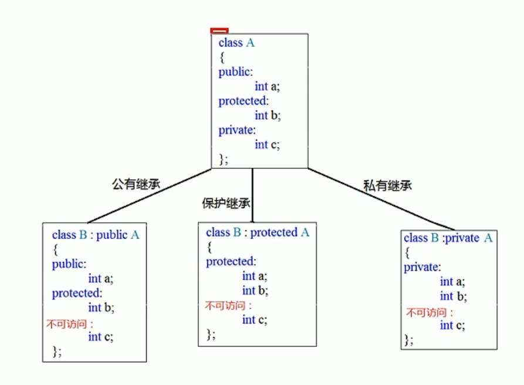 

### 继承中的对象模型

```cpp
class Base{
public:
    int mA;
protected:
    int mB;
private:
    int mC;
}
class Son : public Base{
public:
    int mD;
}

void test01(){
    cout << "size of Son = "<<sizeof(Son)<<endl;
}
int main(){
    test01();
    //输出16，因为父类的所有非静态成员属性都会被子类继承，
    //父类中私有属性 被编译器隐藏了，所以访问不到。
}
```

### 继承中构造和析构顺序

先构造父类，在构造子类

先析构子类，再析构父类

```cpp
class Base{
public:
    Base(){

    }
    ~Base(){

    }
}

class Son : public Base{
public:
    Son(){

    }
    ~Son(){

    }  
}

void test01(){
    Son s;
}
```

### 继承同名成员处理方式

- 访问同类同名成员 直接访问

- 访问父类同名成员 需要加作用域

```cpp
class Base{
public:
    void func(){
        std::cout<<"父类"<<std::endl;
    }
}

class Son : public Base{
public:
    void func(){
        std::cout<<"子类"<<std::endl;
    } 
}

void test01(){
    Son s;
    std::cout<<s.func()<<std::endl;
    std::cout<<s.Base::func()<<std::endl;
}
```

### 多继承语法

语法：`class 子类 : 继承方式 父类1, 继承方式 父类2,...`

### ⭐菱形继承问题


```cpp
class Animal{
public:
    int mAge;
}
class Sheep : public Animal{}
class Tuo : public Animal{}
class SheepTuo : public Sheep,public Tuo{}
void test01(){
    SheepTuo st;
    st.Sheep::mAge = 18;
    st.Tuo::mAge = 28;
    // 当菱形继承，两个父类拥有相同的数据，需要加作用域区分
    cout<<st.Sheep::mAge<<endl;
    cout<<st.Tuo::mAge<<endl;
    /*输出：
    18
    28
    */
    //有两份mAge,其实只需要一份数据，自愿浪费
}
```

利用虚继承解决菱形问题

```cpp
class Animal{
public:
    int mAge;
}
 // 利用虚继承解决菱形问题
 // 关键字virtual 虚继承
 // Animal类为虚基类
class Sheep : virtual public Animal{}
class Tuo : virtual public Animal{}
class SheepTuo : public Sheep,public Tuo{}
void test01(){
    SheepTuo st;
    st.Sheep::mAge = 18;
    st.Tuo::mAge = 28;

    cout<<st.Sheep::mAge<<endl;
    cout<<st.Tuo::mAge<<endl;
    /*输出：
    28
    28
    */
    //只有有一份mAge
}
```

## ⭐多态

通过继承同一个基类，产生了相关的不同的派生类，与基类中同名的成员函数在不同的派生类中会有不同的实现，也就是说：**一个接口、多种方法**

多态分为两类

- 静态多态：**函数重载** 和 **函数运算符重载** 属于静态多态，复用函数名。

- 动态多态：派生类和虚函数实现运行时多态

### 静态多态和动态多态的区别

- 静态多态的函数地址早绑定 - 编译阶段确定函数地址

- 动态多态的函数地址晚绑定 - 运行阶段确定函数地址

```cpp
class Animal{
public:
    void speak(){
        std::cout<<"动物在说话"<<std::endl;
    }
}

class Cat : public:Animal{
public:
    void speak(){
        std::cout<<"小猫在说话"<<std::endl;
    }
}
//执行说话的函数
//地址早绑定 在编译阶段确定函数地址
//如果想执行让猫说话，那么这个函数地址就不能提前绑定，加入virtual关键字
void doSpeak(Animal &animal){
    animal.speak();
}

void test01(){
    Cat cat;
    doSpeak(cat);    //Animal & animal = cat;父类的引用和指针可以直接指向子类
    /*输出
    "动物在说话"
    */
}
```

动态多态的满足条件：

1. 有继承关系

2. 子类重写父类的虚函数             *重写：函数返回值类型、参数列表、完全相同*

动态多态的使用

- 父类的指针或者引用，执行子类对象

```cpp
class Animal{
public:
    //加入virtual关键字，动态多态，地址晚绑定 在运行阶段确定函数地址
    virtual void speak(){
        std::cout<<"动物在说话"<<std::endl;
    }
};

class Cat : public:Animal{
public:
    void speak(){
        std::cout<<"小猫在说话"<<std::endl;
    }
};
void doSpeak(Animal &animal){
    animal.speak();
}

void test01(){
    Cat cat;
    doSpeak(cat);    //Animal & animal = cat;父类的引用和指针可以直接指向子类
    /*输出
    "小猫在说话"
    */
} 
```

### 虚函数的作用

可以让成员函数操作一般化，用基类的指针指向不同的派生类的对象时， 基类指针调用其虚成员函数，则会调用其真正指向对象的成员函数， 而不是基类中定义的成员函数（只要派生类改写了该成员函数）。  若不是虚函数，则不管基类指针指向的哪个派生类对象，调用时都会调用基类中定义的那个函数。

在函数前加入 `virtual` 关键字，会创建一个`vfptr`(**virtual function pointer,虚函数指针**),指向`vftable`（虚函数表），表内记录虚函数地址。

Animal类中的虚函数表

`vftable`

| `&Animal::speak` |     |     |
|:----------------:| --- | --- |
|                  |     |     |
|                  |     |     |
|                  |     |     |

**当子类重写父类的虚函数，子类中的虚函数表内部会替换成子类的虚函数地址。**

当父类的指针或者引用指向子类对象时候，发生多态。

Cat类中的虚函数表

| `&Cat::speak` |     |     |
| ------------- | --- | --- |
|               |     |     |
|               |     |     |
|               |     |     |

### 纯虚函数和抽象类

在多态中，通常父类中虚函数的实现是毫无意义的，主要是调用子类重写的内容

因此可以将虚函数改为纯虚函数。

纯虚函数语法：`virtual 返回值类型 函数名 (参数列表) = 0;`

当类中有了纯虚函数，这个类也成为抽象类。

抽象类的特点

- 无法实例化对象

- 子类必须重写抽象类中的纯虚函数，否则也属于抽象类

### 虚析构和纯虚析构

多态使用时，如果子类中有属性开辟到堆区，那么父类指针在释放时无法调用到子类的析构代码。

解决方式：将父类的析构函数改为**虚析构**或者**纯虚析构**

虚析构和春虚析构的共性：

- 可以解决父类指针释放子类对象

- 都需要有具体的函数实现

虚析构和春虚析构的区别：

- 如果是纯虚函数，该类属于抽象类，无法实例化对象

以下例子，没有调用Cat析构函数，堆区内存没有释放干净，导致**内存泄漏**

```cpp
class Animal{
public:
    // 纯虚函数
    virtual void speak()=0;
    Animal(string name{
        std::cout<<"Animal构造函数"<<std::endl;
        mName = new string(name);
    } 
    ~Animal(){
        std::cout<<"Animal析构函数"<<std::endl;
    }
}

class Cat : public Animal{
public:
    Cat(string name{
        std::cout<<"Cat构造函数"<<std::endl;
        mName = new string(name);
    }

    virtual void speak(){
        std::cout << *mName << "小猫在说话" << std::endl;
    }
    ~Cat(){
        if(mName != NULL){
            std::cout<<"Cat析构函数"<<std::endl;
            delete mName;
            mName = NULL;
        }
    }
    string *mName;
}
void test01()
{
    Animal * animal = new Cat("Tom");
    animal->speak();
    delete animal;    //没有调用Cat析构函数，堆区内存没有释放干净，导致内存泄漏
    /*输出
    "Animal构造函数"
    "Cat构造函数"
    "Tom小猫在说话"
    "Animal析构函数"
}
```

改为虚析构解决

```cpp
class Animal{
public:
    // 纯虚函数
    virtual void speak()=0;
    Animal(string name{
        std::cout<<"Animal构造函数"<<std::endl;
        mName = new string(name);
    } 
     // 虚析构
    virtual ~Animal(){
        std::cout<<"Animal析构函数"<<std::endl;

    //纯虚析构，需要定义函数体
    //virtual ~Animal() = 0;
    }
}
// 纯虚析构 定义
// animal::~Animal(){
//        std::cout<<"Animal析构函数"<<std::endl;

class Cat : public Animal{
public:
    Cat(string name{
        std::cout<<"Cat构造函数"<<std::endl;
        mName = new string(name);
    }

    virtual void speak(){
        std::cout << *mName << "小猫在说话" << std::endl;
    }
    ~Cat(){
        if(mName != NULL){
            std::cout<<"Cat析构函数"<<std::endl;
            delete mName;
            mName = NULL;
        }
    }
    string *mName;
}
void test01()
{
    Animal * animal = new Cat("Tom");
    animal->speak();
    delete animal;   
    /*输出
    "Animal构造函数"
    "Cat构造函数"
    "Tom小猫在说话"
    "Animal析构函数"
    "Animal析构函数"
}
```

### 面试问题

> 1.内联函数、构造函数、静态成员函数、模板函数可以是虚函数吗?

对于虚函数有几点关键点：

- 虚函数是属于对象的
- 虚函数的和运行时期有关

由以上两点，可以回答原问题。

- `inline`：`inline` 需要在编译期就确定类的信息，但是虚函数具体是属于哪个类的，只有在动态运行时才能知道。

- `static`：静态函数是没有 `this` 指针，而虚函数是属于某个对象的`this`与`vptr`来调用的。

- `constructor`：虚函数等到运行时才知道是调用了哪个对象的虚函数。如果构造器也是虚函数，对象都无法构建。因此，构造函数不能是虚函数。而且，在构造函数中调用虚函数，实际执行的是父类的对应函数，因为自己还没有构造好, 多态是被 `disable` 的。

- 模板函数 模板函数也不能是虚函数。因为，类会在`vtbl`中存放类中的所有的虚函数的函数指针，而一个模板函数如果设计为虚函数是无法获悉这个模板函数会被实例化为哪些具体的函数。

> 2.为什么需要虚析构函数，什么时候不需要? 父类的析构函数为什么要定义为虚函数

一般情况下类的析构函数里面都是释放内存资源，而析构函数不被调用的话就会造成内存泄漏。这样做是为了当用一个基类的指针删除一个派生类的对象时， 派生类的析构函数会被正确调用。

当然，并不是要把所有类的析构函数都写成虚函数。因为当类里面有虚函数的时候，编译器会给类添加一个虚函数表，里面来存放虚函数指针，这样就会增加类的存储空间。 所以，只有当一个类被用来作为基类的时候，才把析构函数写成虚函数。

```cpp
    class Base { 
    public:
      virtual ~Base() { }
      virtual
      void show()  { std::cout<< "base_show"<<std::endl; }
      void print() { std::cout<< "base_print"<<std::endl; }
    };

    class Derived : public Base { 
    public:
      void print() { std::cout<< "Derived_print"<<std::endl; }
      void show()  { std::cout<< "Derived_show"<<std::endl; }
    };

    int main(int argc, char const *argv[])
    {
      Base* base = new Derived;
      base->print();  // base
      base->show();   // derived，是在运行期才会确定是哪个对象调用的 show

      delete base;
      return 0;
    }
```

上面示例中，`print()` 函数不是虚函数，因此 `base->print();` 调用的是 `Base` 的 `print`，这个函数调用在编译器就实现了。

# 优先队列

## 定义

`priority_queue<type, container, functional>`

type 就是数据类型，container 就是容器类型（container必须是用数组实现的容器，比如vector,deque等等，但不能用 list。STL里面默认用的是vector），functional 就是比较的方式。

```
和队列基本操作相同:

top 访问队头元素
empty 队列是否为空
size 返回队列内元素个数
push 插入元素到队尾 (并排序)
emplace 原地构造一个元素并插入队列
pop 弹出队头元素
swap 交换内容
```

```c++
//升序队列
priority_queue<int, vector<int>,greater<int> > q;
//降序队列
priority_queue<int, vector<int>,less<int> > q;
```

```c++
//自定义
#include <iostream>
#include <queue>
using namespace std;
//方法一
struct tmp1
{
    int x;
    tmp1(int a){x = a;}
    bool operator<(const tmp1& a) const
    {
        return x < a.x;//大顶堆
    }
}

//方法二
struct tmp2
{
    bool operator()(tmp1 a,tmp1 b)
    {
        return a.x < b.x;//大顶堆
    }
}
int main(){
    tmp1 a(1);
    tmp1 b(2);
    tmp1 c(3);
    priority_queue<tmp1> d;
    d.push(b);
    d.push(c);
    d.push(a);
    while(!d.empty())
    {
        cout <<d.top().x << '\n';
        d.pop();
    }
    cout << endl;

    priority_queue<tmp1,vector<tmp1>,tmp2> f;
    f.push(b);
    f.push(c);
    f.push(a);
    while!(f.empty()){
        cout << f.top().x << '\n';
        f.pop;
    }
}
```

# 栈

```c++
#include<stack>

stack<int> q;    //以int型为例
int x;
q.push(x);        //将x压入栈顶
q.top();        //返回栈顶的元素
q.pop();        //删除栈顶的元素
q.size();        //返回栈中元素的个数
q.empty();        //检查栈是否为空，若为空返回true，否则返回false
```

# 模板和范型编程

## 函数模板

```cpp
tempalte<typename T>
函数声明和定义
```

```cpp
template<typename T>
void mySwap(T &a, T &b){
    T temp = a;
    a = b;
    b = temp;
}

void test01(){
    int a = 10;
    int b = 10;
    //1、自动推导参数类型
    mySwap(a,b);  
    //2、显示类型
    mySwap<int>(a,b);
}
```

### 普通函数和函数模板的调用规则

1. 如果函数模板和普通函数都可以调用，优先调用普通函数模板

2. 可以通过空模板参数列表 强制调用 模板函数

3. 函数模板可以发生函数重载

4. 如果函数模板可以产生更好的匹配，优先调用函数模板

### 模板的局限性

模板不是万能的，有些自定义类型无法直接使用模板

可以利用具体化的模板解决自定义类型。

```cpp
template<class T>
bool myCompare(T &a,T &b){
    if(a==b)
        return true;
    else
        return false;
}
// 利用具体化Person的函数模板，优先调用
template<>bool myCompare(Person &p1, Person &p2){
    if(p1.mName==p2.mName &&p1.mAge == p2.mAge)
        return true;
    else
        return false;
}

Class Person{
public:
    Person(string name, int age){
    this->mName = name;
    this->mAge = age;
}
    string mName;
    int mAge;
}

void test01(){
    Person p1("Tom",10);
    Person p2("Tom",10);    
    myCompare(p1,p2);    
    //myCompare显然不知道如何对比p1和p2
}
```

## 类模板

```cpp
template<typename T>
类
```

# STL

为了提高代码的复用性。

- Standard Template Library 标准模板库

- STL从广义上分为：容器、算法、迭代器

- 容器和算法都是通过迭代器进行无缝链接

- STL几乎所有的代码都采用了模板类或者模板函数

## STL六大组件

分别是：**容器、算法、迭代器、仿函数、适配器(配接器)、空间配置器**

1. 容器： 各种数据结构，如vector、list、deque、set、map等，用来存放数据。

2. 算法：各种常用的算法，如sort、find、copy、for_each等。

3. 迭代器：扮演了容器与算法之间的胶合剂。

4. 仿函数：行为类似函数，可作为算法的某种策略。重载的`()`被称为仿函数

5. 适配器：一种用来修饰容器或者仿函数或迭代器接口的东西。*适配器不常用*

6. 空间配置器：负责空间的配置与管理。

## STL容器、算法、迭代器

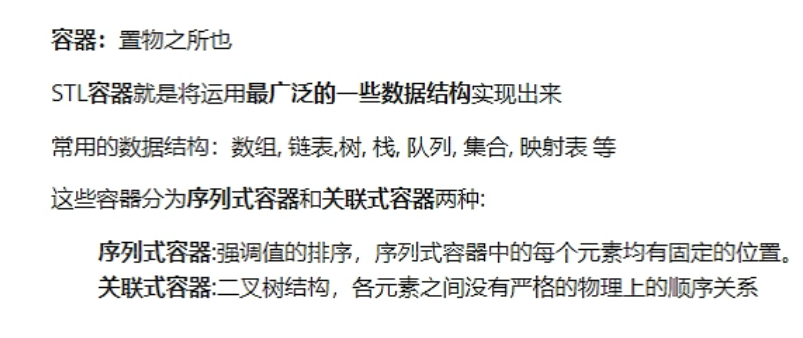

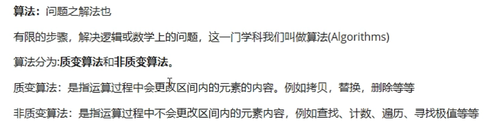

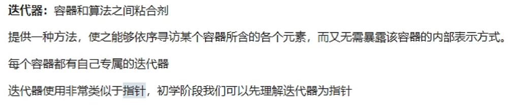

## 常用容器

### deque

双端数组，可以对头端进行插入删除

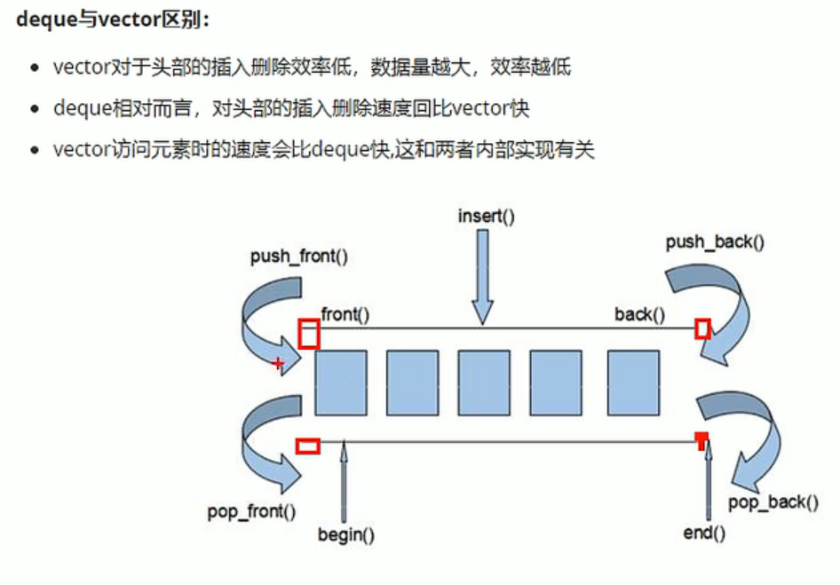

**deque的底层则是 若干个 数组的集合**

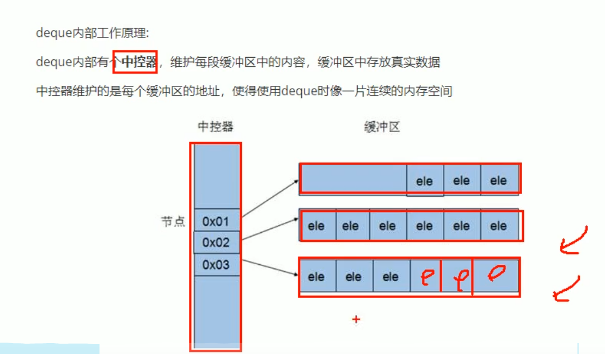

### stack容器

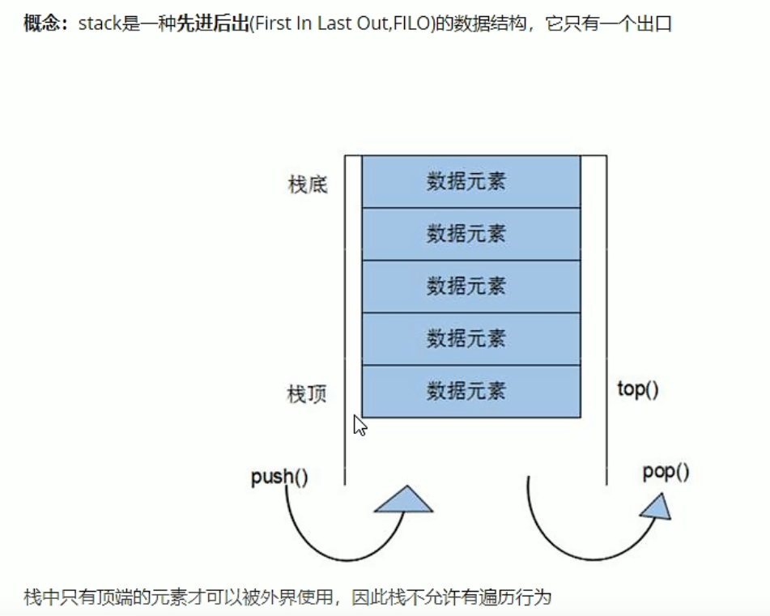

```cpp
push(elem);
pop();
empty();
size();
```

### queue容器

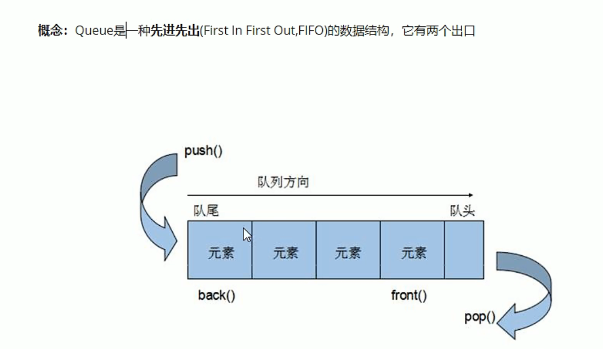

只有队头队尾可以被外界访问，队列不允许遍历。

```cpp
queue<T> que;
queue(const queue &que);

push(elem);
pop();
back();
front();

empty();
size();
```

### priority_queue

容器适配器，需要指定底层的容器类型(第二个参数)

```cpp
和队列基本操作相同:

top 访问队头元素
empty 队列是否为空
size 返回队列内元素个数
push 插入元素到队尾 (并排序)
emplace 原地构造一个元素并插入队列
pop 弹出队头元素
swap 交换内容
//使用基本数据类型时，只需要传入数据类型，默认是大顶堆。即降序
//升序队列
priority_queue <int,vector<int>,greater<int> > q;
//降序队列
priority_queue <int,vector<int>,less<int> > q;
/*
greater和less是std实现的两个仿函数
（就是使一个类的使用看上去像一个函数。
其实现就是类中实现一个operator()，这个类就有了类似函数的行为，
就是一个仿函数类了）
*/
```

### list容器

双向链表

只支持前移和后移，属于双向迭代器。

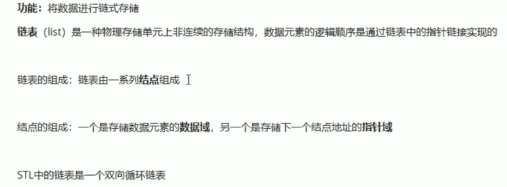

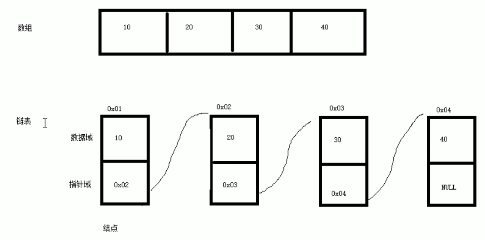

优点：

- 可以对任意位置进行快速插入或删除元素。

- 采用动态存储分配，（相对于vector）不需要余量，不会造成内存浪费和溢出。

缺点：

- 容器遍历速度没有vector速度快，占用空间比数组大。

**list插入和删除操作不会造成原有list迭代器失效，这在vector中不成立**

```cpp
list<T> lst;        // list采用模板类实现，对象的默认构造函数
list(beg, end);     // 构造函数将[beg,end]区间元素拷贝给本身
list(n, elem);      // 构造函数将n个elem拷贝给本身
list(const list &lst);    // 拷贝构造函数

//赋值
assign(begin, end); // 将[beg, end]区间中的数据拷贝赋值给本身
assign(n, elem);    // 将n个elem拷贝赋值给本身
list& operator=(const list &lst);
swap(lst);

//插入
insert( const_iterator pos, const T& value );


//大小操作
size();    
empty();

// 重新指定容器的长度为num，若容器变长，则以默认值填充新位置
// 若容器变短，则末尾超出容器长度的元素被删除。
resize(num); 
resize(num, elem);


// list数据存取
// list属于双向迭代器，不能用at和[]访问元素
front();    // 返回第一个元素
back();    //  返回最后一个元素


// list反转和排序
reverse();
sort();
```

### set/multiset容器

简介

- 所有元素都会在插入时自动被排序

- set不允许重复数据存在

- multiset允许重复数据存在

属于关联式容器，底层是二叉树

```cpp
set<T> s;


s.insert(elem);


//删除
s.clear();
s.erase(pos);    //删除pos迭代器所指的元素
s.erase(begin,end);
s.erase(elem);   //删除值为elem的元素

//查找
//end迭代器指向末尾元素的下一个位置。
s.find(key) //返回迭代器，没找到返回s.end();
s.begin()    //指向第一个元素的迭代器
s.rbegin()    //指向最后一个元素的迭代器
s.rend()    //指向第一个元素的前一个位置

//统计
```

#### pair对组

不需要头文件

```
pair<T,T> p(elem1, elem2);
pair<T,T> p = make_pair(elem1, elem2);
pair<T,T> p = {elem1,elem2};
```

#### set容器排序

set容器默认排序规则为从小到大

- 利用仿函数改变排序规则

```cpp
class Mycompare{
public:
    bool operator()(int v1 ,int v2){
        return v1 > v2;
    }
}；

int main(){
    // 按照指定规则排序
    set<int, Mycompare> s1;

    s1.insert(10);
    s1.insert(20);
    s1.insert(30);
    s1.insert(40);

    for(set<int, Mycompare>::iterator it s1.begin(); it !=s1.end();it++){
        cout<<*it<< " ";
    }
    cout<<endl;

} 
```

### unordered_set

```cpp
template <typename T>
class HashTable{
private:
    vector<list<T>> hash_table;

    int myhash(const T & obj) const{
        return hash(obj, hash_table.size());
    } 
public:
    // size最好是质数
    HashTable(int size=31){
        hash_table.reserve(size);
        hash_table.resize(size);
    }   
    ~HashTable(){}

    // 查找哈希表是否存在该值
    bool contains(const T & obj){
        int hash_value = myhash(obj);
        const list<T> & slot = hash_table[hash_value];
        std::list<T>::const_iterator it = slot.cbegin();
        for(; it != slot.cend() && *it != obj; ++it);
        return it != slot.cend();
    }
    // 插入值
    bool insert(const T & obj){
        if(contains(obj)){
            return false;
        }
        int hash_value = myhash(obj);
        std::list<T> & slot = hash_table[hash_value];
        slot.push_front(obj);
        return true;
    }
    // 删除值
    bool remove(const T & obj){
        list<T> & slot = hash_table[myhash(obj)];
        auto it = find(slot.begin(),slot.end(),obj);
        if(it == slot.end()){
            return false;
        }
        slot.erase(it);
        return true;
    }    

};
// 哈希函数
int hash(const int & key, const int &tableSize){
    return key % tableSize;
}
```

### map/multimap容器

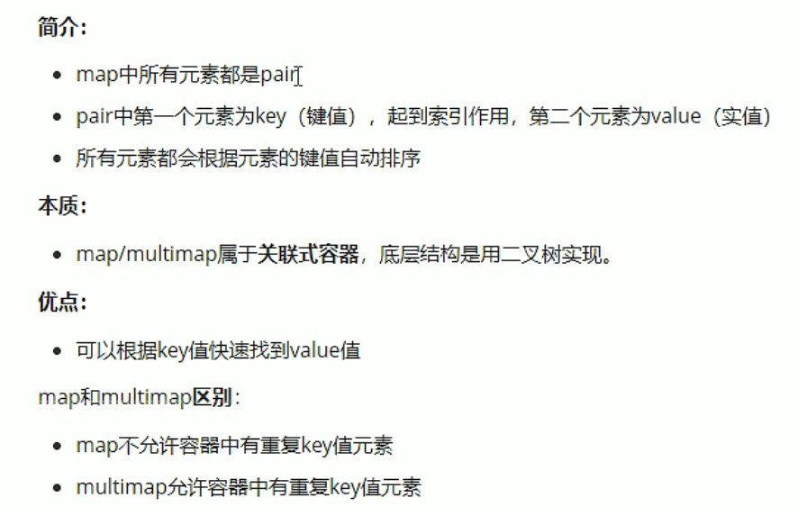

```cpp
map<int,int> m;
m.insert(pair<int,int>(1,10));    //采用匿名对组插入
m.insert(pair<int,int>(2,20));
m.insert(pair<int,int>(3,30));

map<int,int> m2(m);        //拷贝构造

map<int,int> m3 = m2;    //赋值

// 访问某个位置的元素

map<int, int>::iterator pos = m.find(3);
if(pos!=m.end()){
    cout <<"ket="<<(*pos).first<<"value="<<pos->second<<endl;
}else{
    cout<<"未查到元素"<<endl;
}

// 删除
clear();
erase(pos);
erase(key);
erase(beg,end);


// 删除
find(key);    //查找key是否存在，若存在返回该值的迭代器位置。不存在返回set.end();
count(key);    
```

### unordered_map

无序map容器，

```cpp
std::unordered_map<std::string, std::string> umap;
```

| 成员方法               | 功能                                                                                                                            |
| ------------------ | ----------------------------------------------------------------------------------------------------------------------------- |
| begin()            | 返回指向容器中第一个键值对的正向迭代器。                                                                                                          |
| end()              | 返回指向容器中最后一个键值对之后位置的正向迭代器。                                                                                                     |
| cbegin()           | 和 begin() 功能相同，只不过在其基础上增加了 const 属性，即该方法返回的迭代器不能用于修改容器内存储的键值对。                                                                |
| cend()             | 和 end() 功能相同，只不过在其基础上，增加了 const 属性，即该方法返回的迭代器不能用于修改容器内存储的键值对。                                                                 |
| empty()            | 若容器为空，则返回 true；否则 false。                                                                                                      |
| size()             | 返回当前容器中存有键值对的个数。                                                                                                              |
| max_size()         | 返回容器所能容纳键值对的最大个数，不同的操作系统，其返回值亦不相同。                                                                                            |
| operator[key]      | 该模板类中重载了 [] 运算符，其功能是可以向访问数组中元素那样，只要给定某个键值对的键 key，就可以获取该键对应的值。注意，如果当前容器中没有以 key 为键的键值对，则其会使用该键向当前容器中插入一个新键值对。                  |
| at(key)            | 返回容器中存储的键 key 对应的值，如果 key 不存在，则会抛出 out_of_range 异常。                                                                           |
| find(key)          | 查找以 key 为键的键值对，如果找到，则返回一个指向该键值对的正向迭代器；反之，则返回一个指向容器中最后一个键值对之后位置的迭代器（如果 end() 方法返回的迭代器）。                                        |
| count(key)         | 在容器中查找以 key 键的键值对的个数。                                                                                                         |
| equal_range(key)   | 返回一个 pair 对象，其包含 2 个迭代器，用于表明当前容器中键为 key 的键值对所在的范围。                                                                            |
| emplace()          | 向容器中添加新键值对，效率比 insert() 方法高。                                                                                                  |
| emplace_hint()     | 向容器中添加新键值对，效率比 insert() 方法高。                                                                                                  |
| insert()           | 向容器中添加新键值对。                                                                                                                   |
| erase()            | 删除指定键值对。                                                                                                                      |
| clear()            | 清空容器，即删除容器中存储的所有键值对。                                                                                                          |
| swap()             | 交换 2 个 unordered_map 容器存储的键值对，前提是必须保证这 2 个容器的类型完全相等。                                                                          |
| bucket_count()     | 返回当前容器底层存储键值对时，使用桶（一个线性链表代表一个桶）的数量。                                                                                           |
| max_bucket_count() | 返回当前系统中，unordered_map 容器底层最多可以使用多少桶。                                                                                          |
| bucket_size(n)     | 返回第 n 个桶中存储键值对的数量。                                                                                                            |
| bucket(key)        | 返回以 key 为键的键值对所在桶的编号。                                                                                                         |
| load_factor()      | 返回 unordered_map 容器中当前的负载因子。负载因子，指的是的当前容器中存储键值对的数量（size()）和使用桶数（bucket_count()）的比值，即 load_factor() = size() / bucket_count()。 |
| max_load_factor()  | 返回或者设置当前 unordered_map 容器的负载因子。                                                                                               |
| rehash(n)          | 将当前容器底层使用桶的数量设置为 n。                                                                                                           |
| reserve()          | 将存储桶的数量（也就是 bucket_count() 方法的返回值）设置为至少容纳count个元（不超过最大负载因子）所需的数量，并重新整理容器。                                                     |
| hash_function()    | 返回当前容器使用的哈希函数对象。                                                                                                              |

```cpp

```

## 函数对象

概念

- 重载函数调用操作符的类，其对象常称为函数对象

- 函数对象使用重载的`()`时，行为类似函数调用，也叫仿函数。

### 谓词

返回bool类型的仿函数称为**谓词**

如果`operator()`接受一个参数，那么叫做一元谓词

如果`operator()`接受两个参数，那么叫做二元谓词

```cpp
class MyCompare{
public:
    // 谓词
    bool operator()(int val1, int val2){
        return val1>val2;
    }
}

int main(){
    vector<int> v;
    v.push_back(10);
    v.push_back(30);
    v.push_back(20);  

    // 使用函数对象改变算法策略，变为排序规则从大到小
    // 注意`MyCompare()`必须有`()`才是函数对象。
    // `MyCompare`只是类
    sort(v.begin(),v.end(),MyCompare());
}
```

### 内建函数对象

需要引入头文件`#include<functional>`

#### 算术仿函数

其中negate是一元运算，其它都是二元运算

```cpp
template<class C> C plus<T>        //加法仿函数
template<class C> C minus<T>        //减法仿函数
template<class C> C multiplies<T>    //乘法仿函数
template<class C> C divides<T>       //除法仿函数
template<class C> C modulus<T>       //取模仿函数
template<class C> C negate<T>       //取反仿函数
```

#### 关系仿函数

```cpp
template<class C> bool equal_to<T>    //等于
template<class C> bool not_equal<T>   //不等于
template<class C> bool greater<T>   //大于
template<class C> bool greater_equal<T>   //大于等于
template<class C> bool less<T>   //小于
template<class C> bool less_equal<T>   //小于等于
```

```cpp
class MyCompare{
public:
    // 谓词
    bool operator()(int val1, int val2){
        return val1>val2;
    }
}

int main(){
    vector<int> v;
    v.push_back(10);
    v.push_back(30);
    v.push_back(20);  

    // 使用函数对象改变算法策略，变为排序规则从大到小
    // 注意`MyCompare()`必须有`()`才是函数对象。
    // `MyCompare`只是类
    //sort(v.begin(),v.end(),MyCompare());

    //降序
    sort(v.begin(),v.end(),greater<int>());
}
```

#### 逻辑仿函数

```cpp
template<class C> bool logic_and<T>   //逻辑与
template<class C> bool logic_or<T>   //逻辑或
template<class C> bool logic_not<T>   //逻辑非 取反
```

## STL常用算法

- 算法主要有头文件`<algorithm>``<functional>``<numeric>`组成。

- `<algorithm>`是所有STL头文件中最大的一个，范围涉及到比较、交换、查找、遍历操作、复制、修改等

- `<numeric>`只包括几个在序列上面进行简单数学运算的模板函数。

- `<functional>`定义了一些模板类，用以声明函数对象。

### 常用遍历算法

`for_each`    //遍历容器

`transform`  //搬运容器到另一个容器中

#### transform

```cpp
/*
beg1: 源容器起始迭代器
end1: 源容器结束迭代器
beg2: 目标容器开始迭代器
_func:函数或函数对象
*/
transform(iterator beg1, iterator end1,iterator beg2._func);
```

```cpp
#include<iostream>
#include<algorithm>
#include<vector>
using namespace std;


class Transform{
public:
    int operator()(int v){
        return v + 100;
    }
};
int main(){
    vector<int> v;
    for(int i = 0;i < 10; i++){
        v.push_back(i);
    }
    vector<int> v_target;
    v_target.resize(v.size());
    transform(v.begin(),v.end(),v_target.begin(),Transform());
}
```

### 常用查找方法

#### find

查找内置数据类型

```cpp
#include<algorithm>
int main(){
    vector<int> v;
    for(int i = 0;i<10;i++){
        v.push_back(i);
    }
    vector<int>::iterator it = find(v.begin(),v.end(),5);
}
```

查找自定义数据类型

需要重载`==`

```cpp
class Person{
public:
    Person(string name,int age){
        this->mName = name;
        this->mAge = age;
    }

    bool operator==(const Person & p){
        if(this->mName == p.mName && this->mAge == p.Age){
            return true;
        }else{
            return false;
        }
    }
    string mName;
    int mAge;
};

int main(){
    vector<Person> v;

    Person p1("aaa",10);
    Person p2("bbb",20);
    Person p3("ccc",30);

    v.push_back(p1);
    v.push_back(p2);
    v.push_back(p3);

    Person pp("bbb",20);

    vector<Person>::iterator it = find(v.begin(),v.end(),pp);
    if(it == v.end()){
        cout<<"没有找到"<<endl;
    }else{
        cout<<"找到了"<<endl;
    }
}
```

#### find_if

```cpp
#include<algorithm>
using namespace std;
class GreaterFive{
public:
    bool operator()(int val){
        return val > 5;
    }
};

void test01(){
    vector<int> v;
    for(int i=0;i<10;i++){
        v.push_back(i);
    }
    vector<int>::iterator it = find_if(v.begin(),v.end(),GreaterFive());
    if(it==v.end()){
        cout<<"没找到"<<endl;
    }else{
        cout<<"找到大于5的数："<< *it <<endl;
    }
}
```

#### count


#### lower_bound() &&upper_bound()

用于在指定区域内查找不小于目标值的第一个元素。

```cpp
//在 [first, last) 区域内查找第一个不小于 val 的元素
ForwardIterator lower_bound (ForwardIterator first, ForwardIterator last,
                             const T& val);
//在 [first, last) 区域内查找第一个不符合 comp 规则的元素
ForwardIterator lower_bound (ForwardIterator first, ForwardIterator last,
                             const T& val, Compare comp);


//在 [first, last) 区域内查找第一个大于 val 的元素
ForwardIterator upper_bound (ForwardIterator first, ForwardIterator last,
                             const T& val);
//在 [first, last) 区域内查找第一个不符合 comp 规则的元素
ForwardIterator upper_bound (ForwardIterator first, ForwardIterator last,
                             const T& val, Compare comp); 
```


### 常用排序

#### sort

#### random_shuffle

#### merge

合并两个容器至新的容器

```cpp
merge(iterator beg1,iterator end1,iterator beg2,iterator end2,iterator dest);
```

#### reverse

### 常用拷贝和替换算法

#### copy

容器指定范围的元素拷贝到另一容器

```cpp
copy(iterator beg,iterator end,iterator dest);
```

#### replace

将容器内指定范围内的旧元素替换为新元素

```cpp
replace(iterator beg,iterator end,old_value,new_value)
```

### 常用的算术生成算法

使用时包含的头文件为`#include<numeric>`

- `accumulate`计算容器元素累计总和

- `fill`向容器中添加元素

- `iota`用于产生连续的值

```cpp
accumulate(iterator beg,iterator end, value);//value是起始值
fill(iterator beg,iterator end, value);
iota(iterator beg,iterator end,initial);
```

# 类型转换

### 静态转换(static_cast)（编译时类型检查）

**静态转换需要用C++内置函数模板static_cast( expression ）**

static_cast < T > ( expression )，该运算符把expression转换为T类型，但没有运行时类型检查来保证转换的安全性

作用:

1. **用于类层次结构中基类（父类）和派生类（子类）之间指针或引用的转换。**

> C++规定自定义类型数据如果发生了继承关系，编译器允许进行类型转换（向上转型、向下转型），否则不能进行类型转换转换将会失败
> 
> 进行上行转换（把派生类的指针或引用转换成基类表示）是安全的
> 基类指针步长相对于派生类指针步长来说较小，并不会超出派生类范围访问其他数据
> 进行下行转换（把基类指针或引用转换成派生类表示）时，由于没有动态类型检查，所以是不安全的

2. **用于基本数据类型之间的转换，如把int转换成char，把char转换成int（这种转换的安全性也要开发人员来保证）**
