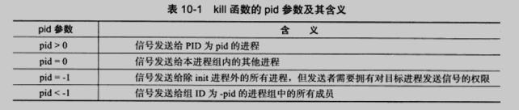

## socket地址API

### 主机字节序 和 网络字节序

- 小端字节序：高位存储在内存高地址处，低位存储在内存低地址处。

大部分PC采用小端字节序，又称主机字节序。

大端字节序又称网络字节序。

### IP地址转换函数

```c
#include <arpa/inet.h>
/*
把 用字符串表示IP地址的src 转换成 用网络字节序整数表示的IP地址，
并把转换结果存储在dst指向的地址
Args:
    af: 指定的地址族
    src: 字符串表示的IP地址
    dst: 转换后的存储地址
Return:
    成功返回1，失败返回0
*/
int inet_pton(int af, const char* src,void* dst) ;

/*
inet_ntop函数进行相反的转换。前三个参数与 inet_pton 相同，最后一个参数cnt
指定目标存储单元的大小。
*/
const char* inet_ntop(int af, const void* src, char* dst,
socklen_t cnt);

/*
以下两个宏 用于指定 cnt 大小，分别用于IPv4和IPv6
*/
#include <netinet/in.h>
#define INET_ADDRSTRLEN 16
#define INET6_ADDRSTRLEN 46
```

## 创建 socket

```c
# include <bits/socket.h>
struct sockaddr_storage
{
    sa_family_t sa_family;
    unsigned long int __ss_align;
    char __ss_padding[128-sizeof(__ss_align)];
};
/*
通用socket地址结构体
sa_family_t: 地址族类型,与协议族类型对应，
地址族就是一个协议族所使用的地址集合

常见的协议族:
协议族        地址族        描述                地址值含义和长度
PF_UNIX        AF_UNIX        UNIX本地域协议族    文件的路径名
PF_INET        AF_INET        TCP/IPv4协议族    16bit端口号和32bitIPv4地址
PF_INET6    AF_INET6    TCP/IPv6协议族    16bit端口号和32bit流标识，
                                        128bitIPv6地址，32bit范围ID
*/


/*TCP/IP协议族有 sockaddr_in 和 sockaddr_in6 两个专用socket地址结构体，
分别用于IPv4和IPv6*/
struct sockaddr_in
{
    sa_family_t sin_family;    // 地址簇: AF_INET
    u_int16_t sin_port;        // 端口号
    struct in_addr sin_addr;    // IPv4地址结构体
};
struct in_addr
{
    u_int32_t s_addr;    //IPv4地址
};
struct sockaddr_in6
{
    sa_family_t sin6_family;    // 地址族: AF_INET6
    u_int16_t sin6_port;        //
    u_int32_t sin6_flowinfo;    //
    struct in6_addr sin6_addr;    //
    u_int32_t sin_scope_id;    //
}


# include <sys/types.h>
# include <sys/socket.h>
int socket(int domain, int type, int protocol);
/*
Function:
    创建一个socket
Args:
    domain: 底层协议,对TCP/IP协议簇，应选择PF_INET(Protocol Family of Internet,用于IPv4)
    type: 服务类型, SOCK_STREAM(流服务)/SOCK_UGRAM(数据报).对TCP/IP,SOCK_STEAM表示传输层使用TCP,SOCK_DGRAM表示使用UDP协议
    protocol: 前两个参数构成的协议集下再选择一个具体的协议.默认为0
Return:
    成功返回一个socket文件描述符，失败返回-1
*/


int bind(int sockfd, const struct sockaddr* my_addr, socklen_t addrlen);
/*
Function:
    将 socket 与 socket地址 绑定
Args:
    sockfd: 文件描述符
    addrlen:sorcket地址长度
*/
```

## 监听socket

```c
# include <sys/socket.h>
int listen(int sockfd, int backlog);
/*
Args:
    sockfd: 被监听的socket
    backlog: 内核监听队列的最大长度
*/
```

`testlisten.c`接收三个参数：IP地址、端口号和backlog值。

`gcc testlisten.c -o testlisten`生成可执行程序`testlisten`

测试本地ip的两个端口通信

`./testlisten 本地ip 12345 5`

`telnet 本地ip 12345 # 建立连接`

`netstat -nt | grep 12345 # 查看连接状态`

在终端输入

```c
#include <sys/socket.h>
#include <netinet/in.h>
#include <arpa/inet.h>
#include <signal.h>
#include <unistd.h>
#include <stdlib.h>
#include <assert.h>
#include <stdio.h>
#include <string.h>
#include <stdbool.h>

static bool stop = false;
/* SIGTERM信号的处理函数，触发时结束主程序中的循环*/
static void handle_term( int sig )
{
    stop = true;
}

int main(int argc, char* argv[])
{
    signal(SIGTERM, handle_term);
    if(argc <= 3)
    {
        printf("usage: %s ip_address port_number backlog\n",basename(argv[0]) );
        return 1;
    }
    const char* ip = argv[1];
    int port = atoi(argv[2]);    // atoi:把字符串转化为整形
    int backlog = atoi(argv[3]);

    int sock = socket(PF_INET, SOCK_STREAM, 0);
    assert(sock >= 0 );

    /* 创建一个IPv4 socket 地址 */
    struct sockaddr_in address;
    bzero( &address, sizeof(address));
    address.sin_family = AF_INET;
    inet_pton(AF_INET, ip , &address.sin_addr );
    address.sin_port = htons(port);

    int ret = bind(sock,(struct sockaddr* )&address , sizeof(address));
    assert(ret != -1 );

    ret = listen(sock, backlog);
    assert(ret != -1);

    /* 循环等待连接，直到有SIGTERM信号将它中断 */
    while(! stop){
    sleep(1);
    }

    /* 关闭socket */
    close(sock);
    return 0;
}
```

## 接受连接

```c
#include <sys/types.h>
#include <sys/socket.h>

int accept(int sockfd, struct sockaddr *addr, socklen_t *addrlen);
/*
接受连接
Args:
    sockfd: 执行过listen系统调用的监听socket
    addr: 获取被接受连接的远端socket地址
    addrlen: addr的长度

*/
```

```c
#include <sys/socket.h>
#include <netinet/in.h>
#include <arpa/inet.h>
#include <assert.h>
#include <stdio.h>
#include <unistd.h>
#include <stdlib.h>
#include <errno.h>
#include <string.h>

int main(int argc, char* argv[]){
    if(argc <= 2){
        printf("usage: %s ip_address port_number\n", basename(argv[0]));
        return 1;
    }
    const char* ip = argv[1];
    int port = atoi(argv[2]);

    /* 创建一个IPv4 socket地址 */
    struct sockaddr_in address;
    bzero(&address, sizeof(address));
    address.sin_family = AF_INET;
    inet_pton(AF_INET, ip, &address.sin_addr);
    address.sin_port = htons(port);

    int sock = socket(PF_INET, SOCK_STREAM, 0);
    assert( sock >= 0);

    int ret = bind(sock,(struct sockaddr*)&address,sizeof(address));
    assert(ret != -1);

    ret = listen(sock, 5);
    assert(ret != -1);

    /* 暂停20秒以等待客户端连接和相关操作（掉线或者退出）完成 */
    sleep(20);
    struct sockaddr_in client;
    socklen_t client_addrlength = sizeof(client);
    int connfd = accept(sock, (struct sockaddr* )&client, 
    &client_addrlength);
    if( connfd < 0){
        printf("errno is %d\n",errno);
    }else{
        /* 接受连接成功则打印出客户端的IP地址和端口号 */
        char remote[INET_ADDRSTRLEN];
        printf("connected with ip: %s and port: %d\n",
        inet_ntop(AF_INET,&client.sin_addr,remote,INET_ADDRSTRLEN),
        ntohs(client.sin_port));
        close(connfd);
    }
    close(sock);
    return 0;
}
```

## 发起连接

```cpp
#include <sys/types.h>
#include <sys/socket.h>
int connect(int sockfd, const struct sockaddr *serv_addr,
 socklen_t addrlen);
/*
Args:
    sockfd: 参数由 socket 系统调用返回一个 socket.
    serv_addr: 服务器监听的 socket地址.
    addrlen: 地址长度
Return:
    成功返回0，失败返回-1
*/
```

## 关闭连接

```c
#include <unistd.h>
int close(int fd);
/*
通过关闭普通文件描述符的系统，fd引用计数-1，为0才真正关闭连接
*/

#include <sys/socket.h>
int shutdown(int sockfd, int howto);
/*
Args:
    sockfd: 参数由 socket 系统调用返回一个 socket.
    howto: shutdown的行为:SHUT_RD|SHUT_WR|SHUT_RDWR.
Return:
    成功返回0，失败返回-1
*/
```

## 数据读写


## 带外数据(out—of—band data)

OOB有时也称为加速数据(expedited data)，

是指连接双方中的一方发生重要事情，想要迅速地通知对方。

这种通知在已经排队等待发送的任何“普通”(有时称为“带内”)数据之前发送。

带外数据设计为比普通数据有更高的优先级。

带外数据是映射到现有的连接中的，而不是在客户机和服务器间再用一个连接。


### TCP数据读写

```c
#include <sys/types.h>
#include <sys/socket.h>
/*
@return		-1 失败
        	0	对方关闭了通信
        	>0	成功读取数据
*/
ssize_t recv(int sockfd, void *buf, size_t len, int flags);


ssize_t send(int sockfd, const void *buf, size_t len, int flags);
```

```c
#include <sys/socket.h>
#include <netinet/in.h>
#include <arpa/inet.h>
#include <assert.h>
#include <stdio.h>
#include <unistd.h>
#include <string.h>
#include <stdlib.h>
#include <errno.h>
int main(int argc, char* argv[]){
    if(argc <= 2){
        printf("usage: %s ip_address port_number\n",
        basename(argv[0]));
        return 1;
    }
    const char* ip = argv[1];
    int port = atoi(argv[2]);

    struct sockaddr_in server_address;
    bzero(&server_address,sizeof(server_address));
    server_address.sin_family = AF_INET;
    inet_pton(AF_INET, ip, &server_address.sin_addr);
    server_address.sin_port = htons( port );

    int sockfd = socket(PF_INET, SOCK_STREAM, 0);
    assert(sockfd >= 0);
    if(connect(sockfd,( struct sockaddr* )&server_address,
                       sizeof(server_address) )<0)
    {
        printf("connection failed %d\n",errno);
    }
    else
    {
        const char* oob_data = "abc";
        const char* normal_data = "123";
        send( sockfd, normal_data, strlen( normal_data ),0 );
        send( sockfd, oob_data, strlen( oob_data), MSG_OOB);
        send( sockfd, normal_data, strlen( normal_data ),0 );
    }
    close(sockfd);
    return 0;
}  }
    close(sockfd);
    return 0;
}
```

接收数据

```c
#include <sys/socket.h>
#include <netinet/in.h>
#include <arpa/inet.h>
#include <assert.h>
#include <stdio.h>
#include <unistd.h>
#include <string.h>
#include <stdlib.h>
#include <errno.h>

#define BUF_SIZE 1024
int main(int argc ,char* argv[]){
    if(argc <= 2){
        printf("usage: %s ip_address port_number\n",basename(argv[0]));
        return 1;
    }
    const char* ip = argv[1];
    int port = atoi(argv[2]);

    struct sockaddr_in address;
    bzero(&address,sizeof(address));
    address.sin_family = AF_INET;
    inet_pton(AF_INET,ip,&address.sin_addr);
    address.sin_port = htons(port);

    int sock = socket(PF_INET,SOCK_STREAM,0);
    assert(sock >=0 );

    int ret = bind(sock,(struct sockaddr*)&address,sizeof(address));
    assert(ret != -1);

    ret = listen(sock,5);
    assert(ret != -1);

    struct sockaddr_in client;
    socklen_t client_addrlength = sizeof(client);
    int connfd = accept(sock,( struct sockaddr*)&client,&client_addrlength);
    if(connfd < 0){
        printf("errno is: %d\n",errno);
    }
    else{
        char buffer[BUF_SIZE];

        memset(buffer,'\0',BUF_SIZE);
        ret = recv(connfd,buffer,BUF_SIZE-1,0);
        printf("got %d bytes of normal data '%s'\n",ret,buffer);

        memset(buffer,'\0',BUF_SIZE);
        ret = recv(connfd,buffer,BUF_SIZE-1,MSG_OOB);
        printf("got %d bytes of oobdata '%s'\n",ret,buffer);

        memset(buffer,'\0',BUF_SIZE);
        ret = recv(connfd,buffer,BUF_SIZE-1,0);
        printf("got %d bytes of normal '%s'\n",ret,buffer);  

        close(connfd);   
    }
    close(sock);
    return 0;
}
```

`testoobsend.c`和`testoobrecv.c`接收两个参数：IP地址、端口号。

`gcc testoobsend.c -o testoobsend`生成可执行程序`testoobsend`

测试本地ip的两个端口通信

`./testoobrecv 本地ip 12345`

`./testoobsend 本地ip 12345`


### UDP数据读写

```c
#include <sys/types.h>
#include <sys/socket.h>
ssize_t recvfrom(int sockfd, void* buf, size_t len, int flags,
                 struct sockaddr* src_addr, socklen_t* addrlen);
ssize_t sendto(int sockfd, const void* buf, size_t len, int flags, 
                const struct sockaddr* dest_addr, socklen_t* addrlen);
```

## 地址信息函数

```c
#include <sys/socket.h>
/*
    获取sockfd对应的本端socket地址
*/
int getsockname(int sockfd, struct sockaddr* address,
 socklen_t* address_len);


/*
    获取sockfd对应的远端socket地址
*/
int getpeername(int sockfd, struct sockaddr* address,
 socklen_t* address_len);
```

## socket选项

读取 和 设置 socket文件描述符属性

```c
#include <sys/socket.h>
int getsockopt(int sockfd, int level, int option_name, void* option_value, socklen_t* restrict option_len);
int setsockopt(int sockfd, int level, int option_name, const void* option_value, socklen_t option_len);
```


# 高级I/O函数

## pipe函数

```cpp
#include <unistd.h>
/*
传入一对文件描述。

往fd[1]写入的数据，可以从fd[0]读出。
且fd[0]只能从管道读数据，fd[1]只能用于往管道写入数据。
写入->fd[1]->fd[0]->读出
*/
int pipe(int fd[2]);
```

## dup函数和dup2函数

```cpp
#include <unistd.h>
/*
    创建一个新的文件描述符，新的文件描述符和原本文件描述符file_descriptor指向
相同的文件，网络连接或管道。
    所以可以把标准输入重定向到一个文件，或者把标准输出重定向到一个网络连接。
Return:
    返回系统当前可用的最小文件描述符。
*/
int dup(int file_descriptor);

/*
    与dup类似
*/
int dup2(int file_descriptor_one, int file_descriptor_two);
```

利用dup函数实现一个基本的CGI服务器

CGI通用网关接口（Common Gateway Interface/CGI）是一种重要的互联网技术，可以让一个客户端，从网页浏览器向执行在网络服务器上的程序请求数据。CGI描述了服务器和请求处理程序之间传输数据的一种标准

```c
#include <sys/socket.h>
#include <netinet/in.h>
#include <arpa/inet.h>
#include <assert.h>
#include <stdio.h>
#include <unistd.h>
#include <string.h>
#include <stdlib.h>
#include <errno.h>


int main(int argc ,char* argv[]){
    if(argc <= 2){
        printf("usage: %s ip_address port_number\n",basename(argv[0]));
        return 1;
    }
    const char* ip = argv[1];
    int port = atoi(argv[2]);

    struct sockaddr_in address;
    bzero(&address,sizeof(address));
    address.sin_family = AF_INET;
    inet_pton(AF_INET,ip,&address.sin_addr);
    address.sin_port = htons(port);

    int sock = socket(PF_INET, SOCK_STREAM, 0);
    assert( sock >= 0);

    int ret = bind(sock,(struct sockaddr*)&address,sizeof(address));
    assert(ret != -1);

    ret = listen(sock, 5);
    assert(ret != -1);

    struct sockaddr_in client;
    socklen_t client_addrlength = sizeof(client);
    int connfd = accept(sock, (struct sockaddr*)&client,
 &client_addrlength );
    if( connfd < 0){
        printf("errno is : %d\n",errno);
    }else{
    /* CGI工作原理 */
        close(STDOUT_FILENO);//先关闭 标准输出 文件描述符STDOUT_FILENO(其值为1)
        dup(connfd); //返回值为1，标准输出 重定向到 网络连接
        printf("abcd\n");//原本标准输出的内容 输出到 与客户连接的socket上
        close(connfd;)
    }
    close(sock);
    return 0;
}
```

## readv函数和writev函数

```c
#include <sys/uio.h>

/*
readv把数据从文件描述符读到分散的内存块中
*/
ssize_t readv(int fd,const struct iovec* vector, int count);

/*
writev将多块分散的内存数据写入到文件描述符中
*/
ssize_t writev(int fd, const struct iovec* vector, int count);
```

## 零拷贝

零拷贝是指计算机执行IO操作时，CPU不需要将数据从一个存储区域复制到另一个存储区域，从而可以减少上下文切换以及CPU的拷贝时间。它是一种`I/O`操作优化技术。


## sendfile函数

```c
#include <sys/sendfile.h>
/*
sendfile在两个文件描述符之间直接传递数据，避免了数据拷贝，
零拷贝操作，效率很高。
*/
ssize_t sendfile(int out_fd, int in_fd, off_t* offset, size_t count);
```

## mmap函数和munmap函数

```c
#include <sys/mman.h>
/*
mmap用于申请一段内存空间。可以把这段内存作为进程通信的共享内存，也可以将文件
直接映射到其中。
Args:
    start:内存起始地址
    length:内存长度
    prot:内存段访问权限 
        PROT_READ 可读|PROT_WRITE 可写|PROT_EXEC 可执行|PROT_NONE 不能被访问 
    fd:被映射文件的文件描述符
    offset:从文件的何处开始映射
*/
void *mmap(void *start, size_t length, int prot, int flags, int fd,
    off_t offset);

/*
释放这段内存
*/
int munmap(void *start, size_t length);
```

## splice函数

```c
#include <fcntl.h>
/*
用于两个文件描述符之间移动数据，零拷贝操作
*/
ssize_t splice(int fd_in, loff_t* off_in, int fd_out,
loff_t* off_out, size_t len, unsigned int flags);
```

`fd_in`参数是待输人数据的文件描述符。如果`fd_in`是一个管道文件描述符，那么`off_in`参数必须被设置为NULL。如果`fd_in`不是一个管道文件描述符（比如 socket)，那么`off_in`表示从输入数据流的何处开始读取数据。此时，若`off_in`被设置为NULL，则表示从输入数据流的当前偏移位置读入;若`off_in`不为NULL，则它将指出具体的偏移位置。`fd_out/off_out`参数的含义与`fd_in/off_in`相同，不过用于输出数据流。`len`参数指定移动数据的长度;`flags`参数则控制数据如何移动，


使用`splice`函数时，`fd_in`和 `fd_out`必须至少有一个是管道文件描述符。`splice`函数调用成功时返回移动字节的数量。它可能返回0，表示没有数据需要移动，这发生在从管道中读取数据（`fd_in`是管道文件描述符）而该管道没有被写人任何数据时。`splice`函数失败时返回-1并设置`errno`。


利用`splice`函数实现一个零拷贝的回射服务器，它将客户端发送的数据原样返回客户端。

```c
#include <sys/socket.h>
#include <netinet/in.h>
#include <arpa/inet.h>
#include <assert.h>
#include <stdio.h>
#include <unistd.h>
#include <string.h>
#include <stdlib.h>
#include <errno.h>
#include <fcntl.h>

int main(int argc ,char* argv[]){
    if(argc <= 2){
        printf("usage: %s ip_address port_number\n",basename(argv[0]));
        return 1;
    }
    const char* ip = argv[1];
    int port = atoi(argv[2]);

    struct sockaddr_in address;
    bzero(&address,sizeof(address));
    address.sin_family = AF_INET;
    inet_pton(AF_INET,ip,&address.sin_addr);
    address.sin_port = htons(port);

    int sock = socket(PF_INET, SOCK_STREAM, 0);
    assert( sock >= 0);

    int ret = bind(sock,(struct sockaddr*)&address,sizeof(address));
    assert(ret != -1);

    ret = listen(sock, 5);
    assert(ret != -1);

    struct sockaddr_in client;
    socklen_t client_addrlength = sizeof(client);
    int connfd = accept(sock, (struct sockaddr*)&client,
 &client_addrlength );
    if( connfd < 0){
        printf("errno is : %d\n",errno);
    }else{
        int pipefd[2];
        assert(ret != -1);
        ret = pipe(pipefd);    //创建管道
        /* 将connfd上流入的客户数据定向到管道中 */
        ret = splice(connfd, NULL, pipefd[1], NULL,32768,
                    SPLICE_F_MORE | SPLICE_F_MOVE);
        assert(ret != -1);
        /* 将管道的输出定向到connfd客户连接文件描述符 */
        ret = splice(pipefd[0], NULL, connfd, NULL,32768,
                    SPLICE_F_MORE | SPLICE_F_MOVE);
        assert(ret != -1);
        close(connfd);
    }
    close(sock);
    return 0;
}
```

## fcntl函数

file control，对文件进行控制

```c
#include <fcntl.h>
int fcntl(int fd, int cmd, ……);

/* 将文件描述符设置为非阻塞 */
int setnonblocking(int fd)
{
	int old_option = fcntl(fd, F_GETFL);	// 获取文件描述符 旧的状态标志
	int new_option = old_option | O_NONBLOCK;	// 设置非阻塞标志
	fcntl(fd, F_SETFL, new_option);
	return old_option;	// 返回 旧的状态标志，以便日后恢复该状态标志
}

```


# I/O复用

I/O复用 使得程序能够**监控多个文件表述符**。

**同时处理多个描述符IO事件的一种技术手段**

下列情况需要使用I/O复用技术：

1. 客户端同时处理多个socket。比如非阻塞的connect技术
2. 客户端同时处理用户输入和网络连接
3. TCP服务器要同时处理监听socket和连接socket。
4. ……


## select系统调用

轮询感兴趣的文件描述符

```c
#include <sys/select.h>
/*
args:
	nfds: 指定被监听的文件描述符总数。描述符从0开始，nfds通常是最大描述符+1
	readfds、writefds、exceptfds: 可读、可写、异常文件描述符
	timeout: 设置select函数超时时间
return:
	成功 返回 就绪的可读可写异常的文件描述符总数
	失败 返回 -1
*/
int select(int nfds, fd_set* readfds, fd_set* writefds, fd_set* exceptfds,
          struct timeval* timeout);

```


`select`接受普通数据和带外数据

```c
#include <sys/types.h>
#include <sys/socket.h>
#include <netinet/in.h>
#include <arpa/inet.h>
#include <assert.h>
#include <stdio.h>
#include <unistd.h>
#include <string.h>
#include <stdlib.h>
#include <errno.h>
#include <fcntl.h>

int main(int argc, char* argv[]){
	if( argc <= 2){
		printf("usage: %s ip_address port_number\n", basename(argv[0]));
		return 1;
    }
    const char* ip = argv[1];
    int port = atoi(argv[2]);
    
    /* 创建一个IPv4 socket地址 */
    int ret = 0;
    struct sockaddr_in address;
    bzero(&address, sizeof(address));
    address.sin_family = AF_INET;
    inet_pton(AF_INET, ip, &address.sin_addr);
    address.sin_port = htons(port);
    
    int listenfd = socket(PF_INET, SOCK_STREAM, 0);
    assert( listenfd >= 0 );
    ret = bind(listenfd, (struct sockaddr*)&address, sizeof(address));
    assert(ret != -1);
    ret = listen(listenfd,5);
    assert(ret != -1);
   
    /* 接受socket连接 */
    struct sockaddr_in client_address;
    socklen_t client_addrlength = sizeof(client_address);
    int connfd = accept(listenfd, (struct sockaddr* )&client_address,
                       &client_addrlength);
    if( connfd < 0 ){
		printf("errno is: %d\n",errno);
    	close(listenfd);
    }
    char buf[1024];
    /* fd_set 一组文件描述字(fd)的集合，它用一位来表示一个fd */
    fd_set read_fds;
    fd_set exception_fds;
    /* FD_ZERO 将指定的文件描述符集清空，在对文件描述符集合进行设置前，必须对其进行初始化 */
    FD_ZERO(&read_fds);
    FD_ZERO(&exception_fds);
    
    while(1){
		memset( buf, '\0', sizeof( buf ));
        /*
        	每次调用select前都要重新在 read_fds 和 exception_fds 中设置文件描述符connfd，因为事件发生后，文件描述集合将被内核修改。
        	FD_SET 用于在文件描述符集合中增加一个新的文件描述符。
        */
        FD_SET( connfd, &read_fds); //将connfd套节字加入到集合read_fds
        FD_SET( connfd, &exception_fds); //将connfd套节字加入到集合exception_fds
        ret = select( connfd + 1, &read_fds, NULL, &exception_fds, NULL);
        if( ret < 0){
			printf("selection failure\n");
			break;
        }
        
        /*
        	对于可读事件,采用普通的 recv 函数读取数据
        	FD_ISSET(int fd,fd_set *fdset);用于测试指定的文件描述符是否在该集合中。
        */
        if( FD_ISSET(connfd, &read_fds) ){
			ret = recv(connfd, buf, sizeof(buf)-1, 0);
			if(ret <= 0){
				break;
			}
            printf("get %d bytes of normal data: %s\n", ret, buf);
        }
        /* 对于异常事件，采用带MSG_OOB标志的recv函数读取带外数据 */
        else if(FD_ISSET(connfd, &exception_fds)){
			ret = recv(connfd, buf, sizeof(buf)-1, MSG_OOB);
    		if( ret<=0 ){
				break;
            }
            printf("get %d bytes of oob data: %s\n", ret, buf);
        }
    }
    close(connfd);
    close(listenfd);
    return 0;
}

```

## poll

和`select`类似，在指定时间内轮询一定数量的文件描述符，以测试其中是否有就绪文件描述符。

```c
#include <poll.h>
/*

@param 	fds: 监听的事件集合
@param	nfds: fds的大小
@param	timeout: 单位毫秒
			-1	将永远阻塞直到某个事件发生
			0	立即返回
@return:
	和select一样
*/
int poll(struct pollfd* fds, nfds_t nfds, int timeout);


struct pollfd{
	int fd;	//文件描述符
    short events;	//注册的事件 poll需要监听的事件
    short revents;	//实际发生的事件，由内核填充
}
```


## epoll

epoll是linux特有的I/O复用函数。

不需要像`select`和`poll`那样重复传入文件描述符集。使用**一个额外的文件描述符** 标识 文件描述符集（或者叫事件集）。

```c
#include <sys/epoll.h>

int epoll_create(int size);

/*
操作epoll内核事件表
@param epfd:内核事件表
@param op:指定操作类型
		EPOLL_CTL_ADD	往事件表中注册fd上的事件
		EPOLL_CTL_MOD	修改fd上的注册事件
		EPOLL_CTL_DEL	删除fd上的注册事件
		
@param fd:要操作的文件描述符
@param event:
@return:
	success	0
	fail	-1
*/
int epoll_ctl(int epfd, int op, int fd, struct epoll_event *event);

/*
timeout时间内监听一组文件描述符上的事件。
如果检测到事件，就将所有就绪事件从 内核事件表epfd 中复制到 events 指向的数组中。
@param maxevents:最多监听事件个数
@return:
	成功	返回就绪的文件描述符个数
	失败	返回-1
*/
int epoll_wait(int epfd, struct epoll_event* events, int maxevents, int timeout);


```


```c
/* 如何索引poll返回的就绪文件描述符 */
int ret = poll(fds, MAX_EVENT_NUMBER, -1);
/* 必须遍历所有已注册文件描述符并找到其中的就绪者 */
for(int i=0;i<MAX_EVENT_NUMBER;++i){
	if(fds[i].revents & POLLIN){	/* 判断第i个文件描述符是否就绪 */
		int sockfd = fds[i].fd;
        /* 处理sockfd */
    }
}

/* 如何索引epoll返回的就绪文件描述符 */
int ret = epoll_wait(epollfd, events, MAX_EVENT_NUMBER, -1);
/* 仅遍历就绪的ret个文件描述符 */
for(int i=0;i<ret;i++){
	int sockfd = events[i].data.fd;
	/* sockfd肯定就绪，直接处理 */
}


```


### LT和ET模式

**水平触发(level-triggered)**

- socket接收缓冲区不为空 有数据可读 读事件一直触发
- socket发送缓冲区不满 可以继续写入数据 写事件一直触发

**边沿触发(edge-triggered)**

- socket的接收缓冲区状态变化时触发读事件，即空的接收缓冲区刚接收到数据时触发读事件
- socket的发送缓冲区状态变化时触发写事件，即满的缓冲区刚空出空间时触发读事件

边沿触发仅触发一次，水平触发会一直触发。

```
**事件宏**

EPOLLIN ： 表示对应的文件描述符可以读（包括对端SOCKET正常关闭）；
EPOLLOUT： 表示对应的文件描述符可以写；
EPOLLPRI： 表示对应的文件描述符有紧急的数据可读（这里应该表示有带外数据到来）；
EPOLLERR： 表示对应的文件描述符发生错误；
EPOLLHUP： 表示对应的文件描述符被挂断；
EPOLLET： 将EPOLL设为边缘触发(Edge Triggered)模式（默认为水平触发），这是相对于水平触发(Level Triggered)来说的。
EPOLLONESHOT： 只监听一次事件，当监听完这次事件之后，如果还需要继续监听这个socket的话，需要再次把这个socket加入到EPOLL队列里
```


```c
#include <sys/types.h>
#include <sys/socket.h>
#include <netinet/in.h>
#include <arpa/inet.h>
#include <assert.h>
#include <stdio.h>
#include <unistd.h>
#include <errno.h>
#include <string.h>
#include <fcntl.h>
#include <stdlib.h>
#include <sys/epoll.h>
#include <pthread.h>

#define MAX_EVENT_NUMBER 1024
#define BUFFER_SIZE 10

int setnonblocking(int fd){
	int old_option = fcntl(fd,F_GETFL);
	int new_option = old_option | O_NONBLOCK;
	fcntl(fd, F_SETFL, new_option);
}
/* 将文件描述符fd上的EPOLLIN注册到epollfd指示的epoll内核事件表中,参数enable_et指定是否对fd启用ET模式 */
void addfd(int epollfd, int fd, bool enable_et){
	epoll_event event;
	event.data.fd = fd;
	event.events = EPOLLIN;		// EPOLLIN 表示可读事件
	if(enable_et){
		event.events |= EPOLLET;
	}
	epoll_ctl(epollfd, EPOLL_CTL_ADD, fd, &event);
	setnonblocking(fd);
}
/* LT模式的工作流程 */
void lt(epoll_event* events, int number, int epollfd, int listenfd)
{
	char buf[BUFFER_SIZE];
	for(int i=0;i<number;i++){
		int sockfd = events[i].data.fd;
		if(sockfd == listenfd){
			struct sockaddr_in client_address;
			socklen_t client_addrlength = sizeof(client_address);
			int connfd = accept(listenfd,(struct sockaddr*)&client_address,&client_addrlength );
			addfd(epollfd, connfd, false);
		}
		else if(events[i].events & EPOLLIN)
		{
			/* 只要 socket 读缓存中还有未读出的数据,这段代码就被触发 */
			printf("event trigger once\n");
			memset(buf,'\0',BUFFER_SIZE);
			int ret = recv(sockfd, buf, BUFFER_SIZE-1, 0);
			if(ret <= 0){
				close(sockfd);
				continue;
			}
			printf("get %d bytes of content: %s\n",ret,buf);
		}
		else
		{
			printf("something else happened \n");
		}
	}
}

/* ET模式的工作流程 */

void et(epoll_event* events,int number, int epollfd, int listenfd)
{
	char buf[BUFFER_SIZE];
	for(int i=0;i<number;i++){
		int sockfd = events[i].data.fd;
		if( sockfd == listenfd ){
			struct sockaddr_in client_address;
			socklen_t client_addrlength = sizeof(client_address);
			int connfd = accept(listenfd,(struct sockaddr*)&client_address, &client_addrlength );
			addfd(epollfd, connfd, true);	
		}
		else if(events[i].events & EPOLLIN)
		{
			/* 这段代码不会重复触发,所以我们循环读取数据，确保把socket读缓存中的所有数据读出 */
			printf("event trigger once\n");
			while(1)
			{
				memset(buf, '\0', BUFFER_SIZE);
				int ret = recv( sockfd, buf, BUFFER_SIZE-1, 0);
				if(ret < 0){
					/* 对于非阻塞IO，下面的条件成立表示数据已经全部读取完毕。此后，epoll就能再次触发sockfd上的EPOLLIN事件，以驱动下一次读操作 */
                	if((errno == EAGAIN) || (errno == EWOULDBLOCK)){
                        printf("read later\n");
                        break;
                    }
                	close(sockfd);
                	break;
				}		
				else if(ret==0){
					close(sockfd);
				}
				else
				{
					printf("get %d bytes of content: %s\n", ret, buf);
				}
			}
		}
        else
        {
			printf("something else happened \n");
        }
	}
}
int main(int argc, char* argv[]){
	const char* ip = argv[1];
    int port = atoi(argv[2]);
    
    int ret = 0;
    struct sockaddr_in address;
    bzero(&address, sizeof(address));
    address.sin_family = AF_INET;
    inet_pton(AF_INET,ip,&address.sin_addr);
    address.sin_port = htons(port);
    
    int listenfd = socket(PF_INET,SOCK_STREAM,0);
    assert(listenfd >= 0);
    
    ret = bind(listenfd, (struct sockaddr*)&address, sizeof(address));
    assert(ret!=-1);
    
    ret = listen(listenfd,5); 	//内核监听队列的最大长度为5
    assert(ret!=-1);
    
    epoll_event events[MAX_EVENT_NUMBER];
    int epollfd = epoll_create(5);
    assert(epollfd != -1);
    addfd(epollfd, listenfd, true);
    
    while(1)
    {
		int ret = epoll_wait(epollfd,events,MAX_EVENT_NUMBER,-1);
    	if(ret<0)
        {
        	printf("epoll failure\n");
        	break;
        }
        lt(events, ret, epollfd, listenfd);	/* 使用LT模式 */
        //et(events, ret, epollfd, listenfd); /* 使用ET模式 */
    }
    close(listenfd);
    return 0;
}

```


## EPOLLONESHOT事件

**问题：**

使用ET模式，一个socket上的某个事件还是可能触发多次。

如果一个线程刚刚读完socket数据，然后去处理读取的数据，而socket上又有新的数据（再次触发EPOLLIN事件）,此时另一个新线程处理这些数据，于是**出现了两个线程同时操作一个socke**t的局面。这不是我们所期望的。

EPOLLONESHOT可以解决此问题。当一个线程处理某个socket，其他线程不可以操作该socket。等线程处理完该socket，重置EPOLLONESHOT事件。

**！！！！以下代码没写完**

```c
#include <sys/types.h>
#include <sys/socket.h>
#include <netinet/in.h>
#include <arpa/inet.h>
#include <assert.h>
#include <stdio.h>
#include <unistd.h>
#include <errno.h>
#include <string.h>
#include <fcntl.h>
#include <stdlib.h>
#include <sys/epoll.h>
#include <pthread.h>

#define MAX_EVENT_NUMBER 1024
#define BUFFER_SIZE 1024

struct fds
{
	int epollfd;
    int sockfd;
};
int setnonblocking(int fd)
{
	int old_option = fcntl(fd, F_GETFL);
    int new_option = old_option | O_NONBLOCK;
    fcntl(fd, F_SETFL, new_option);
    return old_option;
}
/* 将文件描述符fd上的EPOLLIN和EPOLLET事件注册到epollfd指示的epoll内核事件表中,参数 oneshot 指定是否注册fd上的EPOLLONESHOT事件 */
void addfd(int epollfd, int fd, bool oneshot){
	epoll_event event;
	event.data.fd = fd;
	event.events = EPOLLIN;		// EPOLLIN 表示可读事件
	if(oneshot){
		event.events |= EPOLLONESHOT;
	}
	epoll_ctl(epollfd, EPOLL_CTL_ADD, fd, &event);
	setnonblocking(fd);
}

/* 重置fd上的事件。这样操作之后，尽管fd上的EPOLLONESHOT事件被注册，但是操作系统仍然会触发fd上的EPOLLIN事件，且只触发一次 */
void reset_oneshot(int epollfd, int fd){
	epoll_event event;
    event.data.fd = fd;
    event.events = EPOLLIN | EPOLLET | EPOLLONESHOT;
    epoll_ctl(epollfd, EPOLL_CTL_MOD, fd, &event);
}

/* 工作线程 */
void* worker(void* arg)
{
	int sockfd = ( (fds*)arg )->sockfd;
    int epollfd = ( (fds*)arg )->epollfd;
    printf("start new thread to receive data on fd: %d\n", sockfd);
    char buf[ BUFFER_SIZE ];
    memset(buf, '\0', BUFFER_SIZE);
    
}
```

## ⭐select,poll,epoll三者区别

select和poll采用**轮询**的方式。每次调用都要扫描整个注册（被监听的）的文件描述符集合。算法事件复杂度O(n)。

epoll_wait采用的是回调的方式。内核检测到就绪的文件描述符会触发回调函数，不需要轮询。算法事件复杂度O(1)。


## I/O复用应用--非阻塞的connect

 在 TCP socket 被设置为**非阻塞的情况下调用 connect ，若没有立即返回成功，则会返回 -1 以及 errno =EINPROGRESS的错误，其表示连接操作正在进行中，但是尚未完成，与此同时 TCP 三次握手操作会同时进行。**在这之后，我们可以通过调用 select 来检查这个链接是否建立成功。 

在 socket 是**阻塞模式下 connect 函数会一直到有明确的结果才会返回**（或连接成功或连接失败），如果服务器地址“较远”，连接速度比较慢，connect 函数在连接过程中可能会导致程序阻塞在 connect 函数处好一会儿（如两三秒之久）。

在广域网中，connect函数可能需要比较长的时间返回（等待对端发送ack），所以我们通常需要非阻塞connect。

```c
#include <sys/types.h>
#include <sys/socket.h>
#include <netinet/in.h>
#include <arpa/inet.h>
#include <assert.h>
#include <stdio.h>
#include <unistd.h>
#include <errno.h>
#include <string.h>
#include <fcntl.h>
#include <stdlib.h>
#include <time.h>

#define BUFFER_SIZE 1023

/* 将文件描述符设置为非阻塞 */
int setnonblocking(int fd)
{
	int old_option = fcntl(fd, F_GETFL);	// 获取文件描述符 旧的状态标志
	int new_option = old_option | O_NONBLOCK;	// 设置非阻塞标志
	fcntl(fd, F_SETFL, new_option);
	return old_option;	// 返回 旧的状态标志，以便日后恢复该状态标志
}

/* 超时连接函数，参数分别是服务器IP地址、端口号和超时时间(毫秒)。函数成功时返回已经处于连接状态的socket，失败则返回-1 */
int unblock_connect(const char* ip, int port, int time)
{
	int ret = 0;
    struct sockaddr_in address;
    bzero(&address, sizeof(address));
    inet_pton(AF_INET, ip, &address.sin_addr);
    address.sin_port = htons(port);
    
    int sockfd = 
}

```


## I/O复用应用--聊天室程序

### 客户端

客户端程序使用poll同时监听用户输入和网络连接，并利用splice函数将用户输入内容直接定向到网络连接上并发送。

```c
#define _GNU_SOURCE 1
#include <sys/types.h>
#include <sys/socket.h>
#include <netinet/in.h>
#include <arpa/inet.h>
#include <assert.h>
#include <stdio.h>
#include <unistd.h>
#include <string.h>
#include <stdlib.h>
#include <poll.h>
#include <fcntl.h>

#define BUFFER_SIZE 64
int main(int argc, char* argv[]){
    if(argc <= 2){
		// 报错
    }
    const char* ip = argv[1];
	int port = atoi(argv[2]);	//atoi: string->int
    
    struct sockaddr_in server_address;
    bzero(&server_address, sizeof(server_address));
    server_address.sin_family = AF_INET;
    inet_pton(AF_INET,ip,&server_address.sin_addr);
    server_address.sin_port = htons(port);
    
    int sockfd = socket(PF_INET,SOCK_STREAM,0);
    assert(sockfd >= 0);
    if( connect(sockfd,(struct sockaddr* )&server_address, sizeof(server_address))<0)
    {
        printf("connection failed\n");
        close(sockfd);
        return 1;
	}
    
	struct pollfd fds[2];
    /*	注册文件描述符0（标准输入） 和文件描述符sockfd上的可读事件	
    	struct pollfd{
            int fd;	//文件描述符
            short events;	//注册的事件 poll需要监听的事件
            short revents;	//实际发生的事件，由内核填充
        }
    */
    fds[0].fd = 0;
    fds[0].events = POLLIN;	// 监听（标准输入）可读事件
    fds[0].revents = 0;
    fds[1].fd = sockfd;
    fds[1].events = POLLIN | POLLRDHUP;	// 监听可读事件 或者 TCP连接关闭事件
    fds[1].revents = 0;
    
    char read_buf[BUFFER_SIZE];
    int pipefd[2];
    int ret = pipe(pipefd);
    assert(ret!=-1);
    
    while(1){
        /*
        poll(fds,nfds,timeout)
            @param 	fds: 监听的事件集合
            @param	nfds: fds的大小
            @param	timeout: 单位毫秒
                        -1	将永远阻塞直到某个事件发生
                        0	立即返回
            @return:
                和select一样
		*/
		ret = poll(fds,2,-1);
        if(ret < 0)
        {
			printf("poll failure\n");
        	break;
        }
        if(fds[1].revents & POLLRDHUP)
        {
			printf("server close the connection\n");
        	break;
        }
        else if(fds[1].revents & POLLIN)
        {
			memset(read_buf,'\0',BUFFER_SIZE);//清空read_buf,'\0'为空字符
            recv(fds[1].fd,read_buf,BUFFER_SIZE-1,0);
            printf("%s\n",read_buf);
        }
        if(fds[0].revents & POLLIN)
        {
			/*	使用splice将用户输入的数据直接写到sockfd上	*/
			/*		
			pipedfd是管道
			往pipedfd[1]写入的数据，可以从pipedfd[0]读出。且pipedfd[0]只能从管道读数据，pipedfd[1]只能用于往管道写入数据。
			*/
            
            ret = splice(0,NULL,pipefd[1],NULL,32768,SPLICE_F_MORE | SPLICE_F_MOVE);
            ret = splice(pipefd[0],NULL,sockfd,NULL,32768,SPLICE_F_MORE | SPLICE_F_MOVE);
        }
    }
    close(sockfd);
    return 0;
}
```

### 服务器

服务器程序使用poll同时管理 监听socket和连接socket，并且使用牺牲空间换取时间的策略来提高服务器性能。

```cpp
#define _GNU_SOURCE 1
#include <sys/types.h>
#include <sys/socket.h>
#include <netinet/in.h>
#include <arpa/inet.h>
#include <assert.h>
#include <stdio.h>
#include <unistd.h>
#include <errno.h>
#include <string.h>
#include <stdlib.h>
#include <poll.h>
#include <fcntl.h>

#define USER_LIMIT 5	/* 最大用户数量 */
#define BUFFER_SIZE 64 	/* 缓冲区大小 */
#define FD_LIMIT 65535	/* 文件描述符数量限制 */

/* 客户数据：客户端socket地址、待写到客户端的数据、从客户端读入的数据	*/
struct client_data
{
    struct sockaddr_in address;
    char* write_buf;
    char buf[BUFFER_SIZE];
};
/* 将文件描述符设置为非阻塞 */
int setnonblocking(int fd)
{
	int old_option = fcntl(fd, F_GETFL);	// 获取文件描述符 旧的状态标志
	int new_option = old_option | O_NONBLOCK;	// 设置非阻塞标志
	fcntl(fd, F_SETFL, new_option);
	return old_option;	// 返回 旧的状态标志，以便日后恢复该状态标志
}

int main(int argc, char* argv[]){
	if(argc <= 2){
		// 报错
    }
    const char* ip = argv[1];
	int port = atoi(argv[2]);	//atoi: string->int
    int ret=0;
    struct sockaddr_in address;
    bzero(&address,sizeof(address));
    address.sin_family = AF_INET;
    inet_pton(AF_INET,ip,&address.sin_addr);
    address.sin_port = htons(port);
    
    int listenfd = socket(PF_INET,SOCK_STREAM,0);
    assert(listenfd >= 0);
    
    ret = bind(listenfd, ( struct sockaddr* )&address, sizeof(address) );
    assert(ret != -1);
    
    ret = listen(listenfd, 5);
    assert(ret != -1);
    
    /* 创建users数组*/
    struct client_data* users = new client_data[FD_LIMIT];
    struct pollfd fds[USER_LIMIT+1];
    int user_counter = 0;
    for(int i=1; i<USER_LIMIT;++i){
    	fds[i].fd = -1;
    	fds[i].events = 0;
    }
    fds[0].fd = listenfd;
    fds[0].events = POLLIN | POLLERR;	// 监听可读事件 或 错误
    fds[0].revents = 0;
    
    while(1){
		ret = poll(fds,user_counter+1,-1);
		if(ret < 0){
        	printf("poll failure\n");
        	break;
		}
        for(int i=0; i<user_counter+1;++i){
			if((fds[i].fd == listenfd) && (fds[i].revents & POLLIN))
            {
				struct sockaddr_in client_address;
            	socklen_t client_addrlength = sizeof(client_address);
                int connfd = accept(listenfd,(struct sockaddr*)&client_address, &client_addrlength );
                if(connfd < 0){
                	printf("errno is: %d\n",errno);
                	continue;
                }
                /* 如果请求太多，关闭新连接 */
                if(user_counter >= USER_LIMIT)
                {
                	const char* info = "too many users\n";
                	printf("%s",info);
                    send(connfd ,info, strlen(info),0);	// 向客户端发送信息
                    close(connfd);
                    continue;
                }
            /* 对于新的连接，同时修改fds和user数组。users[connfd]对应于新连接文件描述符connfd的客户数据 */
                user_counter++;
                users[connfd].address = client_address;
                setnonblocking(connfd);	/* 设置为非阻塞connect */
                fds[user_counter].fd = connfd;
                fds[user_counter].events = POLLIN | POLLRDHUP | POLLERR;
                fds[user_counter].revents = 0;
                printf("comes a new user,now have %d users\n",user_counter);
            }
            else if(fds[i].revents & POLLERR)
            {
				printf("get an error from %d\n", fds[i].fd);
                char errors[100];
                memset(errors,'\0',100);
                socklen_t length = sizeof(errors);
                
                if(getsockopt(fds[i].fd,SOL_SOCKET, SO_ERROR,&errors, &length)<0){
        			printf("get socket option failed\n");
                }
                continue;
            }
            else if(fds[i].revents & POLLRDHUP){
			/*	如果客户端关闭连接，则服务器也关闭对应的连接，并将用户总数减1	*/
                users[fds[i].fd] = users[fds[user_counter].fd];
                close(fds[i].fd);
                fds[i] = fds[user_counter];
                i--;
                user_counter--;
                printf("a client left\n");
            }
            else if(fds[i].revents & POLLIN)
            {
            /*	监听到服务器有可读数据	*/
            	int connfd = fds[i].fd;
            	memset(users[connfd].buf,'\0',BUFFER_SIZE);
                ret = recv(connfd, users[connfd].buf, BUFFER_SIZE-1,0);
                printf("get %d bytes of client data %s from %d\n",ret,users[connfd].buf,connfd);
                if(ret < 0){
					/*	如果读操作出错，则关闭连接	*/
                    if(errno != EAGAIN)
                    {
                    	close(connfd);
                    	users[fds[i].fd] = users[fds[user_counter].fd];
                        fds[i] = fds[user_counter];
                        i--;
                        user_counter--;
                    }
                }
                else if(ret == 0)
                {
            	}
                else{
					/*	如果接收到客户数据，则通知其他socket连接准备写数据	*/
                    for(int j=1;j<user_counter;++j){
                        if(fds[j].fd == connfd){
                    		continue;	// 跳过 当前发送给服务器数据的客户端
                    	}
                        /*	注册fds的可写事件	*/
                    	fds[j].events |= ~POLLIN;
                    	fds[j].events |= POLLOUT;
                    	users[fds[j].fd].write_buf = users[connfd].buf;
                    }
                }
            }
            else if( fds[i].revents & POLLOUT){
                 /*		监听到服务器有写入的数据	*/
				int connfd = fds[i].fd;
            	if(!users[connfd].write_buf){
                	continue;
                }
                ret = send(connfd, users[connfd].write_buf,strlen(users[connfd].write_buf),0);
                users[connfd].write_buf = NULL;
                /*	写完后重新注册fds的可读事件	*/
                fds[i].events |= ~POLLOUT;
                fds[i].events |= POLLIN;
            }
        }
	}
    delete[] users;	//delete[]删除整个数组
    close(listenfd);
    return 0;
}
```

`client.c`接收两个参数：IP地址、端口号。

`server.cpp`接收两个参数：IP地址、端口号。

`gcc client.c -o client`生成可执行程序`client`

`g++ server.cpp -o server`生成可执行程序`server`

建立多人聊天室

首先一定先运行server用于建立监听socket

`./server 本地ip 12345`

`./client 本地ip 12345`	第一个用户进入聊天室

`./client 本地ip 12345`	第二个用户进入聊天室

……

`./client 本地ip 12345`	第二个用户进入聊天室

## I/O复用应用--同时处理TCP和UDP服务

> 以下代码未验证是否可执行

```c
#include <sys/types.h>
#include <sys/socket.h>
#include <netinet/in.h>
#include <arpa/inet.h>
#include <assert.h>
#include <stdio.h>
#include <unistd.h>
#include <errno.h>
#include <string.h>
#include <fcntl.h>
#include <stdlib.h>
#include <sys/epoll.h>
#include <pthread.h>

#define MAX_EVENT_NUMBER 1024
#define TCP_BUFFER_SIZE 512 
#define UDP_BUFFER_SIZE 1024

int setnonblocking(int fd)
{
	int old_option = fcntl(fd, F_GETFL);
	int	new_option = old_option | O_NONBLOCK;
	fcntl(fd,F_SETFL,new_option);
	return old_option;
}
/* 将文件描述符fd上的EPOLLIN(可读事件)注册到epollfd指示的epoll内核事件表中,启用ET模式 */
void addfd(int epollfd, int fd)
{
	epoll_event event;
	event.data.fd = fd;
	event.events = EPOLLIN | EPOLLET;
	epoll_ctl(epollfd,EPOLL_CTL_ADD,fd,&event);
	setnonblocking(fd);
}

int main(int argc, char* argv[])
{
	if(argc < =2){
    	printf("usage: %s ip_address port_number\n",basename(argv[0]));
		return 1;
    }
    const char* ip = argv[1];
    int port = atoi(argv[2]);
    
    int ret = 0;
    struct sockaddr_in address;
    bzero(&address, sizeof(address));
    address.sin_family = AF_INET;
    inet_pton(AF_INET,ip,&address.sin_addr);
    address.sin_port = htons(port);
    /*	创建TCP socket,并将其绑定到端口port上	*/
    int listenfd = socket(PF_INET,SOCK_STREAM,0);
    assert(listenfd >= 0);
    
    ret = bind(listenfd, (struct sockaddr*)&address, sizeof(address) );
    assert(ret != -1);
    
    ret = listen(listenfd, 5);
    assert(ret != -1);
    
    /*	创建UDP socket,并将其绑定到端口port上	*/
    bzero(&address, sizeof(address));
    address.sin_family = AF_INET;
    inet_pton(AF_INET,ip,&address.sin_addr);
    address.sin_port = htons(port);
    int udpfd = socket(PF_INET,SOCK_DGRAM,0);
    assert(udpfd >= 0);
    
    ret = bind(udpfd, (struct sockaddr*)&address, sizeof(address));
    assert(ret != -1);
    
    epoll_event events[MAX_EVENT_NUMBER];
    int epollfd = epoll_create(5);
    assert(epollfd != -1);
	/*	注册TCP socket 和 UDP socket 上的可读事件	*/
    addfd(epollfd, listenfd);
    addfd(epollfd, udpfd);
    
    while(1)
    {
		int number = epoll_wait( epollfd, events, MAX_EVENT_NUMBER, -1);
        if(number < 0)
        {
        	printf("epoll failure\n");
        	break;
        }
        for(int i=0; i<number; i++){
        	int sockfd = events[i].data.fd;
        	if( sockfd == listenfd){
            	struct sockaddr_in client_address;
            	socklen_t client_addrlength = sizeof(client_address);
                int connfd = aceept(listenfd, (struct sockaddr*)&client_address, &client_addrlength);
                addfd(epollfd,connfd);
            }
            else if(sockfd == udpfd)
            {
            	char buf[UDP_BUFFER_SIZE];
            	memset(buf,'\0',UDP_BUFFER_SIZE);
                struct sockaddr_in client_address;
                socklen_t client_addrlength = sizeof(client_address);
                
                ret = recvfrom(udpfd, buf, UDP_BUFFER_SIZE-1,0,(struct sockaddr*)&client_address, &client_addrlength);
                if( ret>0 ){
					sendto(udpfd, buf, UDP_BUFFER_SIZE-1,0,(struct sockaddr* )&client_address, client_addrlength);
                }
            }
            else if(events[i].events & EPOLLIN)
            {
            	char buf[TCP_BUFFER_SIZE];
            	memset(buf,'\0',UDP_BUFFER_SIZE);
                struct sockaddr_in client_address;
                socklen_t client_addrlength = sizeof(client_address);
                
                ret = recvfrom(udpfd, buf, UDP_BUFFER_SIZE-1, 0, (struct sockaddr*)&client_address, &client_addrlength);
                
                if(ret > 0)
                {
					sendto(udpfd, buf, UDP_BUFFER_SIZE-1, 0,(struct sockaddr*)&client_address, client_addrlength);
                }
            }else if(events[i].events & EPOLLIN)
            {
            	char buf[TCP_BUFFER_SIZE];
            	while(1)
                {
                	memset(buf, '\0', TCP_BUFFER_SIZE);
                	ret = recv(sockfd, buf, TCP_BUFFER_SIZE-1,0);
                	if(ret < 0){
                    	if((errno == EAGAIN) || (error == EWOULDBLOCK))
                        {
                        	break;
                        }
                        close(sockfd);
                        break;
                    }
                    else if(ret == 0)
                    {
						close(sockfd);
                    }
                    else
                    {
						send(sockfd,buf,ret,0);
                    }
                }
            }
            else
            {
				printf("something else happened \n");
            } 
        }
    }
    close(listenfd);
	return 0;
}
```


# 信号

信号是由用户、系统或者进程发送给目标进程的信息，已通知目标进程某个状态的改变或系统异常。

- 对于前台进程，用户可以通过输入特殊的终端字符来给它发送信号。比如输入Ctrl+C通常会给进程发送一个中断信号。
- 系统异常。比如浮点异常和非法内存段访问。
- 系统状态变化。比如 alarm定时器到期将引起SIGALRM信号。
- 运行kill命令或调用kill函数。

## Linux信号

### 发送信号

```c
#include <sys/types.h>
#include <signal.h>
/*
把信号 sig 发送给目标进程 pid
*/
int kill(pid_t pid, int sig);
```




## 信号函数

```c
#include <signal.h>
_sighandler_t signal(int sig, _sighandler_t _handler)
    

/*
相较于 signal 更好的信号处理函数
@param	sig: 要捕获的信号类型
@param	act: 指定新的信号处理方式
@param	oact: 输出信号先前的处理方式
@return 0: 成功 
        -1: 失败
*/
int sigaction(int sig, const struct sigaction* act, struct sigaction* oact);

/*


struct sigaction
{
#ifdef __USE_POSIX199309
	union
	{
		_sighandler_t sa_handler;
		void (*sa_sigaction) (int, siginfo_t*, void* );
	}
	_sigaction_handler;
# define sa_handler __sigaction_handler.sa_handler	\\	sa_handler 信号处理函数
# define sa_sigaction __sigaction_handler.sa_sigaction	
#else
	_sighandler_t sa_handler;
#endif
	_sigset_t sa_mask;		\\	sa_mask 设置进程的信号掩码，指定哪些信号不能发送给本进程
	int sa_flags;
	void (*sa_restorer)	(void);	
};
*/

```


## 信号集

```c
#include <signal.h>
//	sigset_t 表示一组信号
int sigemptyset (sigset_t* _set)	//	清空信号集
int	sigfillset(sigset_t* _set)	//	在信号集中设置所有信号
int	sigaddset(sigset_t* _set,int _signo)	//	将信号_signo添加至信号集中
int sigdelset(sigset_t*	_set,int _signo)	//	将信号_signo从信号集中删除
int sigismember(_const sigset_t* _set, int _signo)	//	测试_signo是否在信号集中
```


# 多进程

## fork创建新进程

```c
#include <sys/types.h>
#include <unistd.h>
pid_t fork(void);
```

该函数每次返回两次，在父进程中返回的是子进程的**PID(Process ID，表示进程号)**，在子进程中则返回0；

**PPID**是父进程的PID

## exec系列系统调用

## 处理僵尸进程

父进程结束，而子进程还没结束，此时子进程就是僵尸进程。**子进程的PPID会被设置为1，即init进程。init进程接管僵尸进程，并等待它结束。**

```c
#include <sys/types.h>
#include <sys/wait.h>
/*
	将阻塞进程，直到该进程的某个子进程结束运行为止。
*/
pid_t wait(int* stat_loc);

/*
	将阻塞进程，直到该进程指定的pid子进程结束运行为止。pid = -1时和wait相同
*/
pid_t waitpid( pid_t pid, int* stat_loc, int options);
```

## 信号量

**引发进程之间的竞争的代码段称为**关键代码段，或者**临界区**

P:传递，进入临界区

V:释放，退出临界区


### semget系统调用

创建一个新的信号量集，或者获取一个已经存在的信号量集。

```c
#include <sys/sem.h>
int semget(key_t key, int num_sems, int sem_flags);
```


## 共享内存

```c
#include <sys/mman.h>
#include <sys/stat.h>
#include <fcntl.h>
/*
创建/打开POSIX共享内存对象
@param	name:创建/打开的共享内存对象
@param	oflag:创建方式。
@param	
*/
int shm_open(const char* name, int oflag, mode_t mode);

/*
关闭POSIX共享内存对象
*/
int shm_unlink(const char* name);
```

编译时需要指定链接选项`-lrt`

## 聊天服务器 (多进程+共享内存版)

一个子进程处理一个客户连接。同时将所有客户socket连接的读缓冲设计为一块共享内存。

```c
#include <sys/socket.h>
#include <netinet/in.h>
#include <arpa/inet.h>
#include <assert.h>
#include <stdio.h>
#include <unistd.h>
#include <errno.h>
#include <string.h>
#include <fcntl.h>
#include <stdlib.h>
#include <sys/epoll.h>
#include <signal.h>
#include <sys/wait.h>
#include <sys/stat.h>
#include <fcntl.h>

#define USER_LIMIT 5
#define BUFFER_SIZE 1024
#define FD_LIMIT 65535
#define MAX_EVENT_NUMBER 1024
#define PROCESS_LIMIT 65536

/*	处理一个客户连接必要的数据	*/
struct client_data
{
	sockaddr_in address;	//	客户端的socket地址
	int connfd;				//	socket 文件描述符
    pid_t pid;				//	处理这个连接的子进程的pid
    int pipefd[2];			//	和父进程通信的管道
};

static const char* sha_name = "/my_shm";
int sig_pipefd[2];
int epollfd;
int listenfd;
int shmfd;
char* share_mem = 0;

/*	客户连接数组。进程用客户连接的编号来索引这个数组，即可取得相关的客户连接数据	*/
client_data* users = 0;
/*	子进程和客户连接的映射关系表。用进程的PID来索引这个数组，即可取得该进程所处理的客户连接的编号	*/
int* sub_process = 0;
/*	当前客户数量	*/
int user_count = 0;
bool stop_child = false;

int setnonblocking(int fd)
{
	int old_option = fcntl(fd, F_GETFL);
	int	new_option = old_option | O_NONBLOCK;
    fcntl(fd,F_SETFL,new_option);
    return old_option;
}

void addfd(int epollfd, int fd)
{
	epoll_event event;
    event.data.fd = fd;
    event.events = EPOLLIN | EPOLLET;
    epoll_ctl(epollfd,EPOLL_CTL_ADD,fd,&event);
    setnonblocking(fd);
}

void sig_handler(int sig)
{
	int save_errno = errno;
    int msg =sig;
    send(sig_pipefd[1], (char* )&msg, 1, 0);
    errno = save_errno;
}

/* 设置信号的处理函数 */
void addsig(int sig, void(*handler)(int), bool restart = true)
{
	struct sigaction sa;
    memset(&sa, '\0',sizeof(sa));
    sa.sa_handler = handler;
    if(restart)
    {
		sa.sa_flags |= SA_RESTART;
    }
    sigfillset( &sa.sa_mask);
    assert(sogaction(sig,&sa,NULL) != -1);
}

void del_resource()
{
	close(sig_pipefd[0]);
    close(sig_pipefd[1]);
    close(listenfd);
    close(epollfd);
    shm_unlink(shm_name);
    delete [] users;
    delete [] sub_process;
}

void child_term_handler(int sig)
{
	stop_child = true;
}
/*	子进程运行的函数。参数idx指出该子进程处理的客户连接的编号，users是保存所有客户连接数据的数组，users是保存所有客户连接数据的数组，参数share_mem指出共享内存的起始地址	*/
int run_child(int idx, client_data* users, char* share_mem)
{
	epoll_event events[MAX_EVENT_NUMBER];
    /*	子进程使用I/O复用技术同时监听两个文件描述符：客户连接socket、与父进程通信的管道文件描述符	*/
    assert(child_epollfd != -1);
    int connfd = users[idx].connfd;
    addfd(child_epollfd,connfd);
    int pipefd = users[idx].pipefd[1];
    addfd(child_epollfd, pipefd);
    int ret;
    /*	子进程需要设置自己的信号处理函数	*/
    addsig(SIGTERM, child_term_handler, false);
    
    while(!stop_child)
    {
		int number = epoll_wait(child_epollfd, events, MAX_EVENT_NUMBER, -1);
        if((number < 0) && (errno != EINTR))
        {
			printf("epoll failure\n");
            break;
        }
        for(int i=0; i<number;i++){
			int sockfd = events[i].data.fd;
            /*	本子进程负责的客户连接有数据到达	*/
            if((sockfd == connfd ) && (events[i].events & EPOLLIN))
            {
            	memset(share_mem + idx*BUFFER_SIZE,'\0',BUFFER_SIZE);
            	/*	将客户数据读取到对应的读缓存中。读缓存是共享内存的一段，他开始于idx*BUFFER_SIZE处，长度为BUFFER_SIZE字节。因此，各个客户连接的读缓存是共享的	*/
             	ret = recv(connfd, share_mem + idx*BUFFER_SIZE, BUFFER_SIZE-1, 0);
            	if(ret < 0)
                {
                    /*	EAGAIN 表示没有数据可读,请稍后再试 */
					if(errno != EAGAIN)
                    {
						stop_child = true;
                    }
                }
                /*	recv 返回0 表示对方关闭了通信 */
                else if( ret == 0){
					stop_child = true;
                }
                else
                {
                    /*	成功读取客户数据后 (通过管道)通知主进程来处理	*/
					send(pipefd,(char* )&idx, sizeof(idx),0);
                }
            }
            /*	主进程通知本进程（通过管道）将第client个客户的数据发送到本进程负责的客户端	*/
            else if((sockfd == pipefd) && (events[i].events & EPOLLIN))
            {
				int client = 0;
                 /*	接收主进程发送来的数据，即有客户数据到达的连接的编号	*/
				ret = recv(sockfd, (char*)&client, sizeof(client),0);	//	&client 是client的地址， 将接收到的char信息存储到client的地址中。 个人觉得这样写有问题，client地址存储的值发生了类型转换 int->char
                
                if(ret < 0){
                	if(errno != EAGAIN)
                    {
                    	stop_child = true;
                    }
                }else if(ret == 0)
                {
                	stop_child = true;    
            	}
                else
                {
                	send(connfd, share_mem + client * BUFFER_SIZE, BUFFER_SIZE, 0);    
            	}
            }
            else{
				continue;
            }
        }
    }
    close(connfd);
    close(pipefd);
    close(child_epollfd);
    return 0;
}


int main(int argc, char* argv[])
{
	if(argc <= 2){
		printf("usage: %s ip_address port_number\n ",basename(argv[0]));
        return 1;
    }
    const char* ip = argv[1];
    int port = atoi( argv[2]);
    
    int ret = 0;
    struct sockaddr_in address;
    bzero(&address, sizeof(address));
    address.sin_family = AF_INET;
    inet_pton( AF_INET, ip, &address.sin_addr);
    address.sin_port = htons( port );
    
    listenfd = socket(PF_INET, SOCK_STREAM, 0);
    assert(listenfd >= 0);
    
    ret = bind(listenfd, (struct sockaddr* )&address, sizeof(address));
    assert(ret != -1);
    
    user_count = 0;
    users = new client_data [USER_LIMIT + 1];
    sub_process = new int [ PROCESS_LIMIT ];
    for( int i=0; i<PROCESS_LIMIT; ++i)
    {
		sub_process[i] = -1;
    }
    epoll_event events[ MAX_EVENT_NUMBER ];
    epollfd = epoll_create(5);
    assert( epollfd != -1);
    addfd(epollfd, listenfd);
    /* 创建一组套接字对sig_pipefd,用于全双工通信，信号处理函数和主进程通信
    */
    ret = socketpair( PF_UNIX, SOCK_STREAM, 0, sig_pipefd);	
    assert( ret != -1);
    setnoblocking( sig_pipefd[1] );
    addfd( epollfd, sig_pipefd[0] );	// 注册sig_pipefd[0]上的可读事件
    
    addsig( SIGCHLD, sig_handler);	// SIGCHLD 子进程停止或终止
    addsig( SIGTERM, sig_handler);	// SIGTERM 软件终止信号
    addsig( SIGINT, sig_handler);	// SIGINT 来自键盘的终端
    addsig( SIGPIPE, SIG_IGN);		// SIGPIPE 对一个管道进行写的操作
    bool stop_server = false;
    bool terminate = false;
    
    /* 创建共享内存， 作为所有客户 socket 连接的读缓存 */
    shmfd = shm_open(shm_name, O_CREAT | O_RDWR, 0666);
    assert(shmfd != -1);
    ret = ftruncate(shmfd, USER_LIMIT * BUFFER_SIZE);
    assert(ret != -1);
    
    share_mem = (char*)mmap(NULL, USER_LIMIT * BUFFER_SIZE, PROT_READ | PROT_WRITE, MAP_SHARED, shmfd, 0);
    assert( share_mem != MAP_FAILED);
    close(shmfd);
    
    while( !stop_server){
		int number = epoll_wait( epollfd, events, MAX_EVENT_NUMBER, -1);
		if(( number < 0 ) && (errno != EINTR)){
        	printf("epoll failure\n");
        	break;
        }
        for(int i=0; i<number; i++){
        	int sockfd = events[i].data.fd;
        	/*	新的客户连接到来	*/
            if( sockfd == listenfd ){
            	struct sockaddr_in client_address;
            	socklen_t client_addrlength = sizeof( client_address );
                int connfd = accept( listenfd, ( struct sockaddr* )&client_address, &client_addrlength );
                if( connfd < 0){
                	printf( "errno is: %d\n", errno);
                    continue;
                }
                if( user_count >= USER_LIMIT ){
                	const char* info = "too many users\n";
                    printf("%s",info);
                    send(connfd, info, strlen( info ), 0);
                    close( connfd );
                    continue;
                }
            	/*	保存第user_count个客户连接的相关数据	*/
                users[user_count].address = client_address;
                users[user_count].connfd = connfd;
                /*	主进程和子进程间建立管道，以传递必要的数据	*/
                ret = socketpair( PF_UNIX, SOCK_STREAM, 0, users[user_count].pipefd );
                assert( ret != -1);
                pip_t pid = fork();
                if( pid < 0){
                	close( connfd );
            		continue;
                }else if(pid == 0)
                {
                    /* pid == 0 说明当前在子进程中 */
                    close(epollfd);
                    close(listenfd);
                    close(users[user_count].pipefd[0]);
                    close(sig_pipefd[0]);
                    close(sig_pipefd[1]);
                    run_child( user_count, users, share_mem );
                    munmap( (void*)share_mem, USER_LIMIT* BUFFER_SIZE);
                    exit(0);
                }else
                {
                    close( connfd );
                    close( users[user_count].pipefd[1]);
                    addfd( epollfd, users[user_count].pipefd[0]);
                    users[user_count].pid = pid;
                	/* 记录新的客户连接在数组users中的索引值，建立进程pid和该索引值之间的映射关系*/
                    sub_process[pid] = user_count;
                    user_count++;
                }
            }
            /*	处理信号事件	*/
            else if( (sockfd == sig_pipefd[0]) && (events[i].events & EPOLLIN))
            {
            	int sig;
                char signals[1024];
                ret = recv( sig_pipefd[0], signals, sizeof( signals), 0);
                if( ret == -1)
                {
                    continue;
                }
                else
                {
                    for(int i=0;i<ret;++i)
                    {
                        switch( signals[i] )
                        {
                            /*	子进程退出，表示有某个客户端关闭了连接	*/
                            case SIGCHLD:
                            {
                                pid_t pid;
                                int stat;
                                while( ( pid = waitpid(-1, &stat, WROHANG)) > 0)
                                {
                                    /*	用子进程的pid取得被关闭的客户连接的编号	*/
                                    int del_user = sub_process[pid];
                                    sub_process[pid] = -1;
                                    if( (del_user < 0) || (del_user > USER_LIMIT))
                                    {
                                        continue;
                                    }
                                    /*	清除第 del_user 个客户连接使用的相关数据	*/
                                    epoll_ctl(epollfd, EPOLL_CTL_DEL,users[del_user].pipefd[0],0);
                                    close(users[del_user].pipefd[0]);
                                    users[del_user] = users[--user_count];
                                    sub_process[users[del_user].pid] = del_user;
                                }
                                if( terminate && user_count == 0)
                                {
                                    stop_server = true;
                                }
                                break;
                            }
                            case SIGTERM:
                            case SIGINT:
                            {
                            	/* 结束服务器程序	*/
                                printf("kill all the child now\n");
                                if(user_count == 0)
                                {
                                    stop_server = true;
                                    break;
                                }
                                for(int i = 0; i<user_count;++i)
                                {
                                    int pid = users[i].pid;
                                    kill(pid, SIGTERM);
                                }
                                terminate = true;
                                break;
                            }
                            default:
                            {
                            	break;        
                            }
                        }
                    }
                }
            }
        }
        /*	某个子进程向父进程写入了数据	*/
     	else if(events[i].events & EPOLLIN)
        {
            int child = 0;
            /*	读取管道数据，child变量记录了是哪个客户连接有数据到达	*/
            ret = recv( sockfd, (char*)&child, sizeof(child), 0);
            printf("read data from child accross pipe\n");
            if(ret == -1)
            {
                continue;
            }
            else if( ret == 0)
            {
                continue;
            }
            else
            {
                /* 向除负责处理第 child 个客户连接的子进程之外的其他子进程发送消息，通知它们有客户数据要写*/
                for(int j=0; j<user_count; ++j)
                {
                    if( users[j].pipefd[0] != sockfd)
                    {
                        printf("send data to child accross pipe\n");
                        send(users[j].pipefd[0],(char*)&child,sizeof(child),0);
                    }
                }
            }
        }
    }
    del_resource();
    return 0;
}
```


# 线程池

## 实现简单的Web服务器

```c
#ifndef HTTPCONNECTION_H
#define HTTPCONNECTION_H

#include <unistd.h>
#include <signal.h>
#include <sys/types.h>
#include <sys/epoll.h>
#include
```

