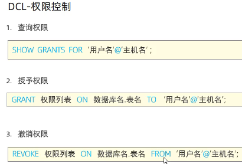
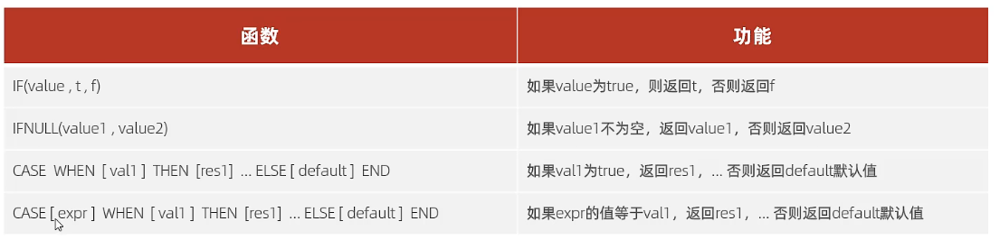
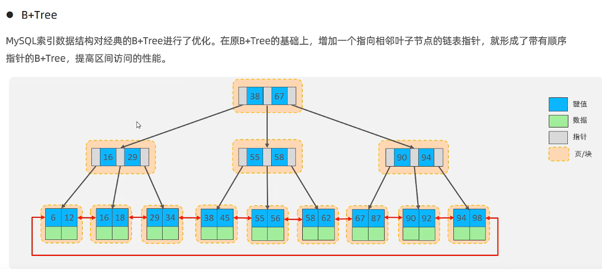
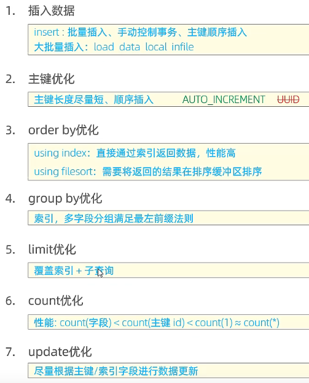

## DDL-数据库操作

```mysql
# 查询所有数据库
show databases;

# 查询当前数据库
SELECT DATABASE();

# 创建
CREATE DATABASE [IF NOT EXISTS] 数据库名 [DEFAULT CHARSET 字符集] [COLLATE 排序规则];

# 删除
DROP DATABASE [IF EXISTS] 数据库名;

# 使用
USE 数据库名;
```

## DDL-表操作

### 查询

```mysql
# 查询当前数据库所有表
SHOW TABLES;

# 查询表结构
DESC 表名;

# 查询指定表的建表语句
SHOW CREATE TABLE 表名;
```

### 创建

```mysql
CREATE TABLE 表名(
    字段1 字段1类型[COMMENT 字段1注释],
    ……
    字段n 字段n类型[COMMENT 字段n注释]
)[COMMENT 标注释];

# 示例
create tables ta_user(
    id int comment '编号',
    name varchar(50) comment '姓名',
    age int comment '年龄',
    gender varchar(1) comment '性别'
) comment '用户表';
```

### 数据类型


### 修改

```sql
# 添加字段
ALTER TABLE 表名 ADD 字段名 类型(长度) [COMMENT 注释] [约束];

# 修改数据类型
ALTER TABLE 表名 MODIFY 字段名 新数据类型(长度);

# 修改字段名和字段类型
ALTER TABLE 表名 CHANGE 旧字段名 新字段名 类型(长度) [COMMENT 注释] [约束]; 

# 修改表名
ALTER TABLE 表名 RENAME TO 新表名;

# 删除字段
ALTER TABLE 表名 DROP 字段名;

# 删除表
DROP TABLE[IF EXISTS] 表名;

# 删除并重新创建该表
TRUNCATE TABLE 表名;
```

## DML-数据操作

### DML-添加数据

```sql
# 指定字段添加数据
INSERT INTO 表名(字段1，字段2，……) VALUES(值1,值2,……);

# 给全部字段添加数据
INSERT INTO 表名 VALUES(值1,值2,……);

# 批量添加数据
INSERT INTO 表名(字段1，字段2，……) VALUES(值1,值2,……),(值1,值2,……),(值1,值2,……);
```

### DML-修改数据

```
UPDATE 表名 SET 字段名1 = 值1, 字段名2 = 值2,……[WHERE 条件];
```

### DML-删除数据

```mysql
DELETE FROM 表名 [WHERE 条件]
```

## DQL

数据查询语言

```sql
SELECT 字段列表 FROM 表名列表 WHERE 条件列表 
GROUP BY 分组字段列表 HAVING 分组后条件列表
ORDER BY 排序字段列表
LIMIT 查询结果的索引值(默认从0开始),查询结果返回的数量
```

### 条件查询WHERE


### 聚合函数

```mysql
-- 统计员工数量
select count(*) from emp;

-- 统计员工平均年龄
select avg(age) from emp;

-- 最大值和最小值
max()
min()

-- 统计西安地区员工年龄之和
select sum(age) from emp where workaddress = '西安';

```


### 分组查询GROUP BY

```sql
-- 根据性别分组，统计男性员工和女性员工数量
select gender，count(*) from emp group by gender;
/*
gender count
男     7
女     9
*/


-- 查询年龄小于45的员工，并根据工作地址分组，获取员工数量大于等于3的工作地址
select workaddress count(*) from emp where age < 45 group by workaddress having count(*) > 3
```


### 排序查询ORDER BY


### 分页查询


### DQL执行顺序


```mysql
-- 案例：
-- 查询年龄为20，21，22，23岁的女性员工信息
select * from emp where gender = '女' and age in(20,21,22,23);

-- 查询性别为男，并且年龄在20-40岁以内的姓名为三个字的员工。
select * from emp where gender = '男' and (age between 20 and 40) and name like '___';

-- 查询所有年龄小于等于35岁员工的姓名和年龄,并对查询结果按年龄升序排序，如果年龄相同按入职时间降序排序。
select name,age from emp where age <= 35 order by age asc, entrydate desc;


```


## DCL

数据控制语言


```mysql
-- 创建用户 itcast,只能再当前主机localhost访问，密码123456;
create user 'itcast'@'localhost' identified by '123456';

-- 创建用户 heima,可以在任意主机访问该数据库，密码123456;
create user 'heima'@'%' identified by '123456';

-- 修改用户 heima 的访问密码为 1234;
alter user 'heima'@'%' identified with mysql_native_password by '1234';

-- 删除itcast@localhost用户
drop user 'itcast'@'localhost';
```


```mysql

```




## 函数


```mysql
-- 通过数据库函数，生成一个六位数的随机验证码
select lpad(round(rand()*10000000,0),6,'0')
```


### 流程函数



```mysql
select ifnull(null,'Default');
-- 返回 Default


-- 查询emp表的员工姓名和工作地址（工作地址为北京/上海，返回一线城市。工作地址为其他，返回二线城市）

select
	name,
	(case workaddress when '北京' then '一线城市' when '上海' then '一线城市' else '二线城市' end) as '工作地址'
from emp;


-- 案例:统计班级各个学员的成绩,展示的规则如下:
-- >= 85，展示优秀
-- >= 60，展示及熬
-- 否则，展示不及格

select
	id,
	name,
	(case when math >= 85 then '优秀' when math >= 60 then '及格' else '不及格' end) as '数学'),
	(case when english >= 85 then '优秀' when english >= 60 then '及格' else '不及格' end) as '英语'),
	(case when chinese >= 85 then '优秀' when chinese >= 60 then '及格' else '不及格' end) as '语文')
from score;

```


## 约束

作用于**表中字段**上的规则，用于限制存储在表中的数据。

作用：保证数据库中数据的正确、有效性和完整性。


示例

| 字段     | 字段含义   | 字段类型        | 约束条件          | 约束关键字                      |
| ------ |:------:| ----------- | ------------- | -------------------------- |
| id     | ID唯一标识 | int         | 主键，并且自动增长     | PRIMARY KEY,AUTO_INCREMENT |
| name   | 姓名     | varchar(10) | 不为空，并且唯一      | NOT NULL,UNIQUE            |
| age    | 年龄     | int         | 大于0，并且小于等于120 | CHECK                      |
| status | 状态     | char(1)     | 默认为1          | DEFAULT                    |
| gender | 性别     | char(1)     | 无             |                            |

```sql
create table user(
    id int primary key auto_increment comment '主键',
    name varchar(10) not null unique comment '姓名',
    age int check(age > 0 && age <= 120) comment '年龄',
    status char(1) default '1' comment '状态',
    gender char(1) comment '性别'
)comment '用户表';


insert into user(name,age,status,gender) 
values('tom1',19,'1','男'),
('tom2',25,'0','男');
```

### 外键约束

让两张表的数据之间建立连接，从而保证数据的一致性和完整性。

```sql
alter table [表名] add constraint [外键名字] foreign key [外键字段名]
references [主表列名];
alter table [表名] drop foreign key [外键名字];
```

| 行为        | 说明                                                       |
|:---------:| -------------------------------------------------------- |
| NO ACTION | 当在父表中删除/更新对应记录时，首先检查该记录是否有对应外键，如果有则不允许删除/更新。与RESTRICT一致。 |
| RESTRICT  | 当在父表中删除/更新对应记录时，首先检查该记录是否有对应外键，如果有则不允许删除/更新。             |
| CASCADE   | 当在父表中删除/更新对应记录时，首先检查该记录是否有对应外键，如果有，则也删除/更新外键在子表的记录。      |
| SET NULL  | 当在父表中删除对应记录时，首先检查该记录是否有对应外键，如果有则设置子表中该外键值为null。          |

```sql
ALTER TABLE 表名 ADD CONSTRAINT 外键名称 FOREIGN KEY 外键字段 
REFERENCES 主表名(主表字段名) ON UPDATE CASCADE ON DELETE CASCADE;
```

### 多表查询

#### 一对多


#### 多对多


创建中间表

```sql
create table student_course(
    id int auto_increament comment '主键' primary key,
    studentid int not null comment '学生ID',
    courseid int not null comment '课程ID',
    constraint fk_courseid foreign key (courseid) 
references course (id),
    constraint fk_courseid foreign key (studentid) 
references student (id)
)comment '学生课程中间表';

insert into student_course values (null,1,1),(null,1,2),
(null,1,3),(null,2,2),(null,2,3),(null,3,4);
```

#### 连接查询-内连接

内连接查询两张表交集部分。


#### 连接查询-外连接

外连接


左连接中，若表2中有些数据没有匹配项，则返回结果时，那些行中的表2字段返回null。


#### 连接查询-自连接

```sql
-- 隐式自连接，查询员工 及其 所属领导的名字 ，自连接必须起别名
select a.name, b.name from emp a, emp b where a.managerid = b.id;

-- 显示自连接，查询所有员工emp 及其领导的名字emp,如果员工没有领导，也需要查询出来
select a.name '员工', b.name '领导' from emp a left join emp b on a.managerid = b.id;
```

#### 连接查询-union，union all


### 子查询


```mysql
-- 列子查询

-- 查询 销售部 和 市场部 的所有员工信息
select * from emp where dept_id in (select id from dept where name = '销售部' or name = '市场部');


-- 查询比 财务部 所有人工资都高的员工信息
select * from emp where salary > all(select salary from emp where dept_id = (select id from dept where name = '财务部'));

-- 查询比 研发部 其中任意一人工资高的员工信息
select * from emp where salary > any(select salary from emp where dept_id = (select id from dept where name = '研发部'));


-- 行子查询

-- 查询与 张无忌 的薪资及直属领导相同的员工信息

select * from emp where (salary,managerid) = (select salary,managerid from emp where name = '张无忌');


```


## 事务

事务是一组操作的集合，它是一个不可分割的工作单位，事务会把所有的操作作为一个整体一起向系统提交或撤销操作请求，即这些操作要么**同时成功，要么同时失败**。


```sql
-- 查看提交方式，1自动，0手动
select @@autocommit;

-- 设置手动提交
set @@autocommit = 0;


-- 提交事务
commit;

-- 回滚事务
```

### 事务的四大特性


### 并发事务


### 事务隔离级别

`√`表示会出现问题

`x`表示不会出现问题


# 存储引擎


存储引擎就是存储数据，建立索引，更新/查询数据等技术的实现方式。存储引擎是基于表的，而不是基于库的，所以存储引擎也被称为表类型。

在创建表时，指定存储引擎

```sql
create table 表名(

)ENGINE = INNODB[COMMENT 标注释];


-- 查询当前数据库支持的存储引擎
show engines;
```

# 索引

帮助mysql**高效获取数据**的**数据结构（有序）**。索引在**存储引擎**里。


我们平常所说的索引，如果没有特别指明，都是指B+Tree结构组织的索引。




## SQL索引性能分析

### SQL执行频率

```sql
show global status like 'Com_______';
```

### 慢查询日志

记录所有执行时间超过指定参数(long_query_time，默认10秒)的所有SQL语句日志。

在`/etc/my.cnf`中配置如下信息：

```
# 开启MySQL慢日志查询开关
slow_query_log = 1

# 设置慢日志的时间为2秒，SQL语句执行时间超过2秒被视为慢查询，记录
long_query_time = 2
```

慢查询日志文件

`/var/lib/mysql/localhost-slow.log`

### profile详情

show profiles能够帮助我们了解SQL语句的耗时。

```sql
# 查看每一条SQL的耗时基本情况
show profiles;


# 查看指定query_id的SQL语句各个阶段的耗时情况
show profile for query query_id;


# 查看指定query_id的sql语句CPU的使用情况
show profile cpu for query query_id;
```

### explain执行计划


### 验证索引效率

建立索引

```sql
create index 索引名 on 表名(字段名);
```

```sql
-- 在未建立索引之前，执行如下sql语句，查看sql的耗时。
select * from tb_sku where sn='10001';

-- 针对字段创建索引
```

### 最左前缀法则

如果索引了多列(联合索引)，要遵守最左前缀法则。最左前缀法则指的是查询从索引的最左列开始，并且不跳过索引中的列。
如果跳跃某一列，索引将部分失效(后面的字段索引失效)。

## 索引使用

- 不要在索引列上运算，索引会失效。

- 字符串类型字段使用时，不加引号，索引将失效

- 模糊查询：如果头部模糊匹配，索引会失效。

- or连接的条件：用or分割开的条件，前面有索引，后面没有索引，索引会失效。

- 如果MySQL评估索引比全表查询慢，则不会使用索引。

- 

### 覆盖索引


### 前缀索引

### 单列索引和联合索引

尽量使用联合索引

```sql
create unique index idx_phone_name on tb_user(phone, name);
```

## 设计原则

1.针对于数据量较大，且查询比较频繁的表建立索引。
2． 针对于常作为查询条件（where)、排序（order by)、分组(group by)操作的字段建立索引。
3.尽量选择区分度高的列作为索引，尽量建立唯一索引，区分度越高，使用索引的效率越高。
4．如果是字符串类型的字段，字段的长度较长，可以针对于字段的特点，建立前缀索引。
5．尽量使用联合索引，减少单列索引，查询时，联合索引很多时候可以覆盖索引，节省存储空间，避免回表，提高查询效率。
6．要控制索引的数量，索引并不是多多益善，索引越多，维护索引结构的代价也就越大，会影响增删改的效率。
7．如果索引列不能存储NULL值，请在创建表时使用NOTNULL约束它。当优化器知道每列是否包含NULL值时，它可以更好地确定哪个索引最有效地用于查询。

# SQL优化

## 插入数据

### insert优化

1. 手动提交事务

```sql
start transaction
insert into tb_test values(1,'tom'),(2,'Cat'),(3,'jerry');
insert into tb_test values(4,'Tom'),(5,'Cat'),(6,'jerry');
commit;
```

2. 主键顺序插入

### 大批量插入数据

```sql
# 客户端连接服务端时，加上参数 --local-infile
mysql--local-infile -u root -p

# 设置全局参数local_infile为1，开启从本地加载文件导入数据的开关
set global local_infile = 1;

# 执行load指令将准备好的数据，加载到表结构中
load data local infile '/root/sql1.log' into table 'tb_user' fields terminated by ',' lines terminated by '\n';
```

## 主键优化

在InnoDB存储引擎中，表数据都是根据**主键顺序**组织存放的，这种存储方式的表称为索引组织表(index organized table IOT)。


## order by优化

用索引排序优化

## group by优化

通过索引来提高效率

需要满足最左前缀法则

## limit优化

## count优化


## update优化

更新索引字段，否则行锁->表锁。


