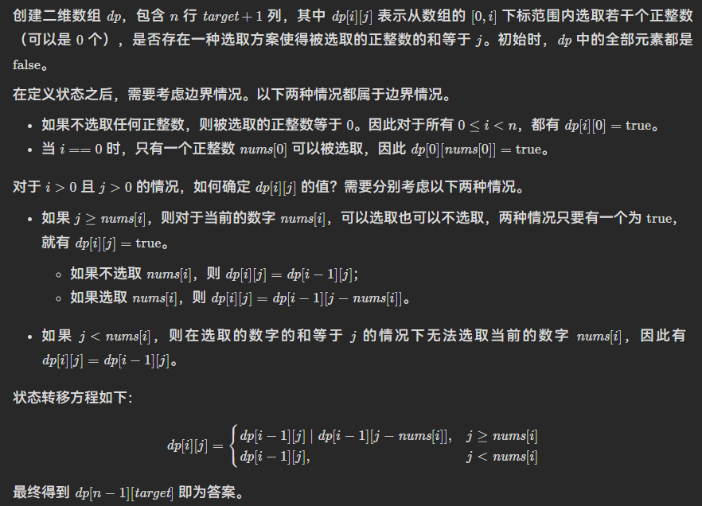

# 哈希表

哈希表-散列表， 它是基于快速存储的角度设计的，也是一种典型的“空间换时间”的做法。


```c
 #include <unordered_map>

 unordered_map<int,int> Hashmap;
```

# 动态规划(Dynamic Programming)

DP在查找有很多重叠子问题的情况的最优解时有效。

**它将问题重新组合成子问题。**

**为了避免多次解决这些子问题，它们的结果都逐渐被计算并被保存，从简单的问题直到整个问题都被解决。**因此，动态规划保存递归时的结果，因而不会在解决同样的问题时花费时间 · · · · · · 动态规划只能应用于有最优 子结构的问题。最优子结构的意思是局部最优解能决定全局最优解（对有些问题这个要求并不能完全满足，故有时需要引入一定的近似）。简单地说，问题能够分解成子问题来解决。”

通俗一点来讲，动态规划和其它遍历算法（如深/广度优先搜索）都是将原问题拆成多个子问题然后求解，他们之间最本质的区别是，动态规划保存子问题的解，避免重复计算。解决动态规划问题的关键是找到状态转移方程，这样我们可以通过计算和储存子问题的解来求解最终问题。

## 70.爬楼梯

> ```
> 假设你正在爬楼梯。需要 n 阶你才能到达楼顶。
> 
> 每次你可以爬 1 或 2 个台阶。你有多少种不同的方法可以爬到楼顶呢？
> 示例 1：
> 
> 输入：n = 2
> 输出：2
> 解释：有两种方法可以爬到楼顶。
> 1. 1 阶 + 1 阶
> 2. 2 阶
> 示例 2：
> 
> 输入：n = 3
> 输出：3
> 解释：有三种方法可以爬到楼顶。
> 1. 1 阶 + 1 阶 + 1 阶
> 2. 1 阶 + 2 阶
> 3. 2 阶 + 1 阶
> ```
> 
> ```c++
> //这是十分经典的斐波那契数列题。定义一个数组 dp，dp[i] 表示走到第 i 阶的方法数。因为
> //我们每次可以走一步或者两步，所以第 i 阶可以从第 i-1 或 i-2 阶到达。换句话说，走到第 i 阶的
> //方法数即为走到第 i-1 阶的方法数加上走到第 i-2 阶的方法数。这样我们就得到了状态转移方程
> //dp[i] = dp[i-1] + dp[i-2]。注意边界条件的处理。
> class Solution{
> public:
>     int climbStairs(int n){
>         if(n<2)return n;
>         vector<int> dp(n+1,1);
>         for(int i=2;i<=n;i++){
>             dp[i]=dp[i-1]+dp[i-2];
>         }
>         return dp[n];
>     }
> }
> ```
> 
> ```c++
> //进一步的，我们可以对动态规划进行空间压缩。因为 dp[i] 只与 dp[i-1] 和 dp[i-2] 有关，因此
> //可以只用两个变量来存储 dp[i-1] 和 dp[i-2]，使得原来的 O(n) 空间复杂度优化为 O(1) 复杂度。
> class Solution{
> public:
>     int climbStairs(int n){
>         if(n<2)return n;
>         int pre1=2,pre2=1,cur;
>         for(int i=2;i<n;i++){
>             cur=pre1+pre2;
>             pre2=pre1;
>             pre1=cur;
>         }
>         return cur;
>     }
> }
> ```

## 122.Best Time to Buy and Sell Stock II (Easy)

```
给定一个数组 prices ，其中 prices[i] 表示股票第 i 天的价格。
在每一天，你可能会决定购买和/或出售股票。你在任何时候最多只能持有一股股票。你也可以购买它，然后在同一天出售。
返回你能获得的最大利润 。
输入: prices = [7,1,5,3,6,4]
输出: 7
解释: 在第 2 天（股票价格 = 1）的时候买入，在第 3 天（股票价格 = 5）的时候卖出, 这笔交易所能获得利润 = 5-1 = 4 。
     随后，在第 4 天（股票价格 = 3）的时候买入，在第 5 天（股票价格 = 6）的时候卖出, 这笔交易所能获得利润 = 6-3 = 3 。
```

```c++
//122. Best Time to Buy and Sell Stock II (Easy)
class Solution {
public:
    int maxProfit(vector<int>& prices) {
        int n=prices.size();
        int dp[n][2];
        dp[0][0]=0;
        dp[0][1]=-prices[0];
        for(int i=1;i<n;i++){
            dp[i][0]=max(dp[i-1][0],dp[i-1][1]+prices[i]);
            dp[i][1]=max(dp[i-1][1],dp[i-1][0]-prices[i]);
        }
        return dp[n-1][0];
    }
};
```

## 221.最大正方形

> 在一个由 '0' 和 '1' 组成的二维矩阵内，找到只包含 '1' 的最大正方形，并返回其面积。 
> 
> 示例 1：
> 
> 输入：matrix = [
> 
> ["1","0","1","0","0"],
> 
> ["1","0","1","1","1"],
> 
> ["1","1","1","1","1"],
> 
> ["1","0","0","1","0"]]
> 输出：4

```
我们知道，该点为右下角的正方形的最大边长，最多比它的上方，左方和左上方为右下角的正方形的边长多1，最好的情况是是它的上方，左方和左上方为右下角的正方形的大小都一样的，这样加上该点就可以构成一个更大的正方形。 但如果它的上方，左方和左上方为右下角的正方形的大小不一样，合起来就会缺了某个角落，这时候只能取那三个正方形中最小的正方形的边长加1了。假设dpi表示以i,j为右下角的正方形的最大边长，则有 dp[i][j] = min(dp[i-1][j-1], dp[i-1][j], dp[i][j-1]) + 1 当然，如果这个点在原矩阵中本身就是0的话，那dp[i]肯定就是0了。
```

```c++
class Solution {
public:
    int maximalSquare(vector<vector<char>>& matrix){
        int m=matrix.size(),n=matrix[0].size(),max_side=0;
        vector<vector<int>> dp(m+1,vector<int>(n+1,0));
        for(int i=1;i<=m;i++){
            for(int j=1;j<=n;j++){
                if(matrix[i-1][j-1]=='1')
                    dp[i][j]=min(dp[i-1][j-1],min(dp[i-1][j],dp[i][j-1]))+1;
                max_side=max(max_side,dp[i][j]);
            }
        }
        return max_side * max_side;
    }
}
```

## 背包问题

背包问题是一种组合优化的 NP 完全问题：有 N 个物品和容量为 W 的背包，每个物品都有自己的体积 w 和价值 v，求拿哪些物品可以使得背包所装下物品的总价值最大。如果限定每种物品只能选择 0 个或 1 个，则问题称为 0-1 背包问题；如果不限定每种物品的数量，则问题称为无界背包问题或完全背包问题。

dp[i][j] 表示前 i 件物品体积不超过 j 的情况下能达到的最大价值。在我们遍历到第 i 件物品时，在当前背包总容量为 j 的情况下，如果我们不将物品 i 放入背包，那么 dp[i][j]= dp[i-1][j]，即前 i 个物品的最大价值等于只取前 i-1 个物品时的最大价值；如果我们将物品 i 放入背包，假设第 i 件物品体积为 w，价值为 v，那么我们得到 dp[i][j] = dp[i-1][j-w] + v。我们只需在遍历过程中对这两种情况取最大值即可，总时间复杂度和空间复杂度都为 O(NW)。

```cpp
int knapsack(vector<int> weights vector<int> values,int N,int W){
    vector<vector<int>> dp(N+1,vector<int>(W+1,0));
    for(int i=1;i<=N;i++){
        int w = weights[i-1],v=values[i-1];
        if(int j = 1;j<=W;j++){
            if(j>=w){
               dp[i][j]=max(dp[i-1][j],dp[i-1][j-w]+v);     
            }else{
                dp[i][j]=dp[i-1][j];
            }
        }
    }
    return dp[N][W];  
}
```

        在完全背包问题中，一个物品可以拿多次。如图上半部分所示，假设我们遍历到物品i=2，且其体积为w=2，价值为v=3；对于背包容量j=5，最多只能装下2个该物品。那我们的状态转移方程就变成了dp[2][5]=max（dp[1][5],dp[1][3]+3,dp[1][1]+6)。如果采用这种方法，假设背包容量无穷大而物体的体积无穷小，我们这里的比较次数也会趋近于无穷大，远超O(NW)的时间复杂度。

        dp[i][j]表示前i件物品体积不超过j的情况下能达到的最大价值，所以在 dp[2][3] 的时候我们其实已经考虑了 dp[1][3] 和 dp[1][1]+6的情况。因此，对于拿多个物品的情况，我们只需考虑 dp[2][3] 即可，即dp[2][5]

状态转移方程

## 416.分割等和子集

给你一个只包含正整数的非空数组nums。请你判断是否可以将这个数组分割成两个子集，使得两个子集的元素和相等。

> 示例 1：
> 
> 输入：nums = [1,5,11,5]
> 输出：true
> 解释：数组可以分割成 [1, 5, 5] 和 [11] 。

> 示例 2：
> 
> 输入：nums = [1,2,3,5]
> 输出：false
> 解释：数组不能分割成两个元素和相等的子集。



```
class Solution {
public:
    bool canPartition(vector<int>& nums) {
        int sum=accumulate(nums.begin(),nums.end(),0);
        if(sum%2!=0)
            return false;
        int target=sum/2,n=nums.size();
        vector<vector<bool>> dp(n,vector<bool>(target+1,false));
        for(int i=0;i<n;i++){
            dp[i][0]=true;
        }
        for(int i=1;i<n;i++){
            for(int j=1;j<=target;j++){
                if(j>=nums[i]){
                    dp[i][j]=(dp[i-1][j] | dp[i-1][j-nums[i]]);
                }else{
                    dp[i][j]=dp[i-1][j];
                }
            }
        }
        return dp[n-1][target];
    }
};
```

## 474.一和零

给你一个二进制字符串数组 strs 和两个整数 m 和 n 。

请你找出并返回 strs 的最大子集的长度，该子集中 最多 有 m 个 0 和 n 个 1 。

如果 x 的所有元素也是 y 的元素，集合 x 是集合 y 的 子集 。

> 示例 1：
> 
> 输入：strs = ["10", "0001", "111001", "1", "0"], m = 5, n = 3
> 输出：4
> 解释：最多有 5 个 0 和 3 个 1 的最大子集是 {"10","0001","1","0"} ，因此答案是 4 。
> 其他满足题意但较小的子集包括 {"0001","1"} 和 {"10","1","0"} 。{"111001"} 不满足题意，因为它含 4 个 1 ，大于 n 的值 3 。
> 示例 2：
> 
> 输入：strs = ["10", "0", "1"], m = 1, n = 1
> 输出：2
> 解释：最大的子集是 {"0", "1"} ，所以答案是 2 。

题解：dp[k][i][j]代表前K个子集中最多存在i个0和j个1的子集长度。

- 当前k个子集中，0或1的个数＞i或j,dp[k][i][j]=dp[k-1][i][j]；

- 当前k个子集中，0或1的个数≤i或j，则dp[k][i][j]=dp[k-1][i-count[k]][j-count[k]]+1；

```cpp
class Solution{
public:

int findMaxForm(vector<string>& strs, int m, int n){
    int s=strs.size();
    vector<vector<vector<int>>> dp(s+1,vector<vector<int>>(m+1,vector<int>(n+1,0)));
    for(int k=1;k<=s;k++){
        auto p=count(strs[k-1]);
        cout<<p.first<<endl;
        for(int i=0;i<=m;i++){
            for(int j=0;j<=n;j++){
                if(i>=p.first && j>=p.second){
                    dp[k][i][j]=max(dp[k-1][i][j],dp[k-1][i-p.first][j-p.second]+1);
                }else{
                    dp[k][i][j]=dp[k-1][i][j];
                }
            }
        }             
    }  
    return dp[s][m][n];
}
pair<int,int> count(const string &str){
    int count0=str.length(),count1=0;
    for(const char &c:str){
        if(c == '1'){
            ++count1;
            --count0;
        }
    }
    return make_pair(count0,count1);
}

};
```

## 322. 零钱兑换

给你一个整数数组 coins ，表示不同面额的硬币；以及一个整数 amount ，表示总金额。

计算并返回可以凑成总金额所需的 最少的硬币个数 。如果没有任何一种硬币组合能组成总金额，返回 -1 。

你可以认为每种硬币的数量是无限的。

> 示例 1：
> 
> 输入：coins = [1, 2, 5], amount = 11
> 输出：3 
> 解释：11 = 5 + 5 + 1
> 示例 2：
> 
> 输入：coins = [2], amount = 3
> 输出：-1
> 示例 3：
> 
> 输入：coins = [1], amount = 0
> 输出：0

题解：dp[i]表示金额为i时的最少硬币数。状态转移方程：dp[i]=min(dp[i],dp[i-c]);c为当前数组元素。

```cpp
class Solution {
public:
    int coinChange(vector<int>& coins, int amount) {
        int m=coins.size();
        vector<int> dp(amount+1,amount+1);//dp[i]表示金额为i的最少硬币数
        dp[0]=0;
        for(int i=1;i<=amount;i++){    
            for(auto &c:coins){
                if(i>=c)
                    dp[i]=min(dp[i],dp[i-c]+1);
            }
        }
        return dp[amount]==amount+1?-1:dp[amount];
    }
};
```

dfs+剪枝(有些用例通不过，且时间会超时)

```cpp
class Solution {
public:
    int coinChange(vector<int>& coins, int amount) {
        sort(coins.begin(),coins.end(),greater<int>());
        for(auto &c:coins){
            cout<<c;
        }
        int m=coins.size();
        int res=amount+2;
        for(int i=0;i<m;i++){
            dfs(i,0,res,coins,amount);
        }
        return res==amount+2?-1:res;

    }
    void dfs(int i,int num,int &res,vector<int>& coins,int amount){
        if(amount==0){
            res=min(res,num);
            return;
        }
        for(int j=i;j<coins.size();j++){
            // 剩下最大面值*剩余硬币数<amount
            if((res-num)*coins[j]<amount)
                break;
            if(coins[j]>amount)
                continue;
            dfs(j,num+1,res,coins,amount-coins[j]);
        }
    }
};
```

## 72. 编辑距离(Hard)

编辑距离算法被数据科学家广泛应用，是用作机器翻译和语音识别评价标准的基本算法。

最直观的方法是暴力检查所有可能的编辑方法，取最短的一个。所有可能的编辑方法达到指数级，但我们不需要进行这么多计算，因为我们只需要找到距离最短的序列而不是所有可能的序列。

方法一：动态规划
思路和算法

我们可以对任意一个单词进行三种操作：

- 插入一个字符；

- 删除一个字符；

- 替换一个字符。

题目给定了两个单词，设为 A 和 B，这样我们就能够六种操作方法。

但我们可以发现，如果我们有单词 A 和单词 B：

对单词 A 删除一个字符和对单词 B 插入一个字符是等价的。例如当单词 A 为 doge，单词 B 为 dog 时，我们既可以删除单词 A 的最后一个字符 e，得到相同的 dog，也可以在单词 B 末尾添加一个字符 e，得到相同的 doge；

同理，对单词 B 删除一个字符和对单词 A 插入一个字符也是等价的；

对单词 A 替换一个字符和对单词 B 替换一个字符是等价的。例如当单词 A 为 bat，单词 B 为 cat 时，我们修改单词 A 的第一个字母 b -> c，和修改单词 B 的第一个字母 c -> b 是等价的。

这样以来，本质不同的操作实际上只有三种：

在单词 A 中插入一个字符；

在单词 B 中插入一个字符；

修改单词 A 的一个字符。

这样以来，我们就可以把原问题转化为规模较小的子问题。我们用A=`horse`，B = `ros` 作为例子，来看一看是如何把这个问题转化为规模较小的若干子问题的。

在单词 A 中插入一个字符：如果我们知道 `horse` 到 `ro` 的编辑距离为 a，那么显然 `horse`到 `ros` 的编辑距离不会超过 a + 1。这是因为我们可以在 a 次操作后将 `horse`和 `ro` 变为相同的字符串，只需要额外的 1 次操作，在单词 A 的末尾添加字符 `s`，就能在 a + 1 次操作后将 `horse`和 `ro`变为相同的字符串；

在单词 B 中插入一个字符：如果我们知道 `hors`到 `ros`的编辑距离为 b，那么显然 `horse` 到 `ros`的编辑距离不会超过 b + 1，原因同上；

修改单词 A 的一个字符：如果我们知道 `hors` 到 `ro` 的编辑距离为 c，那么显然 `horse` 到 `ros` 的编辑距离不会超过 c + 1，原因同上。

那么从 `horse` 变成 `ros` 的编辑距离应该为 `min(a + 1, b + 1, c + 1)`。

注意：为什么我们总是在单词 A 和 B 的末尾插入或者修改字符，能不能在其它的地方进行操作呢？答案是可以的，但是我们知道，操作的顺序是不影响最终的结果的。例如对于单词 `cat`，我们希望在 `c` 和 `a` 之间添加字符 `d` 并且将字符 `t` 修改为字符 `b`，那么这两个操作无论为什么顺序，都会得到最终的结果 cdab。

你可能觉得 horse 到 ro 这个问题也很难解决。但是没关系，我们可以继续用上面的方法拆分这个问题，对于这个问题拆分出来的所有子问题，我们也可以继续拆分，直到：

字符串 A 为空，如从` `转换到 `ro`，显然编辑距离为字符串 B 的长度，这里是 2；

字符串 B 为空，如从 `horse` 转换到` `，显然编辑距离为字符串 A 的长度，这里是 5。

因此，我们就可以使用动态规划来解决这个问题了。我们用 `dp[i][j]` 表示 A 的前 `i`个字母和 B 的前 `j` 个字母之间的编辑距离。

```cpp
class Solution {
public:
    int minDistance(string word1, string word2) {
        int m=word1.size(),n=word2.size();
        //特殊情况：如果m和n有一个为0，则最少操作数为它们的最大值。
        if(!(m && n)){
            return max(m,n);
        }
        vector<vector<int>> dp(m+1,vector<int>(n+1,0));
        for(int i=1;i<=m;i++){
            dp[i][0]=i;
            for(int j=1;j<=n;j++){
                dp[0][j]=j;
                //注意word1[i-1]表示的是word1第i个位置元素。与dp[i][]对应。
                //所以这里是word[i-1]==word2[j-1]而不是word[i]==word2[j]
                if(word1[i-1]==word2[j-1])
                    dp[i][j]=dp[i-1][j-1];
                else{
                    dp[i][j]=min(dp[i-1][j-1]+1,min(dp[i-1][j]+1,dp[i][j-1]+1));
                }
            }
        }
        return dp[m][n];
    }
};
```

## 583.两个字符串的删除操作

 给定两个单词 `word1` 和 `word2` ，返回使得 `word1` 和  `word2` **相同**所需的**最小步数**。

**每步** 可以删除任意一个字符串中的一个字符。

> 示例 1：
> 
> 输入: word1 = "sea", word2 = "eat"
> 输出: 2
> 解释: 第一步将 "sea" 变为 "ea" ，第二步将 "eat "变为 "ea"
> 示例  2:
> 
> 输入：word1 = "leetcode", word2 = "etco"
> 输出：4

```cpp
 class Solution {
public:
    int minDistance(string word1, string word2) {
        /*
            dp[i][j]代表word1到i位置，word2到j位置两个字符串相同需要的最小步数
            ①位置i和位置j字母相同，则dp[i][j]=dp[i-1][j-1];
            ②位置i和位置j字母不相同，删除位置i/j,则dp[i][j]=dp[i-1][j]+1/dp[i][j]=dp[i][j-1]+1;
            考虑边界问题：dp[0][j]=j;dp[i][0]=i。
        */
        int m=word1.size(),n=word2.size();
        vector<vector<int>> dp(m+1,vector<int>(n+1,0));
        for(int i=1;i<=m;i++){
            for(int j=1;j<=n;j++){
                dp[i][0]=i;
                dp[0][j]=j;
                if(word1[i-1]==word2[j-1]){
                    dp[i][j]=dp[i-1][j-1];
                }else{
                    dp[i][j]=min(dp[i-1][j]+1,dp[i][j-1]+1);
                }
            }
        }
        return dp[m][n];
    }
};
```

## 10.正则表达式匹配

  给你一个字符串 s 和一个字符规律 p，请你来实现一个支持 '.' 和 '*' 的正则表达式匹配。

'.' 匹配任意单个字符
'*' 匹配零个或多个前面的那一个元素
所谓匹配，是要涵盖 整个 字符串 s的，而不是部分字符串。

> 示例 1：
> 
> 输入：s = "aa", p = "a"
> 输出：false
> 解释："a" 无法匹配 "aa" 整个字符串。
> 示例 2:
> 
> 输入：s = "aa", p = "a*"
> 输出：true
> 解释：因为 '*' 代表可以匹配零个或多个前面的那一个元素, 在这里前面的元素就是 'a'。因此，字符串 "aa" 可被视为 'a' 重复了一次。
> 示例 3：
> 
> 输入：s = "ab", p = ".*"
> 输出：true
> 解释：".*" 表示可匹配零个或多个（'*'）任意字符（'.'）。
> 
> - `1 <= s.length <= 20`
> - `1 <= p.length <= 30`
> - `s` 只包含从 `a-z` 的小写字母。
> - `p` 只包含从 `a-z` 的小写字母，以及字符 `.` 和 `*`。
> - 保证每次出现字符 `*` 时，前面都匹配到有效的字符

```cpp
class Solution{
public:
    bool isMatch(string s,string p){
        int m=s.size(),n=p.size();
        vector<vector<bool>> dp(m+1,vector<int>(n+1,false);
        //dp[i][j]表示p的前j个位置的正则化表达式能否匹配s的前i个字符串
        //边界条件：dp[0][0]=true;两个空字符串是可以匹配的。
        for(int i=1;i<=n;i++){
            if(p[i-1]=='*')
                dp[0][i]=dp[0][i-2];
        }
        for(int i=1;i<=m;i++){
            for(int j=1;j<=n;j++){
                //.匹配任意单个字符，所以dp[i][j]=dp[i-1][j-1]
                if(p[i-1]=='.')
                    dp[i][j]=dp[i-1][j-1];
                //当p[j-1]和s[i-1]都为字母时，
                //dp[i][j]=dp[i-1][j-1]&&s[i-1]==p[j-1]
                else if(p[i-1]!='*')
                    dp[i][j]=dp[i-1][j-1]&&s[i-1]==p[j-1];
                //当p[j-2]p[j-1]!=".*",即p[j-2]p[j-1]=="{字母}*"
                //dp[i][j]=dp[i][j-2];
                else if(s[i-1]!=p[j-2] && p[j-2]!='.')
                    dp[i][j]=dp[i][j-2];
                /***剩余情况p[j-2]p[j-1]==".*"：
                ①s="abc",p="a.*",dp[i][j]=dp[i-1][j];
                ②s="ac",p="a.*",dp[i][j]=dp[i][j-1];
                ③s="a",p="a.*",dp[i][j]=dp[i][j-2];
                ***/
                else
                    dp[i][j]==dp[i][j]= dp[i][j-1] || dp[i-1][j] ||dp[i][j-2];
            }
        }
    }  
    return dp[m][n];      
};
```

## 股票交易

## 309. 最佳买卖股票时机含冷冻期

给定一个整数数组prices，其中第  prices[i] 表示第 i 天的股票价格 。​

设计一个算法计算出最大利润。在满足以下约束条件下，你可以尽可能地完成更多的交易（多次买卖一支股票）:

卖出股票后，你无法在第二天买入股票 (即冷冻期为 1 天)。
注意：你不能同时参与多笔交易（你必须在再次购买前出售掉之前的股票）。

```cpp
class Solution {
public:
    int maxProfit(vector<int>& prices) {
        int s=prices.size();
        if(s<=1)
            return 0;
        //dp[i][0]第i天持有股票->dp[i][1]第i天没有股票且不在冷冻期->frozen[i]第i天处于冷冻期
        vector<vector<int>> dp(s,vector<int>(2,0));
        vector<int> frozen(s,0);
        dp[0][0]=-prices[0];
        for(int i=1;i<s;i++){
            dp[i][0]=max(dp[i-1][0],frozen[i-1]-prices[i]);
            dp[i][1]=dp[i][0]+prices[i];
            frozen[i]=max(frozen[i-1],dp[i-1][1]);
            }
        return max(dp[s-1][1],frozen[s-1]);
    }
};
```

## 714. 买卖股票的最佳时机含手续费

难度中等805收藏分享切换为英文接收动态反馈

给定一个整数数组 `prices`，其中 `prices[i]`表示第 `i` 天的股票价格 ；整数 `fee` 代表了交易股票的手续费用。

你可以无限次地完成交易，但是你每笔交易都需要付手续费。如果你已经购买了一个股票，在卖出它之前你就不能再继续购买股票了。

返回获得利润的最大值。

> 注意：这里的一笔交易指买入持有并卖出股票的整个过程，每笔交易你只需要为支付一次手续费。
> 
> **示例 1：**
> 
> 输入：prices = [1, 3, 2, 8, 4, 9], fee = 2
> 输出：8
> 解释：能够达到的最大利润:  
> 在此处买入 prices[0] = 1
> 在此处卖出 prices[3] = 8
> 在此处买入 prices[4] = 4
> 在此处卖出 prices[5] = 9
> 总利润: ((8 - 1) - 2) + ((9 - 4) - 2) = 8
> 
> **示例 2：**
> 
> 输入：prices = [1,3,7,5,10,3], fee = 3
> 输出：6

```cpp
class Solution {
public:
    int maxProfit(vector<int>& prices, int fee) {
        int s = prices.size();
        if(s<=1)
            return 0;
        //  dp[i][0] 第i天持有股票；dp[i][1] 第i天不持有股票
        vector<vector<int>> dp(s+1,vector<int>(2,0));
        dp[0][0] = - prices[0] - fee;
        for(int i=1;i<=s;i++){
            dp[i][0] = max(dp[i-1][1] - prices[i-1] - fee, dp[i-1][0]);
            dp[i][1] = max(dp[i-1][0] + prices[i-1], dp[i-1][1]);
            cout<<dp[i][0]<<" "<<dp[i][1]<<endl;
        }
        return dp[s][1];
    }
};
```

优化后代码：

```cpp
class Solution {
public:
    int maxProfit(vector<int>& prices, int fee) {
        int s = prices.size();
        if(s<=1)
            return 0;
        //  dp[0] 持有股票；dp[1] 不持有股票
        vector<int> dp(s+1,0);
        dp[0] = - prices[0] - fee;
        for(int i=1;i<=s;i++){
            dp[0] = max(dp[1] - prices[i-1] - fee, dp[0]);
            dp[1] = max(dp[0] + prices[i-1], dp[1]);
        }
        return dp[1];
    }
};
```

# 二分查找

时间复杂度为`O(log n)`

**求左边界：向下取整，等号归右，左加一
求右边界：向上取整，等号归左，右减一**
**总是右侧为所求**

求左边界

```cpp
int left = 0,right = n-1;
while(left < right){
//求左边界(注意这里不要等号)
    int mid = (left+right)>>1;//向下取整;>>1:结果右移一位，=结果/2
    if(nums[mid]>=target)
        right = mid;            //等号归右
    else
        left = mid+1;            //左加一   
}//此时right即为所求

求右边界

```c++
int left = 0,right = n-1;
while(left<right){
    int mid = (left + right +1)>>1;        //向上取整
    if(num[mid] <= target) 
        left = mid;        
    else
        right = mid-1;
}//此时right即为所求
```

## 34.在排序数组中查找元素的第一个和最后一个位置

```
给定一个按照升序排列的整数数组 nums，和一个目标值 target。找出给定目标值在数组中的开始位置和结束位置。
如果数组中不存在目标值 target，返回 [-1, -1]。
进阶：
你可以设计并实现时间复杂度为 O(log n) 的算法解决此问题吗？

示例 1：
输入：nums = [5,7,7,8,8,10], target = 8
输出：[3,4]

示例 2：
输入：nums = [5,7,7,8,8,10], target = 6
输出：[-1,-1]

示例 3：
输入：nums = [], target = 0
输出：[-1,-1]
```

```c++
class Solution {
public:
    vector<int> searchRange(vector<int>& nums, int target) {
        vector<int> result={-1,-1};
        int n=nums.size();
        //空字符串
        if(n==0){
            return result;
        }
        //求左边界
        int left=0,right=n-1,mid;
        while(left<right){
            mid=(left+right)>>1;
            if(nums[mid]>=target){
                right=mid;
            }
            else 
                left=mid+1;
        }
        if(nums[right]==target)
            result[0]=right;
        //求右边界
        left=0,right=n-1;    
        while(left<right){
            mid=(left+right+1)>>1;
            if(nums[mid]<=target){
                left=mid;
            }
            else 
                right=mid-1;           
        }
        if(nums[right]==target)
            result[1]=right;
        return result;
    }
};
```

## 81.搜索旋转排序数组Ⅱ


```c++
class Solution {
public:
    bool search(vector<int>& nums, int target) {
        int left=0,right=nums.size()-1,mid;
        while(left<=right){
            mid=(left+right)>>1;
            if(nums[mid]==target)
                return true;

            //如果无法判断哪边为递增序列，left++
            if(nums[left]==nums[mid])
                left++;

            //右序列为递增序列
            else if(nums[mid]<=nums[right]){
                if(nums[left]<=target&&target<nums[mid])
                    right=mid;
                else 
                    left=mid+1;
            }
            //左序列为递增序列
            else{
                if(nums[left]<=target&&target<nums[mid])
                    right=mid;
                else 
                    left=mid+1;
            }   
        }
    }
}
```

## 4.寻找两个有序数组的中位数

> 给定两个大小分别为 m 和 n 的正序（从小到大）数组nums1和nums2。请你找出并返回这两个正序数组的 中位数 。
> 
> 算法的时间复杂度应该为 O(log (m+n)) 。
> 
> 示例 1：
> 
> 输入：nums1 = [1,3], nums2 = [2]
> 输出：2.00000
> 解释：合并数组 = [1,2,3] ，中位数 2
> 示例 2：
> 
> 输入：nums1 = [1,2], nums2 = [3,4]
> 输出：2.50000
> 解释：合并数组 = [1,2,3,4] ，中位数 (2 + 3) / 2 = 2.5

- 使用归并的方式，合并两个有序数组，得到一个大的有序数组。大的有序数组的中间位置的元素，即为中位数。

- 不需要合并数组，只要找到中位数位置即可。由于两个数组的长度已知，因此中位数对应的两个数组的下标之和也是已知的。

维护两个指针，初始时分别指向两个数组的下标0的位置，每次将指向较小值的指针后移一位（如果一个指针已经到达数组末尾，则只需要移动另一个数组的指针），直到到达中位数的位置。

因此我们可以归纳出三种情况：

1. 如果`A[K/2-1]<B[K/2-1]`,则比`A[K/2-1]`小的数最多只有A的前`K/2-1`个数，即比`A[K/2-1]`小的数最多只有`k-2`个，因此`A[K/2-1]`不可能是第K个数，`A[0]`到`A[K/2-1]`也不可能是第k个数，可以全部排除。
2. 如果`A[K/2-1]>B[K/2-1]`，则可以排除`B[0]`到`B[K/2-1]`。
3. 如果`A[K/2-1]=B[K/2-1]`，则可以归入第一种情况处理。

可以看到，比较`A[K/2-1]`和`B[K/2-1]`后，可以排除`k/2`个不可能是第`k`小的数，查找范围缩小了一半。同时，我们将在排除后的新数组上继续进行二分查找，并且根据我们排除数的个数，减少`k`的值，这是因为我们排除的数都不大于第`k`小的数。

有以下三种情况需要特殊处理：

1. `A[K/2-1]`或者`B[K/2-1]`越界，那么我们可以选取对应数组中的最后一个元素。在这种情况下，我们必须根据排除数的个数减少k的值，而不能直接将k减去k/2。
2. 如果一个数组为空，说明该数组中的所有元素都被排除，我们可以直接返回另一个数组中第k小的元素。
3. 如果k=1,我们只要返回两个数组首元素的最小值即可。

```c++
class Solution {
public:
    int getKthElement(const vector<int>& nums1, const vector<int>& nums2, int k) {
        /* 主要思路：要找到第 k (k>1) 小的元素，那么就取 pivot1 = nums1[k/2-1] 和 pivot2 = nums2[k/2-1] 进行比较
         * 这里的 "/" 表示整除
         * nums1 中小于等于 pivot1 的元素有 nums1[0 .. k/2-2] 共计 k/2-1 个
         * nums2 中小于等于 pivot2 的元素有 nums2[0 .. k/2-2] 共计 k/2-1 个
         * 取 pivot = min(pivot1, pivot2)，两个数组中小于等于 pivot 的元素共计不会超过 (k/2-1) + (k/2-1) <= k-2 个
         * 这样 pivot 本身最大也只能是第 k-1 小的元素
         * 如果 pivot = pivot1，那么 nums1[0 .. k/2-1] 都不可能是第 k 小的元素。把这些元素全部 "删除"，剩下的作为新的 nums1 数组
         * 如果 pivot = pivot2，那么 nums2[0 .. k/2-1] 都不可能是第 k 小的元素。把这些元素全部 "删除"，剩下的作为新的 nums2 数组
         * 由于我们 "删除" 了一些元素（这些元素都比第 k 小的元素要小），因此需要修改 k 的值，减去删除的数的个数
         */

        int m = nums1.size();
        int n = nums2.size();
        int index1 = 0, index2 = 0;

        while (true) {
            // 边界情况
            if (index1 == m) {
                return nums2[index2 + k - 1];
            }
            if (index2 == n) {
                return nums1[index1 + k - 1];
            }
            if (k == 1) {
                return min(nums1[index1], nums2[index2]);
            }

            // 正常情况
            int newIndex1 = min(index1 + k / 2 - 1, m - 1);
            int newIndex2 = min(index2 + k / 2 - 1, n - 1);
            int pivot1 = nums1[newIndex1];
            int pivot2 = nums2[newIndex2];
            if (pivot1 <= pivot2) {
                k -= newIndex1 - index1 + 1;
                index1 = newIndex1 + 1;
            }
            else {
                k -= newIndex2 - index2 + 1;
                index2 = newIndex2 + 1;
            }
        }
    }

    double findMedianSortedArrays(vector<int>& nums1, vector<int>& nums2) {
        int totalLength = nums1.size() + nums2.size();
        if (totalLength % 2 == 1) {
            return getKthElement(nums1, nums2, (totalLength + 1) / 2);
        }
        else {
            return (getKthElement(nums1, nums2, totalLength / 2) + getKthElement(nums1, nums2, totalLength / 2 + 1)) / 2.0;
        }
    }
};
```

# 排序

## 选择排序

首先在未排序序列中找到最小（大）元素，存放到排序序列的起始位置。再从剩余未排序元素中继续寻找最小（大）元素，然后放到已排序序列的末尾。重复第二步，直到所有元素均排序完毕。

## 快速排序

1. `i=L,j=R`;将基准数挖出形成第一个坑`a[i]`。
2. `j--`由后向前找出比它小的数，找到后挖出此数填前一个坑`a[i]`。
3. `i++`由前向后找到比它大的数，找到后也挖出此数填到前一个坑`a[j]`中。
4. 再重复执行2、3二步，直到i==j，再将基准填入`a[j]`中。

```c++
void quick_sort(int s[], int l , int r)
{
    if(l < r){
        int i = l,i = r,x = s[l];
        while(i < j)
        {
            while(i < j && s[j] >= x)
                j--;
            if(i < j)
                s[i++] = s[j];
            while(i < j && s[i] < x)
                i++;
            if(i < j)
                s[j--] = s[i];
        }
        s[i] = x;
        quick_sort(s,l,i-1);
        quick_sort(s,i+1,r);
    }
}
```

## 75.颜色分类

> 给定一个包含红色、白色和蓝色、共 n 个元素的数组 nums ，原地对它们进行排序，使得相同颜色的元素相邻，并按照红色、白色、蓝色顺序排列。
> 
> 我们使用整数 0、 1 和 2 分别表示红色、白色和蓝色。
> 
> 必须在不使用库的sort函数的情况下解决这个问题。
> 
> 示例 1：
> 
> ```
> 输入：nums = [2,0,2,1,1,0]
> 输出：[0,0,1,1,2,2]
> ```
> 
> 示例 2：
> 
> ```
> 输入：nums = [2,0,1]
> 输出：[0,1,2]
> ```
> 
> - **你可以不使用代码库中的排序函数来解决这道题吗？**
> - **你能想出一个仅使用常数空间的一趟扫描算法吗？**

```c++
#include <iostream>
#include <vector>

using namespace std;

class Solution {
public:
    void sortColors(vector<int> &nums) {
        int size = nums.size();
        if (size < 2) {
            return;
        }

        // all in [0, zero) = 0
        // all in [zero, i) = 1
        // all in [two, len - 1] = 2

        int zero = 0;
        int two = size;
        int i = 0;
        while (i < two) {
            if (nums[i] == 0) {
                swap(nums[zero], nums[i]);
                zero++;
                i++;
            } else if (nums[i] == 1) {
                i++;
            } else {
                two--;
                swap(nums[i], nums[two]);
            }
        }
    }
};
```

## 快速选择

### 215. Kth  Largest Element in an Array

快速选择一般用于求解 k-th Element 问题，可以在 *O*(*n*) 时间复杂度，*O*(1) 空间复杂度完成求解工作。快速选择的实现和快速排序相似，不过只需要找到第 *k* 大的枢（pivot）即可，不需要对其左右再进行排序。与快速排序一样，快速选择一般需要先打乱数组，否则最坏情况下时间复杂度为 *O*(*n*2)，我们这里为了方便省略掉了打乱的步骤。

```c++
// 主函数
int findKthLargest(vector<int>& nums, int k) {
int l = 0, r = nums.size() - 1, target = nums.size() - k;
    while (l < r) {
        int mid = quickSelection(nums, l, r);
        if (mid == target) {
            return nums[mid];
        }
        if (mid < target) {
            l = mid + 1;
        } else {
            r = mid - 1;
        } 
    }
    return nums[l];
}
// 辅函数 - 快速选择
int quickSelection(vector<int>& nums, int l, int r) {
    int i = l + 1, j = r;
    while (true) {
        while (i < r && nums[i] <= nums[l]) {
            ++i;
        }
        while (l < j && nums[j] >= nums[l]) {
            --j;
        }
        if (i >= j) {
            break; 
        }
        swap(nums[i], nums[j]);
    }
    swap(nums[l], nums[j]);
    return j;
}
```

## 桶排序

### 347.前k个高频元素

> 给你一个整数数组 `nums` 和一个整数 `k` ，请你返回其中出现频率前 `k` 高的元素。你可以按 **任意顺序** 返回答案。
> 
> ```
> 示例 1:
> 输入: nums = [1,1,1,2,2,3], k = 2
> 输出: [1,2]
> 
> 示例 2:
> 输入: nums = [1], k = 1
> 输出: [1]
> ```

首先遍历整个数组，并使用哈希表记录每个数字出现的次数，并形成一个“出现次数数组”。找出原数组的前k个高频元素，就相当于找出“出现次数数组”的前k大的值。

最简单的做法是给「出现次数数组」排序。但由于可能有`O(N)`个不同的出现次数（其中`N`为原数组长度），故总的算法复杂度会达到`O(Nlog N)`，不满足题目的要求。

在这里，我们可以利用堆的思想：建立一个小顶堆，然后遍历「出现次数数组」：

如果堆的元素个数小于`k`，就可以直接插入堆中。
如果堆的元素个数等于 `k`，则检查堆顶与当前出现次数的大小。如果堆顶更大，说明至少有 `k` 个数字的出现次数比当前值大，故舍弃当前值；否则，就弹出堆顶，并将当前值插入堆中。

```c++
public:
    struct cmp{
        bool operator()(pair<int, int>& m, pair<int, int>& n) const{
            return m.second > n.second;
        }
    };

    vector<int> topKFrequent(vector<int>& nums, int k) {
        unordered_map<int, int> occurrences;
        for (auto& v : nums) {
            occurrences[v]++;
        }

        // pair 的第一个元素代表数组的值，第二个元素代表了该值出现的次数
        priority_queue<pair<int, int>, vector<pair<int, int>>, cmp> q;
        for (auto& [num, count] : occurrences) {
            if (q.size() == k) {
                if (q.top().second < count) {
                    q.pop();
                    q.emplace(num, count);
                }
            } else {
                q.emplace(num, count);
            }
        }
        vector<int> ret;
        while (!q.empty()) {
            ret.emplace_back(q.top().first);
            q.pop();
        }
        return ret;
    }
};
```

### 451.根据字符出现频率排序

> 给定一个字符串，请将字符串里的字符按照出现的频率降序排列。
> 
> ```
> 示例 1:
> 
> 输入:
> "tree"
> 
> 输出:
> "eert"
> ```
> 
> 解释:
> 'e'出现两次，'r'和't'都只出现一次。
> 因此'e'必须出现在'r'和't'之前。此外，"eetr"也是一个有效的答案。
> 
> ```
> 示例 2:
> 
> 输入:
> "cccaaa"
> 
> 输出:
> "cccaaa"
> ```
> 
> 解释:
> 'c'和'a'都出现三次。此外，"aaaccc"也是有效的答案。
> 注意"cacaca"是不正确的，因为相同的字母必须放在一起。
> 
> ```
> 示例 3:
> 
> 输入:
> "Aabb"
> 
> 输出:
> "bbAa"
> ```
> 
> 解释:
> 此外，"bbaA"也是一个有效的答案，但"Aabb"是不正确的。
> 注意'A'和'a'被认为是两种不同的字符。

```c++
class Solution {
public:
    struct cmp{
        bool operator () (pair<char, int>& m, pair<char, int>& n) const{
            return m.second<n.second;
        }
    };
    string frequencySort(string s) {
        unordered_map<char, int> occurrences;
        for(auto & i : s){
            occurrences[i]++;
        }
        string ret;
        priority_queue<pair<char, int>,vector<pair<char, int>>,cmp> q;
        for(auto &[char1, count] : occurrences){
                    q.emplace(char1, count);
        }
        while (!q.empty()) {
            while(occurrences[q.top().first]!=0){
                occurrences[q.top().first]--;
                ret.push_back(q.top().first);
            }
            q.pop();
        }
        return ret;
    }
};
```

# 深度优先搜索

深度优先搜索（depth-first seach，DFS）在搜索到一个新的节点时，立即对该新节点进行遍历；因此遍历需要用先入后出的栈来实现，也可以通过与栈等价的递归来实现。对于树结构而言，由于总是对新节点调用遍历，因此看起来是向着“深”的方向前进。

> 考虑如下一颗简单的树。我们从 1 号节点开始遍历，假如遍历顺序是从左子节点到右子节点，那么按照优先向着“深”的方向前进的策略，假如我们使用递归实现，我们的遍历过程为 1（起始节点）->2（遍历更深一层的左子节点）->4（遍历更深一层的左子节点）->2（无子节点，返回父结点）->1（子节点均已完成遍历，返回父结点）->3（遍历更深一层的右子节点）->1（无子节点，返回父结点）-> 结束程序（子节点均已完成遍历）。如果我们使用栈实现，我们的栈顶元素的变化过程为 1->2->4->3。 
> 
> ```
>         1
>       /  \
>     2    3
>   /
> 4
> ```

## 695.Max Area of Island (Easy)

> 给你一个大小为 m x n 的二进制矩阵 grid 。
> 
> 岛屿 是由一些相邻的 1 (代表土地) 构成的组合，这里的「相邻」要求两个 1 必须在 水平或者竖直的四个方向上 相邻。你可以假设 grid 的四个边缘都被 0（代表水）包围着。
> 
> 岛屿的面积是岛上值为 1 的单元格的数目。
> 
> 计算并返回 grid 中最大的岛屿面积。如果没有岛屿，则返回面积为 0 。

```
示例 1：
输入：grid = [
[0,0,1,0,0,0,0,1,0,0,0,0,0],                [0,0,0,0,0,0,0,1,1,1,0,0,0],
[0,1,1,0,1,0,0,0,0,0,0,0,0],
[0,1,0,0,1,1,0,0,1,0,1,0,0],
[0,1,0,0,1,1,0,0,1,1,1,0,0],
[0,0,0,0,0,0,0,0,0,0,1,0,0],
[0,0,0,0,0,0,0,1,1,1,0,0,0],
[0,0,0,0,0,0,0,1,1,0,0,0,0]]
输出：6
解释：答案不应该是 11 ，因为岛屿只能包含水平或垂直这四个方向上的 1 。
示例 2：
输入：grid = [[0,0,0,0,0,0,0,0]]
输出：0
```

```c++
vector<int> direction{-1,0,1,0,-1}
int maxAreaOfIsland(vector<vector<int>>& grid){
    int m = grid.size(), n = m?grid[0].size():0,local_area,area=0,x,y;
    for(int i = 0; i<m;++i){
        for(int j = 0; j<n; ++j){
            if(grid[i][j]){
                local_area = 1;
                grid[i][j] = 0;
                stack<pair<int,int>> island;
                island.push({i,j});
                while(!island.empty()){
                    auto [r,c] = island.top();
                    island.pop();
                    for(int k =0; k<4;++k){
                        x = r + direction[k], y = c + direction[k+1];
                        if(x >= 0 && x < m&& y>=0 && y<n && grid[x][y] == 1){
                            grid[x][y] = 0;
                            ++local_area;
                            island.push({x,y});
                        }
                    }
                }
                area = max(area, local_area);
            }
        }
    }
    return area;
}
```

## 417.太平洋大西洋水流问题

> ```
> 有一个 m × n 的矩形岛屿，与 太平洋 和 大西洋 相邻。 “太平洋” 处于大陆的左边界和上边界，而 “大西洋” 处于大陆的右边界和下边界。
> 
> 这个岛被分割成一个由若干方形单元格组成的网格。给定一个 m x n 的整数矩阵 heights ， heights[r][c]表示坐标 (r, c) 上单元格 高于海平面的高度 。
> 
> 岛上雨水较多，如果相邻单元格的高度 小于或等于 当前单元格的高度，雨水可以直接向北、南、东、西流向相邻单元格。水可以从海洋附近的任何单元格流入海洋。
> 
> 返回 网格坐标 result 的 2D列表 ，其中 result[i] = [ri, ci] 表示雨水可以从单元格 (ri, ci) 流向 太平洋和大西洋 。
> 
> 示例 1：
> 
> 输入: heights = [
> [1,2,2,3,5],
> [3,2,3,4,4],
> [2,4,5,3,1],
> [6,7,1,4,5],
> [5,1,1,2,4]]
> 输出: [[0,4],[1,3],[1,4],[2,2],[3,0],[3,1],[4,0]]
> 
> 示例 2：
> 
> 输入: heights = [[2,1],[1,2]]
> 输出: [[0,0],[0,1],[1,0],[1,1]]
> ```

```c++
class Solution{
public:
    vector<int> direction{0,-1,0,1,0};
    vector<vector<int>> pacificAtlantic(vector<vector<int>>& heights) {
        int m=heights.size(),n=heights[0].size();
        vector<vector<bool>> Pacific(m,vector<bool>(n,false));
        vector<vector<bool>> Atlantic(m,vector<bool>(n,false));
        vector<vector<int>> res;
        for(int i=0;i<heights.size();i++){
            dfs(heights,Pacific,i,0);
            dfs(heights,Atlantic,i,n-1);
        }
        for(int i=0;i<heights.size();i++){
            dfs(heights,Pacific,0,i);
            dfs(heights,Atlantic,m-1,i);
        }
        for(int i=0;i<heights.size();i++){
            for(int j=0;j<heights.size();j++){
                if(Atlantic[i][j] && Pacific[i][j]){
                    res.push_back(vector<int>{i,j});
                }
            }    
        }
        return res;
    }
    void dfs(vector<vector<int>> & heights,vector<vector<bool>>& ocean,int r,int c){
        int x,y;
        if(ocean[r][c])
            return;
        ocean[r][c]=true;
        for(int k=0;k<4;k++){
            x=r+direction[k];
            y=c+direction[k+1];
            if(x<heights.size() && y<heights[0].size() && x>=0 && y>=0 && !ocean[x][y] && heights[x][y]>=heights[r][c]){
                dfs(heights,ocean,x,y);
            }
        }
    } 
};
```

## 回溯法

顾名思义，回溯法的核心是回溯。在搜索到某一节点的时候，如果我们发现目前的节点（及其子节点）并不是需求目标时，我们回退到原来的节点继续搜索，并且把在目前节点修改的状态还原。

这样的好处是我们可以始终只对图的总状态进行修改，而非每次遍历时新建一个图来储存状态。在具体的写法上，它与普通的深度优先搜索一样，都有 [修改当前节点状态]→[递归子节点] 的步骤，只是多了回溯的步骤，变成了 [修改当前节点状态]→[递归子节点]→[回改当前节点状态]。

```c++
def backtrack(路径，选择列表):
    if    满足结束条件：
        result.add(路径)
        return
    for 选择 in 选择列表:
        if 选择 in 路径:
            continue;

        路径.add(选择)
        backtrack(路径,选择列表)
        //将数值改回原来的状态
        路径.remove(选择)
```

### 46.Permutation

> ```
> 题目描述
> 
> 给定一个无重复数字的整数数组，求其所有的排列方式。
> 
> 输入输出样例
> 
> 输入是一个一维整数数组，输出是一个二维数组，表示输入数组的所有排列方式。
> 
> Input: [1,2,3]
> 
> Output: [[1,2,3], [1,3,2], [2,1,3], [2,3,1], [3,1,2], [3,2,1]]
> ```

```c++
vector<vector<int>> premute(vector<int>& nums){
    vector<vector<int>> ans;
    backtracking(nums,0,ans);
    return ans;
}
void backtracking(vector<int> &nums,int level, vector<vector<int>> &ans){
    if(level == nums.size()-1){
        ans.push_back(nums);
        return;
    }
    for(int i= level;i<nums.size();i++){
        swap(nums[i],nums[level]);
        backtracking(nums,level+1,ans);
        swap(nums[i],nums[level]);
    }
}
```

```
i=0,lv=0    swap1    
    i=1,lv=1    swap1                    
        lv=2    ans+=[1,2,3]    return
    i=1,lv=1     swap2
    i=2,lv=1    swap1    [1,3,2]
        lv=2    ans+=[1,3,2]    reutrn
    i=2,lv=1    swap2    [1,2,3]
    i=3            return
i=0,lv=0    swap2
i=1,lv=0    swap1    [2,1,3]
    i=1,lv=1    swap1    
        lv=2    ans+=[2,1,3]    return
    i=1,lv=1    swap2
    i=2,lv=1    swap1    [2,3,1]
        lv=2    ans+=[2,3,1]    return
    i=2,lv=1    swap2    [2,1,3]
    i=3            return
i=1,lv=0    swap2    [1,2,3]
i=2,lv=0    swap1    [3,2,1]
    i=1,lv=1    swap1
        lv=2    ans+=[3,2,1]    return
    i=1,lv=1    swap2
    i=2,lv=1    swap1    [3,1,2]
        lv=2    ans+=[3,1,2]    return
    i=2,lv=1    swap2    [3,2,1]
    i=3            return
i=3    return    
```

### 47. 全排列 II

```
给定一个可包含重复数字的序列 nums ，按任意顺序 返回所有不重复的全排列。

示例 1：

输入：nums = [1,1,2]
输出：
[[1,1,2],
 [1,2,1],
 [2,1,1]]

示例 2：

输入：nums = [1,2,3]
输出：[[1,2,3],[1,3,2],[2,1,3],[2,3,1],[3,1,2],[3,2,1]]
```

```c++
class Solution {
public:
    vector<vector<int>> res;

    void dfs(vector<int>& nums, vector<int>& flag, vector<int>& cur){
        if(cur.size() == nums.size()){
            res.push_back(cur);
            return;
        }

        for(int i=0; i<nums.size(); ++i){
            if(flag[i] || (i>0 && nums[i]==nums[i-1] && !flag[i-1])){// 跳过重复元素    ! flag[i-1]加！的原因是上一次dfs完之后flag[i-1]=0,表示访问过
                continue;
            }
            flag[i] = 1;
            cur.push_back(nums[i]);
            dfs(nums, flag, cur);
            cur.pop_back();
            flag[i] = 0;
        }
    }

    vector<vector<int>> permuteUnique(vector<int>& nums) {
        res.clear();
        sort(nums.begin(), nums.end());
        vector<int> flag(nums.size(), 0);
        vector<int> cur;
        dfs(nums, flag, cur);

        return res;
    }
};
```

```
1,1,2
-i=0,f0=1,ans=1
--i=0,f0=1
--i=1,f0=1,f1=1,ans=1,1
---i=0,f0=1,f1=1
---i=1,f0=1,f1=1
---i=2,f0=1,f1=1,f2=1,ans=1,1,2
--i=
```

### 77.Combinations (Medium)

> ```
> 题目描述
> 
> 给定一个整数 n 和一个整数 k，求在 1 到 n 中选取 k 个数字的所有组合方法。
> 
> 输入输出样例
> 
> 输入是两个正整数 n 和 k，输出是一个二维数组，表示所有组合方式。
> Input: n = 4, k = 2
> Output: [[2,4], [3,4], [2,3], [1,2], [1,3], [1,4]]
> 这里二维数组的每个维度都可以以任意顺序输出。
> ```

```c++
vector<vector<int>> combine(int n,int k){
    vector<vector<int>> ans;
    vector<int>    comb(k,0);
    int count = 0;
    backtracking(ans,comb,count,1,n,k);
    return ans;
}

void backtracking(vector<vector<int>>& ans,vector<int>& comb,int& count, int pos, int n, int k){
    if(count == k){
        ans.push_back(comb);
        return
    }
    for(int i=pos;i<=n;++i){
        comb[count] = i;
        count++;
        backtracking(ans,comb,count,i+1,n,k);
        --count;
    }

}
```

### 79.Word Search

> ```
> 题目描述
> 给定一个字母矩阵，所有的字母都与上下左右四个方向上的字母相连。给定一个字符串，求字符串能不能在字母矩阵中寻找到.
> 
> 输入输出样例
> 输入是一个二维字符数组和一个字符串，输出是一个布尔值，表示字符串是否可以被寻找到。
> Input: word = "ABCCED", board =
> [[’A’,’B’,’C’,’E’],
> [’S’,’F’,’C’,’S’],
> [’A’,’D’,’E’,’E’]]
> Output: true
> 
> 从左上角的’A’ 开始，我们可以先向右、再向下、最后向左，找到连续的"ABCCED"。
> ```

```c++
bool exist(vector<vector<char>>& board,string word){
    if(board.empty())
        return false;
    int m = board.size(),n = board[0].size();
    vector<vector<bool>> visited(m,    vector<bool>(n,    false));
    bool find = false;
    for(int i= 0;i<m;i++){
        for(int j=0;j<n;j++){
            backtracking(i,j,board,word,find,visited,0);
        }
    }
    return find;
}

void backtracking(int i, int j, vector<vector<char>>& board,string& word, bool& find, vector<vector<bool>>& visited, int pos){
    if(i<0 || i>=board.size() || j< 0|| j>= board[0].size()){
        return;
    }
    if(visited[i][j] || find || board[i][j] != word[pos]){
        return;
    }
    if(pos == word.size()-1){
        find = true;
        return;
    }
    visited[i][j] = true;
    backtracking(i+1,j,board,word,find,visited,pos+1);
    backtracking(i-1,j,board,word,find,visited,pos+1);
    backtracking(i,j+1,board,word,find,visited,pos+1);
    backtracking(i,j-1,board,word,find,visited,pos+1);
    visited[i][j] =false;
}
```

### 37.解数独

> ```
> 编写一个程序，通过填充空格来解决数独问题。
> 
> 数独的解法需 遵循如下规则：
> 
> 数字 1-9 在每一行只能出现一次。
> 数字 1-9 在每一列只能出现一次。
> 数字 1-9 在每一个以粗实线分隔的 3x3 宫内只能出现一次。（请参考示例图）
> 数独部分空格内已填入了数字，空白格用 '.' 表示。
> ```
> 
> 
> 
> ```
> 输入：board = [["5","3",".",".","7",".",".",".","."],["6",".",".","1","9","5",".",".","."],[".","9","8",".",".",".",".","6","."],["8",".",".",".","6",".",".",".","3"],["4",".",".","8",".","3",".",".","1"],["7",".",".",".","2",".",".",".","6"],[".","6",".",".",".",".","2","8","."],[".",".",".","4","1","9",".",".","5"],[".",".",".",".","8",".",".","7","9"]]
> 输出：[["5","3","4","6","7","8","9","1","2"],["6","7","2","1","9","5","3","4","8"],["1","9","8","3","4","2","5","6","7"],["8","5","9","7","6","1","4","2","3"],["4","2","6","8","5","3","7","9","1"],["7","1","3","9","2","4","8","5","6"],["9","6","1","5","3","7","2","8","4"],["2","8","7","4","1","9","6","3","5"],["3","4","5","2","8","6","1","7","9"]]
> 
> 题目数据 **保证** 输入数独仅有一个解
> ```

```c++
class Solution {
public:
    void solveSudoku(vector<vector<char>>& board) {
        prepare(board);
        dfs(board,0);
    }

    void dfs(vector<vector<char>>& board,int k){
        //占满所有的空格退出
        if(k==spaces.size()){
            valid=true;
            return;
        }
        int i=spaces[k].first,j=spaces[k].second;
        for(int val=0;val<9 && !valid;val++){
            if(!isValidVal(i,j,val)){
                continue;
            }
            setflag(i,j,val,true);
            board[i][j]=val+1+'0';
            dfs(board,k+1);
            //这里不能回退，2个原因，
            //1.即使不回退board也会被新的值覆盖
            //2.由于会根据valid退出循环，因此，让board[i][j]='.'，相当于没有更新board。
           // board[i][j]='.';
            setflag(i,j,val,false);
        }
    }

    bool isValidVal(int i,int j,int val){
        return (!row[i][val]&&!column[j][val]&&!block[i/3][j/3][val])?true:false;
    }

    void setflag(int i,int j,int val,bool flag){
         row[i][val]=flag;
         column[j][val]=flag;
         block[i/3][j/3][val]=flag;
    }

     void prepare(vector<vector<char>>& board){
         row.resize(9);
         for(int i=0;i<9;i++){
             row[i].resize(9,false);
         }
         column.resize(9);
         for(int i=0;i<9;i++){
             column[i].resize(9,false);
         }
         block.resize(3);
         for(int i=0;i<3;i++){
             block[i].resize(3);
         }
         for(int i=0;i<3;i++){
             for(int j=0;j<3;j++){
                 block[i][j].resize(9,false);
             }
         }
        for(int i=0;i<9;i++){
            for(int j=0;j<9;j++){
                if(board[i][j]=='.'){
                    spaces.emplace_back(i,j);
                }
                else{
                    int val=board[i][j]-'0'-1;
                    setflag(i,j,val,true);
                }
            }
        }
    }
    vector<vector<bool>> row;
    vector<vector<bool>> column;
    vector<vector<vector<bool>>> block;
    vector<pair<int,int>> spaces;
    bool valid=false;
};
```

# 广度优先搜索（Breadth First Search）

```c++
create a queue Q
mark v as visited put v into Q
while Q is non-empty
    remove the head u of Q
    mark and enqueue all (unvisited) neighbours of u
```

```c++
#include <iostream>
#include <list>

using namespace std;

class Graph {
    int numVertices;
    list<int>* adjLists;
    bool* visited;

    public:
    Graph(int vertices);
    void addEdge(int src,int dest);
    void BFS(int startVertex);
};

//    Create a graph with given vertices,
//    and maintain an adjacency list
Graph::Graph(int vertices){
    numVertices = vertices;
    adjLists = new list<int>[vertices];
}

//    Add edges to the graph
void Graph::addEdge(int src,int dest){
    adjList[src].push_back(dest);
    adjList[dest].push_back(src);
}

//    BFS algorithm
void Graph::BFS(int startVertex){
    visited = new bool[numVertices];
    for(int i = 0;i< numVertices;i++)
        visited[i]=false;
    list<int> queue;

    visited[startVertex] = true;
    queue.push_back(startVertex);

    list<int>::iterator i;

    while(!queue.empty()){
        int currVertex = queue.front();
        cout<<"Visited "<<currVertex<<" ";
        queue.pop_front();

        for(i=adjLists[currVertex].begin();i!=adjLists[currVertex].end();i++){
            int adjVertex = *i;
            if(!visited[adjVertex]){
                visited[adjVertex] = true;
                queue.push_back(adjVertex);
            }
        }
    } 
}
int main(){
    Graph g(4);
    g.addEdge(0,1);
    g.addEdge(0,2);
    g.addEdge(1,2);
    g.addEdge(2,0);
    g.addEdge(2,3);
    g.addEdge(3,3);

    g.BFS(2);

    return 0;
}
```

## 310.最小高度树

> ```
> 树是一个无向图，其中任何两个顶点只通过一条路径连接。 换句话说，一个任何没有简单环路的连通图都是一棵树。
> 
> 给你一棵包含 n 个节点的树，标记为 0 到 n - 1 。给定数字 n 和一个有 n - 1 条无向边的 edges 列表（每一个边都是一对标签），其中 edges[i] = [ai, bi] 表示树中节点 ai 和 bi 之间存在一条无向边。
> 
> 可选择树中任何一个节点作为根。当选择节点 x 作为根节点时，设结果树的高度为 h 。在所有可能的树中，具有最小高度的树（即，min(h)）被称为 最小高度树 。
> 
> 请你找到所有的 最小高度树 并按 任意顺序 返回它们的根节点标签列表。
> 
> 树的 高度 是指根节点和叶子节点之间最长向下路径上边的数量。
> 
> 
> 输入：n = 4, edges = [[1,0],[1,2],[1,3]]
> 输出：[1]
> 解释：如图所示，当根是标签为 1 的节点时，树的高度是 1 ，这是唯一的最小高度树
> ```
> 
> 
> 
> ```
> 输入：n = 6, edges = [[3,0],[3,1],[3,2],[3,4],[5,4]]
> 输出：[3,4]
> ```
> 
> 

```c++
//我们从边缘开始，先找到所有出度为1的节点，然后把所有出度为1的节点进队列，然后不断地bfs，最后找到的就是两边同时向中间靠近的节点，那么这个中间节点就相当于把整个距离二分了，那么它当然就是到两边距离最小的点啦，也就是到其他叶子节点最近的节点了。

//    1.搜先遍历整个无向图，构建邻接图，将所有节点的度存储到degree
//    2.新建队列，存储度为1的节点。
//    4.从队列第一个元素开始bfs，并存储节点至结果res。
//    5.首先记录队列的长度sz，遍历sz长度下的叶子节点,每遍历到一个节点degree[i]--，并pop()。
//    6.将degree[i]==1的阶段push到队列中。
//    7.进入下一轮循环4-6,至遍历到中间节点（最后的若干节点）并存储结果。
class Solution {
public:
    vector<int> findMinHeightTrees(int n, vector<vector<int>>& edges) {
        if(n==1)
            return vector<int>{0};
        vector<int> degree(n);
        vector<int> res;
        map<int,vector<int>> m;//邻接表
        for(int i=0;i<edges.size();i++){
            int x=edges[i][0];
            int y=edges[i][1];
            degree[x]++;
            degree[y]++;
            m[x].emplace_back(y);
            m[y].emplace_back(x);
        }
        queue<int> q;
        for(int i=0;i<n;i++){
            if(degree[i]==1)
                q.push(i);
        }
        while(!q.empty()){
            res.clear();
            int sz=q.size();
            for(int i=0;i<sz;i++){
                int cur = q.front();
                q.pop();
                degree[cur]--;
                res.emplace_back(cur);
                for(int i:m[cur]){
                    degree[i]--;
                    if(degree[i]==1)
                        q.push(i);
                }
            }
        }
        return res;
    }
};
```

## 646.最长数对链

给出 n 个数对。 在每一个数对中，第一个数字总是比第二个数字小。

现在，我们定义一种跟随关系，当且仅当 b < c 时，数对(c, d) 才可以跟在 (a, b) 后面。我们用这种形式来构造一个数对链。

给定一个数对集合，找出能够形成的最长数对链的长度。你不需要用到所有的数对，你可以以任何顺序选择其中的一些数对来构造。

 

示例：

输入：[[1,2], [2,3], [3,4]]
输出：2
解释：最长的数对链是 [1,2] -> [3,4]

```cpp
class Solution {
    public:
    int findLongestChain(vector<vector<int>>& pairs){
        sort(pairs.begin(),pairs.end());
        vector<int> arr;
        for(auto p : pairs){
            int x = p[0], y = p[1];
            if (arr.size() == 0 || x > arr.back()){
                arr.emplace_back(y);
            }else {
                int idx = lower_bound(arr.begin(),arr.end(),x) - arr.begin();
                arr[idx] = min(arr[idx], y);
            }
        }
        return arr.size();    
    }
};
```

# 数学题

## 504. 七进制数

给定一个整数 `num`，将其转化为 **7 进制**，并以字符串形式输出。

**示例 1:**

**输入:** num = 100
**输出:** "202"

**示例 2:**

**输入:** num = -7
**输出:** "-10"

```cpp
class Solution {
public:
    string convertToBase7(int num) {
        string ans;
        string sign;
        if(num==0)
            return "0";
        else if(num<0){
            sign = "-";
            num = -num;
        }
        else
            sign="";

        while(num){
            int a = num / 7, b=num % 7;
            ans =to_string(b) + ans;
            num = a;
        }
        return sign+ans;
    }
};
```

## 415. 字符串相加

难度简单632收藏分享切换为英文接收动态反馈

给定两个字符串形式的非负整数 `num1` 和`num2` ，计算它们的和并同样以字符串形式返回。

你不能使用任何內建的用于处理大整数的库（比如 `BigInteger`）， 也不能直接将输入的字符串转换为整数形式。

**示例 1：**

输入：**num1 = "11", num2 = "123"
输出：**"134"

**示例 2：**

输入：**num1 = "456", num2 = "77"
输出：**"533"

**示例 3：**

输入：**num1 = "0", num2 = "0"
输出：**"0"

```cpp
class Solution {
public:
    string addStrings(string num1, string num2) {
        int s1 = num1.size(),s2 = num2.size();
        int carry=0;//进位
        string res ="";
        while(s1>0 || s2>0 || carry!=0){
            int x = s1>0?num1[s1-1]-'0': 0;
            int y = s2>0?num2[s2-1]-'0': 0;
            int temp = x + y + carry;
            carry = temp / 10;
            res += temp % 10 + '0';
            s1--;
            s2--;
        }
        reverse(res.begin(),res.end());
        return res;
    }
};
```

## 202. 快乐数

编写一个算法来判断一个数 `n` 是不是快乐数。

**「快乐数」** 定义为：

- 对于一个正整数，每一次将该数替换为它每个位置上的数字的平方和。
- 然后重复这个过程直到这个数变为 1，也可能是 **无限循环** 但始终变不到 1。
- 如果这个过程 **结果为** 1，那么这个数就是快乐数。

如果 `n` 是 *快乐数* 就返回 `true` ；不是，则返回 `false` 。

**示例 1：**

**输入：**n = 19
**输出：**true
**解释：**
12 + 92 = 82
82 + 22 = 68
62 + 82 = 100
12 + 02 + 02 = 1

**示例 2：**

**输入：**n = 2
**输出：**false 

```cpp
/*如果 n 是一个快乐数，即没有循环，那么快跑者最终会比慢跑者先到达数字 1。
如果 n 不是一个快乐的数字，那么最终快跑者和慢跑者将在同一个数字上相遇。
*/
public:
    int getNext(int n){
        int totalSum = 0;
        while(n>0){
            int d = n % 10;
            n = n / 10;
            totalSum += d*d;
    }
    return totalSum;
}
    bool isHappy(int n){
        int slowRunner = n;
        int fastRunner = getNext(n);
        while (fastRunner != 1 && slowRunner != fastRunner){
            slowRunner = getNext(slowRunner);
            fasterRunner = getNext(getNext(fasterRunner));
    }
    return fasterRunner == 1;
}
```

# 位运算

## 461.Hamming Distance (Easy)

题目描述

给定两个十进制数字，求它们二进制表示的汉明距离（Hamming distance，即不同位的个数）。

输入输出样例

输入是两个十进制整数，输出是一个十进制整数，表示两个输入数字的汉明距离。

> Input: x = 1, y = 4
> 
> Output: 2

```cpp
int hammingDistance(int x, int y) {
int diff = x ^ y,ans = 0;    //0100 ^ 0001 = 0101
    while(diff){
        ans += diff & 1; 
        diff =>>1;
    }
}
```

## 260. 只出现一次的数字 III

给你一个整数数组 `nums`，其中恰好有两个元素只出现一次，其余所有元素均出现两次。 找出只出现一次的那两个元素。你可以按 **任意顺序** 返回答案。

你必须设计并实现线性时间复杂度的算法且仅使用常量额外空间来解决此问题。

**示例 1：**

输入：**nums = [1,2,1,3,2,5]
输出：**[3,5]
**解释：**[5, 3] 也是有效的答案。

**示例 2：**

输入：**nums = [-1,0]
输出：**[-1,0]

**示例 3：**

输入：**nums = [0,1]
输出：**[1,0] 

```cpp
class Solution {
public:
    vector<int> singleNumber(vector<int>& nums) {
        int xorsum = 0;
        for (int num: nums) {
           xorsum ^= num;
        }
        // 防止溢出 
        // INT_MIN = -2^31
        // INT_MAX = 2^31-1
        int lsb = (xorsum == INT_MIN ? xorsum : xorsum & (-xorsum));
        int type1 = 0, type2 = 0;
        for (int num: nums) {
            if (num & lsb) {
                type1 ^= num;
            }
            else {
                type2 ^= num;
            }
        }
        return {type1, type2};
    }
};
```


## 448.找到所有数组中消失的数字

给你一个含`n`个整数的数组`nums`，其中`nums[i]`在区间`[1, n]`内。请你找出所有在`[1, n]`范围内但没有出现在`nums`中的数字，并以数组的形式返回结果。

> **示例 1：**
> 
> 输入：**nums = [4,3,2,7,8,2,3,1]
> 输出：**[5,6]
> 
> **示例 2：**
> 
> 输入：**nums = [1,1]
> 输出：**[2]

奇技淫巧：

利用数组这种数据结构建立 n 个桶，把所有重复出现的位置进行标记，然后再遍历一遍数组，

即可找到没有出现过的数字。进一步地，我们可以直接对原数组进行标记：把重复出现的数字在

原数组出现的位置设为负数，最后仍然为正数的位置即为没有出现过的数。

```cpp
class Solution{
public:
    vector<int> findDisappearedNumbers(vector<int>& nums){
        vector<int> ans;
        for (const int & num: nums) {
            int pos = abs(num) - 1;
            if (nums[pos] > 0) {
            nums[pos] = -nums[pos];
        }
}
        for (int i = 0; i < nums.size(); ++i) {
            if (nums[i] > 0) {
            ans.push_back(i + 1);
        }
}
```
