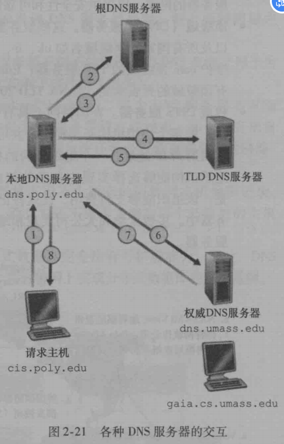

# 五层因特网协议栈

## 应用层

网络应用程序及它们的应用层协议存留的地方。

位于应用层的信息分组称为**报文（message）**

应用层协议:

- HTTP:提供Web文档请求和传送

- SMTP:提供电子邮件报文的传输

- FTP：它提供两个端系统之间的文件传送

## 运输层

在应用程序端点之前传送应用层报文。

位于传输层的信息分组称为**报文段（segment）**

运输层协议：

- TCP:提供可靠连接、**流量控制**（发送方和接收方速率匹配）、**拥塞控制机制**

- UDP:无连接服务。没有TCP的三种机制。

## 网络层

负责将**数据报**从一台主机移动到另一台主机。

在一台源主机的运输层协议（TCP和UDP）向网络层递交运输层**报文段和目的地址**。

位于网络层的信息分组称为**数据报（datagram）**

- IP协议

## 链路层

将帧从当前节点（主机或路由器）传递给下一个节点（路由器）

提供下一个节点（路由器）地址

位于链路层的信息分组称为**帧（frame）**

## 物理层

将**帧**的一个一个bit移动到下一个节点


## 封装

每一层，一个分组具有两种类型的字段：首部字段和**有效载荷字段(payload field)**，有效载荷字段通常来自上一层的分组。

# 应用层

## 应用层体系结构

### 客户-服务器体系结构

服务器，服务于来自许多其他称为客户的主机的请求。一个经典的例子是Wb应用程序，其中总是打开的Wb服务器服务于来自浏览器（运行在客户主机上）的请求。当Web服务器接收到来自某客户对某对象的请求时，它向该客户发送所请求的对象作为响应。

- 客户-服务器体系结构中，**客户相互之间不直接通信**；例如，在Web应用中两个浏览器并不直接通信。

- 服务器具有固定的、周知的地址，该地址称为IP地址。

具有客户-服务器体系结构的非常著名的应用程序包括Web、FTP、Telnet和电子邮件。

### P2P体系结构

应用程序之间直接通信。

## 进程通信

应用程序的通信实际上是**进程（process）**

**一个进程可以被认为是运行在端系统中的一个程序**。当进程运行在相同的端系统上时，它们使用进程间通信机制相互通信。进程间通信的规则由端系统上的操作系统确定。

在两个不同端系统上的进程，通过跨越计算机网络交换**报文**（**message**）而相互通信。

### 客户和服务器进程

网络应用程序由成对的进程(**客户(client)和服务器(server)**)组成，这些进程通过网络相互发送报文。

发起通信的进程是**客户**，等待联系的进程是**服务器**

例如：

- Web中，浏览器是一个**客户进程**、Web服务器是一台**服务器进程**。

- P2P文件共享中，下载文件的对等方是**客户**，上载文件的对等方是**服务器**

### 进程与计算机网络之间的接口

从一个进程向另一个进程发送的报文必须通过下面的运输层。进程通过**套接字（socket）** 软件接口向运输层发送报文和接收报文。


### 进程寻址

接收进程需要有一个地址。需要两个信息：

1. 主机地址

2. 定义在目的主机中的接收进程的标识符

主机由**IP地址**标识。是32bit信息

接收进程有**端口号（port number）** 确定。

已经流行的应用分配了特定端口号。例如：

- Web服务器用端口号80来标识。

- 邮件服务器进程（使用SMTP协议）用端口号25来标识。

## 可供应用程序使用的运输服务

一个运输层协议能够为调用它的应用程序提供什么样的服务呢？我们大体能够从四个方面对应用程序服务要求进行分类：**可靠数据传输**、**吞吐量**、**定时**和**安全性**。因特网中实际上没有针对吞吐量和定时的运输层协议。


### TCP服务

TCP服务模型包括面向连接服务和可靠数据传输服务。且提供拥塞控制机制。

TCP和UDP都没有任何加密机制。现在已经研制出加强版的TCP，通过**安全套接字层（Secure Sockets Layer）** 加强TCP。注意**这种加强是在应用层上进行加强**。

### UDP服务

不需要握手、不可靠数据传输服务。不提供拥塞控制机制。

## 应用层协议

### HTTP概述

Web的应用层协议是**超文本传输协议**（HyperText Transfer Protocol，HTTP)

#### Web页面

由对象组成。对象可以是HTML文件、JPEG、视频或程序等，它们可以通过一个URL地址寻址。

> 例如，一个Web页面包括HTML文本和5个JPEG，这个Web页面有6个对象。HTML基本文件通过对象的URL地址引用页面中的其他对象。每个URL地址由两部分组成:存放对象的服务器主机名和对象的路径名。
> 
> 例如
> 
> `http://www.someSchool.edu/someDepartment/picture.gif`,
> 
> 其中`www.someSchool.edu`就是主机名，`/someDepartment/picture.gif`就是路径名。

浏览器其实就是HTTP客户端，Web服务器是HTTP的服务器端，存储Web对象，每个对象由URL寻址。

#### HTTP

HTTP定义了Web客户向Web服务器请求Web页面的方式。HTTP使用TCP作为它的支撑运输协议。一旦连接建立，浏览器和服务器进程通过套接字访问TCP。

HTTP服务器不保存客户任何信息，所以HTTP属于**无状态协议（stateless protocol）**

#### 非持续连接和持续连接

从服务器向客户传送一个Web页面（包括1个HTML基本文件和10个JPEG图形）。HTML基本文件的URL为`http://www.someSchool.edu/someDepartment/home.index`

**采用非持续连接的HTTP**

- HTTP客户进程在端口号80发起一个到服务器`www.someSchool.edu`的TCP连接。80是HTTP默认端口号。

- HTTP客户经它的套接字向该服务器发送一个HTTP请求报文。请求报文包含了路径名`/someDepartment/home.index`

- HTTP服务器进程经它的套接字接收改请求报文，从服务器本地检索出`www.someSchool.edu/someDepartment/home.index`，在一个HTTP响应报文中封装对象，并通过其套接字向客户发送响应报文。

- HTTP服务器进程通知TCP断开该TCP连接。（但是直到TCP确认客户已经完整接收到报文为止）

- HTTP客户接收响应报文，TCP连接关闭。客户从响应报文中提取改文件，检查该HTML文件，得到对10个JPEG图形的引用。

- 对每个引用的JPEG图形对象重复前4个步骤。

上面的步骤举例说明了非持续连接的使用，其中每个TCP连接在服务器发送一个对象后关闭，即该连接并不为其他的对象而持续下来。值得注意的是每个TCP连接只传输一个请求报文和一个响应报文。因此在本例中，当用户请求该Wb页面时，要产生11个TCP连接。

**持续连接的HTTP**

在采用持续连接的情况下，服务器在发送响应后保持该TCP连接打开。在相同的客户与服务器之间的后续请求和响应报文能够通过相同的连接进行传送。

> 特别是，一个完整的Web页面(上例中的HTML基本文件加上10个图形)可以用单个持续TCP连接进行传送。
> 
> 更有甚者，位于同一台服务器的多个Web页面在从该服务器发送给同一个客户时，可以在单个持续TCP连接上进行。可以一个接一个地发出对对象的这些请求，而不必等待对未决请求（流水线）的回答。
> 
> 一般来说，如果一条连接经过一定时间间隔（一个可配置的超时间隔）仍未被使用，HTTP服务器就关闭该连接。HTTP的默认模式是使用带流水线的持续连接。

### HTTP报文格式

#### 请求报文

典型的HTTP请求报文：


#### 响应报文


状态码：

- 200 OK:请求成功，信息在返回的响应报文中。

- 301 Moved Permanently：请求的对象已经被永久转移了，新的URL定义在响应报文的Location：首部行中。客户软件将自动获取新的URL。

- 400 Bad Request：一个通用差错代码，指示该请求不能被服务器理解。

- 404 Not Found：被请求的文档不在服务器上。

- 505 HTTP Version Not Supported：服务器不支持请求报文使用的HTTP协议版本。

### 用户与服务器的交互：cookie

HTTP服务器是无状态的，无法保存客户信息。为此，HHTP使用了cookie。

用户请求服务器时，服务器接收到会标识用户，给用户赋ID，下次请求服务器，服务器会识别。

### Web缓存

**Web缓存器(Web cache)** 也叫**代理服务器(proxy server)**。它能够代表初始Web服务器来满足HTTP请求的网络实体。

当客户请求代理服务器，代理服务器有的返回给客户，没有的向初始服务器请求，接收到时在代理服务器本地存一份副本，再返回给客户。

因此，代理服务器即使服务器又是客户。


代理服务器可以大大缓解流量压力，降低时延。


### 条件GET方法

- 首先代理缓存器代表浏览器向Web服务器发送请求报文。


- Web服务器向缓存器发送具有被请求的对象的响应报文


- 该缓存器将对象转发到浏览器并缓存到本地。同时存储该对象最后修改时间。下次浏览器请求同一个对象，缓存器确保对象是否已经修改，向服务器发送**条件GET**执行最新查询。


- Web服务器仍会发送一个响应代码，状态码：304 Not Modified，说明没有修改。


### 文件传输协议：FTP

### 电子邮件传输协议：SMTP

### DNS：因特网的目录服务

由主机名到IP地址转换的目录服务。

DNS也属于应用层协议

DNS工作机理概述

假设运行在用户主机上的某些应用程序(如Wb浏览器或邮件阅读器)需要将主机名转换为IP地址。这些应用程序将调用DNS的客户端，并指明需要被转换的主机名（在很多基于UNIX的机器上，应用程序为了执行这种转换需要调用函数gethostbyname（）).
用户主机上的DNS接收到后，向网络中发送一个DNS查询报文。所有的DNS请求和回答报文**使用UDP**数据报经**端口53**发送。经过若干毫秒到若干秒的时延后，用户主机上的DNS接收到一个提供所希望映射的DNS回答报文。这个映射结果则被传递到调用DNS的应用程序。


三种类型DNS服务器：

- 根DNS服务器

- 顶级域(Top-Level Domain，TLD)DNS服务器和权威服务器。负责顶级域名如`com`、`org`、`net`、`edu`和`gov`以及所有国家的顶级域名如`uk`、`fr`等

- 权威DNS服务器




## TCP套接字编程

```python
# TCPClient.py
from socket import *
serverName = 'servername'
serverPort = 12000
clientSocket = socket(AF_INET, SOCK_STREAM)
clientSocket.connect((serverName,serverPort))
sentence = raw_input('Input lowercase sentence:')
clientSocket.send(sentence)
modifiedSentence = clientSocket.recv(1024)
print('From Server:',modifiedSentence)
clientSocket.close()
```

```python
# TCPServer.py
from socket import *
serverPort = 12000
serverSocket = socket(AF_INET,SOCK_STREAM)
serverSocket.bind(('',serverPort))

# 让服务器聆听来自客户的TCP连接请求。请求连接的最大数(至少为1)
serverSocket.listen(1)
print('The server is ready to receive')
while(1){
    connectionSocket,addr = serverSocket.accept()
    sentence = connectionSocket.recv(1024)
    capitalizedSentence = sentence.upper()
    connectionSocket.send(capitalizedSentence)
    connectionSocket.close()
}
```


# 运输层

## 多路复用与多路分解

- 将运输层报文段中的数据交付到正确的套接字的工作称为**多路分解(demultiplexing)**。

- 源主机从不同套接字中手机数据块并封装上首部信息从而生成报文段，然后将报文段传递给网络层，这个过程称为**多路复用(multiplexing)**

端口号是16bit数(0~65535之间)，其中0~1023范围的端口号是**周知端口号(well-known port number)**，例如HTTP的端口号是80，FTP的端口号是21。


## 无连接运输：UDP

UDP的优点

- **实时性**：采用UDP时，只要应用进程将数据传递给UDP，UDP就会将此数据打包进UDP报文段并立即传递给网络层。在另一方面，TCP有一个拥塞控制机制。当链路变得拥塞时来遏制TCP发送方，导致TCP继续重新发送数据报文段指导目的主机收到并加以确认，交付时间可能需要很长。

- **无需建立连接**:耗时短。

- **无连接状态**：

- **分组首部开销小**：每个TCP报文段有20字节的首部开销，UDP仅有8字节的开销。

### UDP报文段结构

长度字段是指包括首部在内的UDP报文段长度（以字节为单位）。


## TCP(Transmission Control Protocol)

### 三次握手、四次挥手

- 第一次握手： 建立连接。客户端发送连接请求报文段，将SYN位置为1，Sequence Number为x；然后，客户端进入SYN_SEND状态，等待服务器的确认；  

- 第二次握手： 服务器收到SYN报文段。服务器收到客户端的SYN报文段，需要对这个SYN报文段进行确认，设置Acknowledgment Number为x+1(Sequence Number+1)；同时，自己自己还要发送SYN请求信息，将SYN位置为1，Sequence Number为y；服务器端将上述所有信息放到一个报文段（即SYN+ACK报文段）中，一并发送给客户端，此时服务器进入SYN_RECV状态；  

- 第三次握手： 客户端收到服务器的SYN+ACK报文段。然后将Acknowledgment Number设置为y+1，向服务器发送ACK报文段，这个报文段发送完毕以后，客户端和服务器端都进入ESTABLISHED状态，完成TCP三次握手。


 **TCP连接:SYN ACK RST UTG PSH FIN**  
**SYN：同步标志**  
同步序列编号(Synchronize Sequence Numbers)栏有效。该标志仅在三次握手建立TCP连接时有效。它提示TCP连接的服务端检查序列编号，该序列编号为TCP连接初始端(一般是客户端)的初始序列编号。  
**ACK：确认标志**  
确认编号(Acknowledgement Number)栏有效。大多数情况下该标志位是置位的。TCP报头内的确认编号栏内包含的确认编号(w+1，Figure-1)为下一个预期的序列编号，同时提示远端系统已经成功接收所有数据。  
**RST：复位标志**  
复位标志有效。用于复位相应的TCP连接。  
**URG：紧急标志**  
紧急(The urgent pointer) 标志有效。紧急标志置位，  
**PSH：推标志**  
该标志置位时，接收端不将该数据进行队列处理，而是尽可能快将数据转由应用处理。在处理 telnet 或 rlogin 等交互模式的连接时，该标志总是置位的。  
**FIN：结束标志**  
带有该标志置位的数据包用来结束一个TCP回话，但对应端口仍处于开放状态，准备接收后续数据。


- **序号 ：** 用于对字节流进行编号，例如序号为 301，表示第一个字节的编号为 301，如果携带的数据长度为 100 字节，那么下一个报文段的序号应为 401。
- **确认号 ：** 期望收到的下一个报文段的序号。例如 B 正确收到 A 发送来的一个报文段，序号为 501，携带的数据长度为 200字节，因此 B 期望下一个报文段的序号为 701，B 发送给 A 的确认报文段中确认号就为701。
- **数据偏移** ：指的是数据部分距离报文段起始处的偏移量，实际上指的是首部的长度。
- **确认 ACK** ：当 ACK=1 时确认号字段有效，否则无效。TCP 规定，在连接建立后所有传送的报文段都必须把 ACK 置 1。
- **同步 SYN ：** 在连接建立时用来同步序号。当 SYN=1，ACK=0 时表示这是一个连接请求报文段。若对方同意建立连接，则响应报文中 SYN=1，ACK=1。
- **终止 FIN ：** 用来释放一个连接，当 FIN=1时，表示此报文段的发送方的数据已发送完毕，并要求释放运输连接。
- **窗口 ：** 窗口值作为接收方让发送方设置其发送窗口的依据。之所以要有这个限制，是因为接收方的数据缓存空间是有限的。

### TCP拥塞控制

https://www.zhihu.com/people/themost-silence

发送方维持一个拥塞窗口**cwnd ( congestion window )** 的状态变量。拥塞窗口的大小取决于网络的拥塞程度，并且动态地在变化。发送方让自己的发送窗口等于拥塞窗口。  
发送方控制拥塞窗口的原则是：只要网络没有出现拥塞，拥塞窗口就再增大一些，以便把更多的分组发送出去。但只要网络出现拥塞，拥塞窗口就减小一些，以减少注入到网络中的分组数。

**慢开始算法**  
当主机开始发送数据时，如果立即所大量数据字节注入到网络，那么就有可能引起网络拥塞，因为现在并不清楚网络的负荷情况。  
因此，较好的方法是 先探测一下，即由小到大逐渐增大发送窗口，也就是说，由小到大逐渐增大拥塞窗口数值。  
通常在刚刚开始发送报文段时，先把拥塞窗口 cwnd 设置为一个最大报文段MSS的数值。而在每收到一个对新的报文段的确认后，把拥塞窗口增加至多一个MSS的数值。用这样的方法逐步增大发送方的拥塞窗口 cwnd ，可以使分组注入到网络的速率更加合理。


每经过一个传输轮次，拥塞窗口 cwnd 就加倍。一个传输轮次所经历的时间其实就是往返时间RTT。不过“传输轮次”更加强调：把拥塞窗口cwnd所允许发送的报文段都连续发送出去，并收到了对已发送的最后一个字节的确认。  
另，慢开始的“慢”并不是指cwnd的增长速率慢，而是指在TCP开始发送报文段时先设置cwnd=1，使得发送方在开始时只发送一个报文段（目的是试探一下网络的拥塞情况），然后再逐渐增大cwnd。  
为了防止拥塞窗口cwnd增长过大引起网络拥塞，还需要设置一个慢开始门限ssthresh状态变量。慢开始门限ssthresh的用法如下：  
当 cwnd < ssthresh 时，使用上述的慢开始算法。  
当 cwnd > ssthresh 时，停止使用慢开始算法而改用拥塞避免算法。  
当 cwnd = ssthresh 时，既可使用慢开始算法，也可使用拥塞控制避免算法。  

**拥塞避免**  
让拥塞窗口cwnd缓慢地增大，即每经过一个往返时间RTT就把发送方的拥塞窗口cwnd加1，而不是加倍。这样拥塞窗口cwnd按线性规律缓慢增长，比慢开始算法的拥塞窗口增长速率缓慢得多。 


无论在慢开始阶段还是在拥塞避免阶段，只要发送方判断网络出现拥塞（其根据就是没有收到确认），就要把慢开始门限ssthresh设置为出现拥塞时的发送方窗口值的一半（但不能小于2）。然后把拥塞窗口cwnd重新设置为1，执行慢开始算法。  
这样做的目的就是要迅速减少主机发送到网络中的分组数，使得发生 拥塞的路由器有足够时间把队列中积压的分组处理完毕。  
如下图，用具体数值说明了上述拥塞控制的过程。现在发送窗口的大小和拥塞窗口一样大。  


### 快重传和快恢复

快重传算法首先要求接收方每收到一个失序的报文段后就立即发出重复确认（为的是使发送方及早知道有报文段没有到达对方）而不要等到自己发送数据时才进行捎带确认。


与快重传配合使用的还有快恢复算法，其过程有以下两个要点：  
当发送方连续收到三个重复确认，就执行“乘法减小”算法，把慢开始门限ssthresh减半。  
与慢开始不同之处是现在不执行慢开始算法（即拥塞窗口cwnd现在不设置为1），而是把cwnd值设置为 慢开始门限ssthresh减半后的数值，然后开始执行拥塞避免算法（“加法增大”），使拥塞窗口缓慢地线性增大。


# 网络层

网络层两个重要功能：转发和路由

网络层三个组件：

- 路由选择协议：决定数据报从源到目的地所流经的路径。

- IP协议

- 互联网控制报文协议（ICMP）：报告数据报中的差错和对某些网络层信息请求进行响应的设施。

## 网际协议：因特网中的转发和编址

### IPv4数据报格式


- 版本：IPv4/IPv6

- 首部长度：IPv4数据报可包含一些可变数量的**选项**。用这**4bit**确定选项的长度。

- 服务类型：比如IP电话和FTP。

- 数据报长度：IP数据报总长度（首部+数据）。如图最大16bit，65535字节。

- 标识、标志、片偏移：

- 寿命:(Time-To-Live，TTL)字段用来确保数据报不会永远在网络中循环。每当数据报由一台路由器处理时，该字段的值减1。减为0，数据报丢弃。

- 协议。数据报要交付的运输层协议，在一个IP数据报到达其最终目的地才会用到。=6交给TCP，=17交给UDP。

- 首部检验和：

- 源和目的IP地址

- 选项：很少使用

- 数据（有效载荷）

IP数据报分片

将数据报分成片(fragment)。在端系统通过**标识、标志、片偏移**重新组装片。

### 编址

无类别域间路由选择(Classless Interdomain Routing, CIDR)。

1. 获取一块地址

为了获取一块IP地址用于一个组织的子网，

2. 获取主机地址：**动态主机配置协议(Dynamic Host Configuration, DHCP)**

DHCP可以自动分配主机的IP地址。使主机连接网络时获得相同IP地址，或者给主机分配**临时的IP地址**，该地址在每次与网络连接时可能是不同的。

### 因特网控制报文协议(ICMP)

主要用于在主机与路由器之间传递控制信息，包括报告错误、交换受限控制和状态信息等。


### IPv6

#### IPv6数据报格式

ipv6的首部是8bit


- 版本：4bit，IPv6的字段值为6

- 流量类型

- 流标签

- 有效载荷长度

- 下一个首部：该字段标识数据报中的内容（数据字段）需要交付给哪个协议(TCP/UDP)。相当于IPv4的协议。

- 跳限制：类似IPv4寿命、

- 源地址和目的地址

- 数据

IPv6的变化：

- 扩大的地址容量。（32bit->128bit)

- 简化高效的40字节定长首部。舍弃了IPv4首部的选项。

- 流标签与优先级。流（flow），比如音频和视频就是流，而电子邮件就不是流。流定义很模糊。

## 路由选择算法

### 链路状态路由选择算法：Dijkstra算法

会产生振荡，t1时刻，顺时针环路不堵塞，大家都选择顺时针，t2时刻，逆时针环路不堵塞，大家都选择逆时针。

### 距离向量路由选择算法


如果节点x想去z，存在x->y->x的**路由选择环路**问题

### 层次路由选择

## 因特网中的路由选择

## 广播和多播路由选择

- 广播路由选择：网络层提供了一个源节点向网络中其他所有节点交付分组的方式。

- 多播路由选择：使单个源节点能够向其他网络节点的一个子集发送分组的副本。

### 广播路由选择算法

序号控制洪泛

### 多播路由选择

#### 因特网组管理协议(IGMP)

IGMP运行在主机和相连的路由器之间。IGMP会通知与主机相连的路由器：本主机上运行的一个应用程序想加入一个特定的多播组。

因特网的多播路由选择算法：

- 距离向量路由选择算法

- 协议无关的多播：
  
  - 稠密模式：洪泛与剪枝反向路径转发
  
  - 稀疏模式：建立多播分发树

# 数据链路层

## MAC地址

MAC地址是硬件地址，IP地址是网络地址。IP地址用来定位设备位置，MAC地址用来确认设备（MAC地址类似身份证）。

## 交换机和路由器比较


## 回顾：Web页面请求的历程


 

### 准备:DHCP、UDP、IP

当Bob将电脑与网络连接时，首先需要获取一个IP地址。所以，Bob的电脑需要运行**DHCP**协议，以从本地DHCP服务器获得一个IP地址以及其他信息。

1. Bob电脑生成一个**DHCP请求报文**，并将这个报文放入具有目的地端口67（DHCP服务器）和源端口68（DHCP客户）的**UDP报文段**。该UDP报文段则被放置在一个具有广播IP目的地地址（255.255.255.255）和源IP地址（0.0.0.0）的**IP数据报**中，因为Bob的电脑没有IP地址。

2. 包括DHCP请求报文的IP数据报则被放置在以太网帧中。该以太网帧具有目的MAC地址FF:FF:FF:FF:FF:FF，使该帧广播到与交换机连接的所有设备（如果顺利的话也包括DHCP服务器）；该帧的源MAC地址是Bob电脑的MAC地址00:16:D3:23:68:8A。

3. 包含DHCP请求的广播以太网帧是第一个由Bob电脑发送到以太网交换机的帧。该交换机在所有的出端口广播入帧，包括连接到路由器端口。

4. 路由器在它的具有MAC地址00:22:6B:45:1F的接口接收到该广播以太网帧，从中抽取IP数据报。该数据报的广播IP目的地址指示了这个IP数据报应当由在该结点的高层协议处理，因此该数据报的**载荷(一个UDP报文段)** 被分解，向上到达UDP。DHCP请求报文从此UDP报文段中抽取出来。此时DHCP服务器有了DHCP请求报文。

5. 运行在路由器中的DHCP服务器能够以**CIDR**块68.85.2.0/24分配IP地址。本例中，在学校使用的所有IP地址都在Comcast的地址块中。DHCP服务器分配地址68.85.2.101给Bob电脑。DHCP服务器生成包含这个IP地址以及DNS服务器的IP地址（68.87.71.226）、默认网关路由器的IP地址（68.85.2.1）和子网块（68.85.2.0/24)的一个**DHCP ACK报文**。报文->UDP报文段->IP数据报->以太网帧。以太网帧的源MAC地址是路由器连到归属网络时接口的MAC地址(00:22:6B:1F:1B)，目的MAC地址是Bob电脑的MAC地址（00:16:D3:23:68:8A)。

```
68.85.2.0/24
01000100 01010101 00000010 00000000
```

6. 包含DHCP ACK的以太网帧由路由器发送给交换机。因为交换机是**自学习的**，并且先前从Bob电脑收到包含DHCP请求的以太网帧，所以该交换机知道寻址00:16:D3:23:68:8A的帧仅从通向Bob电脑的输出端口转发。

7. Bob电脑接收到以太网帧，以太网帧->……->DHCP ACK报文。Bob的DHCP客户记录下它的IP地址和它的DNS服务器的IP地址。在IP转发表中安装默认网关的地址。Bob的电脑将向该默认网关发送目的地址为其子网68.85.2.0/24以外的所有数据报。此时，Bob电脑初始化完成所有网络组件。可以准备处理Web网页获取。

### 仍在准备：DNS和ARP
