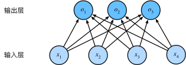

# Softmax回归

回归估计一个连续值，分类预测离散类别。**回归**可以预测*多少*的问题，比如预测房价或者患者住院的天数。而对于分类问题，一般求解的是*哪一个*，不是*多少*的问题。

针对分类问题，我们一般只对样本的`硬性`类别感兴趣，即属于哪个类别。我们希望得到`软性`类别，即得到属于每个类别的概率。 这两者的界限往往很模糊。其中的一个原因是：即使我们只关心硬类别，我们仍然使用软类别的模型。

## 分类问题

我们从一个图像分类问题开始。 假设每次输入是一个2×2的灰度图像。 我们可以用一个标量表示每个像素值，每个图像对应四个特征`x1,x2,x3,x4`。 此外，假设每个图像属于类别“猫”，“鸡”和“狗”中的一个。采用**独热编码**（one-hot encoding）。在我们的例子中，标签y将是一个三维向量， 其中(1,0,0)对应于“猫”、(0,1,0)对应于“鸡”、(0,0,1)对应于“狗”。

为了估计所有可能类别的条件概率，我们需要一个有多个输出的模型，每个类别对应一个输出。 为了解决线性模型的分类问题，我们需要和输出一样多的*仿射函数*（affine function）。 每个输出对应于它自己的仿射函数。 在我们的例子中，由于我们有4个特征和3个可能的输出类别， 我们将需要12个标量来表示权重（带下标的w）， 3个标量来表示偏置（带下标的b）。 下面我们为每个输入计算三个*未规范化的预测*（logit）：$o_1、o_2和o_3$。
$$
o_1 = x_1w_{11}+x_2w_{12}+x_3w_{13}+x_4w_{14}+b_1,\\
o_2 = x_1w_{21}+x_2w_{22}+x_3w_{23}+x_4w_{24}+b_2,\\
o_3 = x_1w_{31}+x_2w_{32}+x_3w_{33}+x_4w_{34}+b_3
$$

			<!--块级封装-->
    
	<!--将图片和文字居中-->
    
     		<!--换行-->
    Softmax是单层神经网络	<!--标题-->
    

为了更简洁地表达模型，我们仍然使用线性代数符号。 通过向量形式表达为$o=Wx+b$， 这是一种更适合数学和编写代码的形式。 由此，我们已经将所有权重放到一个3×4矩阵中。 对于给定数据样本的特征$x$， 我们的输出是由权重与输入特征进行矩阵-向量乘法再加上偏置$b$得到的。

## softmax运算

现在我们将优化参数以最大化观测数据的概率。 为了得到预测结果，我们将设置一个阈值，如选择**具有最大概率的标签**。

我们希望模型的输出$\hat{y}$可以视为属于类j的概率， 然后选择具有最大输出值的类别作为我们的预测。 例如，如果$\hat{y_1}$、$\hat{y_2}$和$\hat{y_3}$分别为0.1、0.8和0.1， 那么我们预测的类别是2，在我们的例子中代表“鸡”。

然而我们能否将未规范化的预测o直接视作我们感兴趣的输出呢？ 答案是否定的。 因为将线性层的输出直接视为概率时存在一些问题： 一方面，我们没有限制这些输出数字的总和为1。 另一方面，根据输入的不同，它们可以为负值。 这些违反了概率基本公理。

要将输出视为概率，我们必须保证在任何数据上的输出都是非负的且总和为1。 此外，我们需要一个训练目标，来鼓励模型精准地估计概率。 在分类器输出0.5的所有样本中，我们希望这些样本有一半实际上属于预测的类。 这个属性叫做**校准**。

社会科学家邓肯·卢斯于1959年在*选择模型*（choice model）的理论基础上 发明的*softmax函数*正是这样做的： softmax函数将未规范化的预测变换为非负并且总和为1，同时要求模型保持可导。 我们首先对每个未规范化的预测求幂，这样可以确保输出非负。 为了确保最终输出的总和为1，我们再对每个求幂后的结果除以它们的总和。如下式：
$$
\hat{y}=softmax(o) 其中 \hat{y_i} = \frac{exp(o_j)}{ \sum_k{o_k}}
$$
这里，对于所有的j总有$0≤\hat{y_j}≤1$。 因此，$\hat{y_j}$可以视为一个正确的概率分布。 softmax运算不会改变未规范化的预测o之间的顺序，只会确定分配给每个类别的概率。 因此，在预测过程中，我们仍然可以用下式来选择最有可能的类别。

## 损失函数

接下来，我们需要一个损失函数来度量预测的效果。 我们将使用最大似然估计，这与在线性回归中的方法相同。

### 

softmax函数给出了一个向量$\hat{y}$， 我们可以将其视为“对给定任意输入x的每个类的条件概率”。 例如，$\hat{y_1}=P(y=猫∣x)$。 假设整个数据集{X,Y}具有n个样本， 其中索引i的样本由特征向量$x^{(i)}$和独热标签向量$y^{(i)}$组成。 我们可以将估计值与实际值进行比较：
$$
P(Y|X)=\prod_{i=1}^{n}P(y^{(i)}|x^{(i)})
$$
根据最大似然估计，我们最大化$P(Y∣X)$，相当于最小化负对数似然：
$$
\begin{aligned}
-logP(Y|X) &=\sum_{i=1}^{n}-\log{P(y^{(i)}|x^{(i)})}\\
&= \sum_{i=1}^{n}l(y^{(i)}|x^{(i)})
\end{aligned}
$$
其中，对于任何独热标签向量$y$和模型预测$\hat{y}$,损失函数为：
$$
l(y,\hat{y})=-\sum_{j=1}^{q}y_j\log{\hat{y_j}}
$$
通常又被称为**交叉熵损失**

### softmax及其导数

$$
\begin{aligned}
l(y,\hat{y}) &= - \sum_{j=1}^{q}y_j\log{\frac{\exp(o_j)}{\sum_{k=1}^{q}\exp(o_j)}}\\
			& =\sum_{j=1}^{q}y_i\log{\sum_{k=1}^{q}\exp(o_k)-\sum_{j=1}^{q}y_jo_j}\\
			& =\log\sum_{k=1}^{q}\exp(o_k)-\sum_{j=1}^{q}y_jo_j
\end{aligned}
$$

考虑相对于任何未规范化的预测$o_j$的导数，我们得到：
$$
\partial_{o_j}l(y,\hat{y})=\frac{\exp(o_j)}{\sum_{k=1}^{q}\exp(o_k)}-y_j=softmax(o_j)-y_j
$$
换句话说，导数是我们softmax模型分配的概率与实际发生的情况之间的差异。

从这个意义上讲，这与我们在回归中看到的非常相似， 其中梯度是观测值y和估计值$\hat{y}$之间的差异。 这不是巧合，在任何指数族分布模型中 ， 对数似然的梯度正是由此得出的。 这使梯度计算在实践中变得容易很多。

### *最大似然估计*

　　似然性（likelihood）与概率（possibility）同样可以表示事件发生的可能性大小，但是二者有着很大的区别：

- 概率 ![[公式]](https://www.zhihu.com/equation?tex=p%28x%7C%5Ctheta%29) 是在已知参数 ![[公式]](https://www.zhihu.com/equation?tex=%5Ctheta) 的情况下，发生观测结果 ![[公式]](https://www.zhihu.com/equation?tex=x) 可能性大小；
- 似然性 ![[公式]](https://www.zhihu.com/equation?tex=L%28%5Ctheta%7Cx%29) 则是从观测结果 ![[公式]](https://www.zhihu.com/equation?tex=x) 出发，分布函数的参数为 ![[公式]](https://www.zhihu.com/equation?tex=%5Ctheta) 的可能性大小；

#### 似然函数

$$
L(\theta|x)=p(x|\theta)
$$

#### 最大似然估计

对于给定的观测数据$x$，我们希望能从所有的参数$\theta_1,\theta_2,\dots \theta_n$中找出能最大概率生成观测数据的参数$\theta^*$作为估计结果。

被估计出的参数$\theta^*$应该满足：
$$
L(\theta^*|x) = p(x|\theta^*)\ge p(x|\theta)=L(\theta|x),\theta=\theta_1\dots,\theta_n
$$
我们将估计的参数$\theta$看成变量，计算得到生成观测数据$x$的概率函数$p(x|\theta)$，并找到能最大化概率函数的参数即可：
$$
\theta^* = arg\max p(x|\theta)
$$
**最大化的步骤通过求导等于0来解得**。
$$
\frac{\mathrm{d} }{\mathrm{d} \theta} L(\theta|x)=0
$$
由于式子通常是累乘的形式，我们借助对数函数来简化问题:
$$
\frac{\mathrm{d} }{\mathrm{d} \theta} \ln L(\theta|x)=0
$$
上式也通常被称作**对数似然方程**