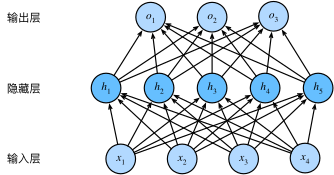
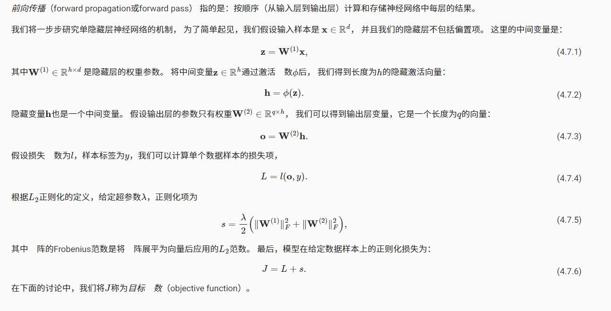
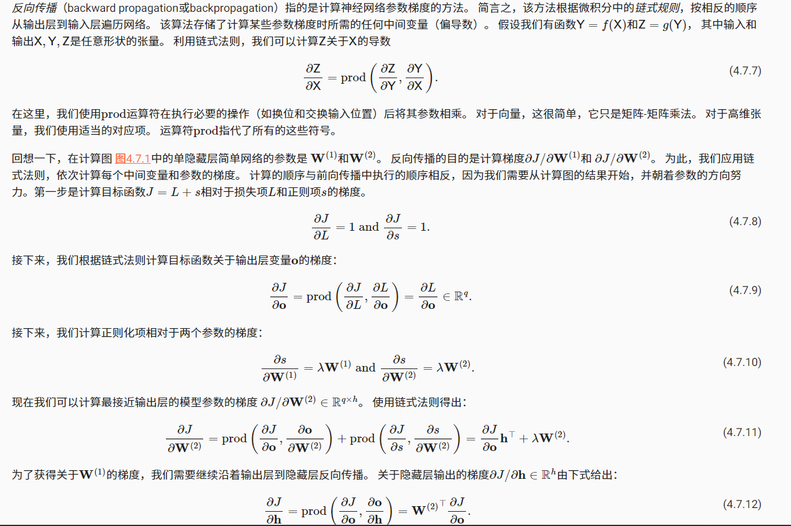
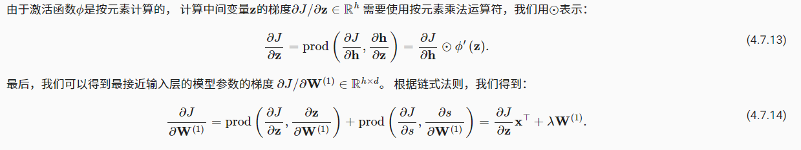
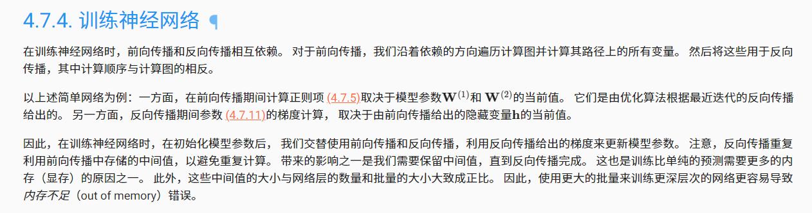
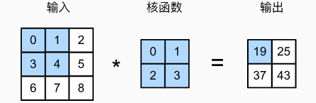

## Softmax回归

回归估计一个连续值，分类预测离散类别。**回归**可以预测*多少*的问题，比如预测房价或者患者住院的天数。而对于分类问题，一般求解的是*哪一个*，不是*多少*的问题。

针对分类问题，我们一般只对样本的`硬性`类别感兴趣，即属于哪个类别。我们希望得到`软性`类别，即得到属于每个类别的概率。 这两者的界限往往很模糊。其中的一个原因是：即使我们只关心硬类别，我们仍然使用软类别的模型。

## 分类问题

我们从一个图像分类问题开始。 假设每次输入是一个2×2的灰度图像。 我们可以用一个标量表示每个像素值，每个图像对应四个特征`x1,x2,x3,x4`。 此外，假设每个图像属于类别“猫”，“鸡”和“狗”中的一个。采用**独热编码**（one-hot encoding）。在我们的例子中，标签y将是一个三维向量， 其中(1,0,0)对应于“猫”、(0,1,0)对应于“鸡”、(0,0,1)对应于“狗”。

为了估计所有可能类别的条件概率，我们需要一个有多个输出的模型，每个类别对应一个输出。 为了解决线性模型的分类问题，我们需要和输出一样多的*仿射函数*（affine function）。 每个输出对应于它自己的仿射函数。 在我们的例子中，由于我们有4个特征和3个可能的输出类别， 我们将需要12个标量来表示权重（带下标的w）， 3个标量来表示偏置（带下标的b）。 下面我们为每个输入计算三个*未规范化的预测*（logit）：$o_1、o_2和o_3$。

$o_1 = x_1w_{11}+x_2w_{12}+x_3w_{13}+x_4w_{14}+b_1,\\
o_2 = x_1w_{21}+x_2w_{22}+x_3w_{23}+x_4w_{24}+b_2,\\
o_3 = x_1w_{31}+x_2w_{32}+x_3w_{33}+x_4w_{34}+b_3$

<div>            <!--块级封装-->
    <center>    <!--将图片和文字居中-->
    
    <br>        <!--换行-->
    Softmax是单层神经网络    <!--标题-->
    </center>
</div>

为了更简洁地表达模型，我们仍然使用线性代数符号。 通过向量形式表达为$o=Wx+b$， 这是一种更适合数学和编写代码的形式。 由此，我们已经将所有权重放到一个3×4矩阵中。 对于给定数据样本的特征$x$， 我们的输出是由权重与输入特征进行矩阵-向量乘法再加上偏置$b$得到的。

### softmax运算

现在我们将优化参数以最大化观测数据的概率。 为了得到预测结果，我们将设置一个阈值，如选择**具有最大概率的标签**。

我们希望模型的输出$\hat{y}$可以视为属于类j的概率， 然后选择具有最大输出值的类别作为我们的预测。 例如，如果$\hat{y_1}$、$\hat{y_2}$和$\hat{y_3}$分别为0.1、0.8和0.1， 那么我们预测的类别是2，在我们的例子中代表“鸡”。

然而我们能否将未规范化的预测o直接视作我们感兴趣的输出呢？ 答案是否定的。 因为将线性层的输出直接视为概率时存在一些问题： 一方面，我们没有限制这些输出数字的总和为1。 另一方面，根据输入的不同，它们可以为负值。 这些违反了概率基本公理。

要将输出视为概率，我们必须保证在任何数据上的输出都是非负的且总和为1。 此外，我们需要一个训练目标，来鼓励模型精准地估计概率。 在分类器输出0.5的所有样本中，我们希望这些样本有一半实际上属于预测的类。 这个属性叫做**校准**。

社会科学家邓肯·卢斯于1959年在*选择模型*（choice model）的理论基础上 发明的*softmax函数*正是这样做的： softmax函数将未规范化的预测变换为非负并且总和为1，同时要求模型保持可导。 我们首先对每个未规范化的预测求幂，这样可以确保输出非负。 为了确保最终输出的总和为1，我们再对每个求幂后的结果除以它们的总和。如下式：
$\hat{y}=softmax(o) 其中 \hat{y_i} = \frac{exp(o_j)}{ \sum_k{o_k}}$
这里，对于所有的j总有$0≤\hat{y_j}≤1$。 因此，$\hat{y_j}$可以视为一个正确的概率分布。 softmax运算不会改变未规范化的预测o之间的顺序，只会确定分配给每个类别的概率。 因此，在预测过程中，我们仍然可以用下式来选择最有可能的类别。

### 交叉熵损失函数

接下来，我们需要一个损失函数来度量预测的效果。 我们将使用最大似然估计，这与在线性回归中的方法相同。

softmax函数给出了一个向量$\hat{y}$， 我们可以将其视为“对给定任意输入x的每个类的条件概率”。 例如，$\hat{y_1}=P(y=猫∣x)$。 假设整个数据集{X,Y}具有n个样本， 其中索引i的样本由特征向量$x^{(i)}$和独热标签向量$y^{(i)}$组成。 我们可以将估计值与实际值进行比较：
$P(Y|X)=\prod_{i=1}^{n}P(y^{(i)}|x^{(i)})$根据最大似然估计，我们最大化

$P(Y∣X)$，相当于最小化负对数似然：

$$
x = \dfrac{-b \pm \sqrt{b^2 - 4ac}}{2a}
$$

$$
\begin{aligned}
-logP(Y|X) &=\sum_{i=1}^{n}-\log{P(y^{(i)}|x^{(i)})}\\
&= \sum_{i=1}^{n}l(y^{(i)}|x^{(i)})
\end{aligned}
$$

其中，对于任何独热标签向量

$y$和模型预测$\hat{y}$,损失函数为：

$$
l(y,\hat{y})=-\sum_{j=1}^{q}y_j\log{\hat{y_j}}
$$

通常又被称为**交叉熵损失**

### softmax及其导数

$$
\begin{aligned}
l(y,\hat{y}) &= - \sum_{j=1}^{q}y_j\log{\frac{\exp(o_j)}{\sum_{k=1}^{q}\exp(o_j)}}\\
            & =\sum_{j=1}^{q}y_i\log{\sum_{k=1}^{q}\exp(o_k)-\sum_{j=1}^{q}y_jo_j}\\
            & =\log\sum_{k=1}^{q}\exp(o_k)-\sum_{j=1}^{q}y_jo_j
\end{aligned}
$$

考虑相对于任何未规范化的预测$o_j$的导数，我们得到：

$$
\partial_{o_j}l(y,\hat{y})=\frac{\exp(o_j)}{\sum_{k=1}^{q}\exp(o_k)}-y_j=softmax(o_j)-y_j
$$

换句话说，导数是我们softmax模型分配的概率与实际发生的情况之间的差异。

从这个意义上讲，这与我们在回归中看到的非常相似， 其中梯度是观测值y和估计值$\hat{y}$之间的差异。 这不是巧合，在任何指数族分布模型中 ， 对数似然的梯度正是由此得出的。 这使梯度计算在实践中变得容易很多。

### *最大似然估计*

　　似然性（likelihood）与概率（possibility）同样可以表示事件发生的可能性大小，但是二者有着很大的区别：

- 概率 ![[公式]](https://www.zhihu.com/equation?tex=p%28x%7C%5Ctheta%29) 是在已知参数 ![[公式]](https://www.zhihu.com/equation?tex=%5Ctheta) 的情况下，发生观测结果 ![[公式]](https://www.zhihu.com/equation?tex=x) 可能性大小；
- 似然性 ![[公式]](https://www.zhihu.com/equation?tex=L%28%5Ctheta%7Cx%29) 则是从观测结果 ![[公式]](https://www.zhihu.com/equation?tex=x) 出发，分布函数的参数为 ![[公式]](https://www.zhihu.com/equation?tex=%5Ctheta) 的可能性大小；

#### 似然函数

$$
L(\theta|x)=p(x|\theta)
$$

#### 最大似然估计

对于给定的观测数据$x$，我们希望能从所有的参数$\theta_1,\theta_2,\dots \theta_n$中找出能最大概率生成观测数据的参数$\theta^*$作为估计结果。

被估计出的参数$\theta^*$应该满足：
$
L(\theta^*|x) = p(x|\theta^*)\ge p(x|\theta)=L(\theta|x),\theta=\theta_1\dots,\theta_n
$
我们将估计的参数$\theta$看成变量，计算得到生成观测数据x的概率函数$p(x|\theta)$，并找到能最大化概率函数的参数即可：

$$
\theta^* = arg\max p(x|\theta)

$$

 **最大化的步骤通过求导等于0来解得**。

$$
\frac{\mathrm{d} }{\mathrm{d} \theta} L(\theta|x)=0
$$

由于式子通常是累乘的形式，我们借助对数函数来简化问题:

$$
\frac{\mathrm{d} }{\mathrm{d} \theta} \ln L(\theta|x)=0
$$

上式也通常被称作**对数似然方程** 

## 多层感知机(MLP:multilayer perceptron)

结构如下



通过矩阵$X \in\mathbb{R}^{n\times d} $来表示n个样本的小批量，其中每个样本具有d个输入特征。对于具有h个隐藏单元的单隐藏层多层感知机， 用$H \in\mathbb{R}^{n\times h} $表示隐藏层的输出， 称为*隐藏表示*

$$
\begin{split}\begin{aligned}
 \mathbf{H} & = \mathbf{X} \mathbf{W}^{(1)} + \mathbf{b}^{(1)}, \
 \mathbf{O} & = \mathbf{H}\mathbf{W}^{(2)} + \mathbf{b}^{(2)}.
\end{aligned}\end{split}
$$

注意在添加隐藏层之后，模型现在需要跟踪和更新额外的参数。 可我们能从中得到什么好处呢？ 你可能会惊讶地发现：在上面定义的模型里，我们没有好处！ 原因很简单：上面的隐藏单元由输入的仿射函数给出， 而输出（softmax操作前）只是隐藏单元的仿射函数。 仿射函数的仿射函数本身就是仿射函数， 但是我们之前的线性模型已经能够表示任何仿射函数。

#### 从线性到非线性

为了发挥多层架构的潜力， 我们还需要一个额外的关键要素： 在仿射变换之后对每个隐藏单元应用非线性的*激活函数*（activation function）σ。 激活函数的输出（例如，σ(⋅)）被称为*活性值*（activations）。 一般来说，有了激活函数，就不可能再将我们的多层感知机退化成线性模型：

$$
\begin{split}\begin{aligned}
 \mathbf{H} & = \sigma(\mathbf{X} \mathbf{W}^{(1)} + \mathbf{b}^{(1)}), \
 \mathbf{O} & = \mathbf{H}\mathbf{W}^{(2)} + \mathbf{b}^{(2)}.\
\end{aligned}\end{split}
$$

### 激活函数

#### ReLU函数

$$
\operatorname{ReLU}(x) = \max(x, 0).
$$

#### sigmoid函数

$$
\operatorname{sigmoid}(x) = \frac{1}{1 + \exp(-x)}.
$$

#### tanh函数

$$
\operatorname{tanh}(x) = \frac{1 - \exp(-2x)}{1 + \exp(-2x)}.
$$

### Dropout

### 前向传播



前向传播计算图


### 反向传播







## 卷积

卷积计算的两个特点：

- 平移不变性：不管检测对象出现在图像中的哪个位置，神经网络的前面几层应该对相同的图像区域具有相似的反应。

- 局部性：神经网络的前面几层应该只探索输入图像中的局部区域，而不过度在意图像中相隔较远区域的关系，这就是“局部性”原则。最终，可以聚合这些局部特征，以在整个图像级别进行预测。



输出大小等于输入大小$n_k \times n_w$减去卷积核大小$k_h \times k_w$，即：

$$
(n_h-k_h+1) \times (n_w-k_w+1)
$$

### 互相关运算(即卷积运算)

```python
import torch
from torch import nn
from d2l import torch as d2l

def corr2d(X,K):

    h,w=K.shape
    Y = torch.zeros((X.shape[0] - h + 1,X.shape[1] - w + 1))
    for i in range(Y.shape[0]):
        for j in range(Y.shape[1]):
            Y[i,j] = (X[i:i + h,j:j + w]*K).sum()
    return Y
```

### 卷积层

```python
class Conv2D(nn.Module):
    def __init__(self,kernel_size):
        super().__init__()
        self.weight = nn.Parameter(torch.rand(kernel_size))
        self.bias = nn.Parameter(torch.zeros(1))

    def forward(self,x):
        return corr2d(x, self.weight) + self.bias
```

### 感受野

卷积层的输出有时被称为**特征映射(feature map)**，因为他可以被视为一个输入映射到下一层的空间维度的转换器。在卷积神经网络层，对于某一层的任意元素x，其**感受野（receptive field)**是指在前向传播期间可能影响x计算的所有元素（来自所有先前层）。

### 填充

在应用多层卷积时，我们常常丢失边缘像素。 由于我们通常使用小卷积核，因此对于任何单个卷积，我们可能只会丢失几个像素。 但随着我们应用许多连续卷积层，累积丢失的像素数就多了。 解决这个问题的简单方法即为**填充（padding)**

$$
(n_h-k_h+p_h+1)\times(n_w-k_w+p_w+1)。
$$

```python
conv2d = nn.Conv2d(1, 1, kernel_size=3, padding=1, stride=2)
comp_conv2d(conv2d, X).shape
```

### 步幅

步幅大于1可以迅速降低输出的大小，减少计算量，加快训练。

垂直步幅为3 ，水平步幅为2的二维互相关运算：


$$
\lfloor(n_h-k_h+p_h+s_h)/s_h\rfloor \times \lfloor(n_w-k_w+p_w+s_w)/s_w\rfloor.
$$

```python
conv2d = nn.Conv2d(1, 1, kernel_size=(3, 5), padding=(0, 1), stride=(3, 4))
comp_conv2d(conv2d, X).shape
```

# 目标检测

## 锚框

### NMS（non-maximum suppression）

对于一个预测边界框$B$，目标检测模型会计算每个类别的预测概率。假设最大概率为$p$，则该概率所对应的类别B即为预测的类别。我们将$p$称为预测边界框B的置信度(confidence)。在同一张图像中，所有预测的非背景边界框都按置信度降序排序，以生成列表$L$，然后我们通过以下步骤操作排序列表$L$:

1. 从L中选取置信度最高的预测边界框$B_1$作为基准，然后将所有与$B_1$的IoU超过预定阈值$\epsilon$的非基准预测边界框从中移除。这时，保留了置信度最高的预测边界框，去除了与其太过相似的其他预测边界框。简而言之，那些具有*非极大值*置信度的边界框被*抑制*了。

2. 从$L$中选取置信度第二高的预测边界框$B_2$作为又一个基准，然后将所有与$L$的IoU大于的非基准预测边界框从中移除。

3. 重复上述过程，直到$L$中的所有预测边界框都曾被用作基准。此时，中任意一对预测边界框的IoU都小于阈值$\epsilon$；因此，没有一对边界框过于相似。

4. 输出列表$L$中的所有预测边界框。

```python
def nms(boxes, scores, iou_threshold):
    """

    """
    B = torch.argsort(scores, dim=-1, descending=True)
    keep = []
    while B.numel() > 0:
        i = B[0]
        keep.append(i)
        if B.numel() == 1: break
        iou = box_iou(boxes[i,:].reshape(-1, 4),
                        boxes[B[1:],:].reshape(-1,4)).reshape(-1)
        inds = torch.nonzero(iou <= iou_threshold).reshape(-1)
        B = B[inds + 1]
    return torch.tensor(keep)
```

### L1 Loss

$$
L1 = \sum_{i=1}^{n}|y_i - f(x_i)|
$$

当**假设 x 为预测框和真实框之间的数值差异**时，公式变为：

$$
L_1 = |X|
$$

导数：

$$
\frac{dL_1}{dx} =
\left\{ \begin{matrix}

1 \quad if x \ge 0\\
-1 \quad otherwise

\end{matrix}\right.
$$

特点：
L1 loss在零点处不平滑，学习慢；
$L_1$损失函数对 x 的导数为常数，训练后期，x很小时，如果学习率不变，损失函数会在稳定值附近波动，很难收敛到更高的精度。

### Smooth L1 Loss

$$
smooth_{L_1}(x) =
\left\{ \begin{matrix}

0.5x^2 \quad if |x| < 1\\
|x|-0.5 \quad otherwise

\end{matrix}\right.
$$

导数

$$
\frac{dsmooth_{L_1}}{dx} = 
\left\{ \begin{matrix}

x \quad if |x| < 1\\
\pm1 \quad otherwise

\end{matrix}\right.
$$

- 特点：  
  Smooth L1 Loss 相比L1 loss 改进了零点不平滑问题。  
  相比于L2 loss，在 x 较大的时候不像 L2 对异常值敏感，是一个缓慢变化的loss。
