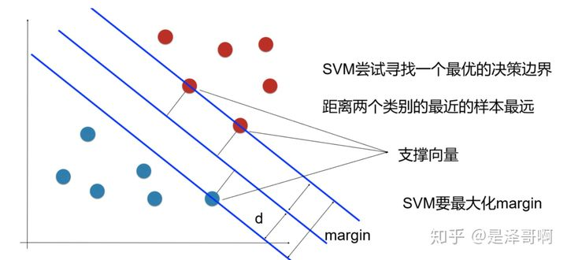
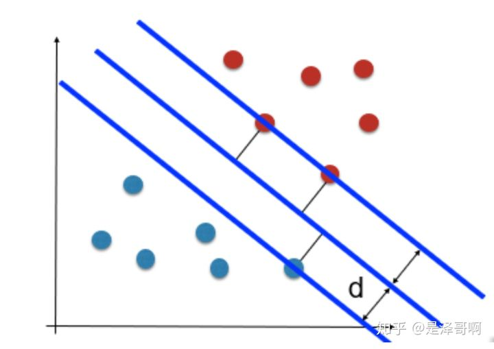
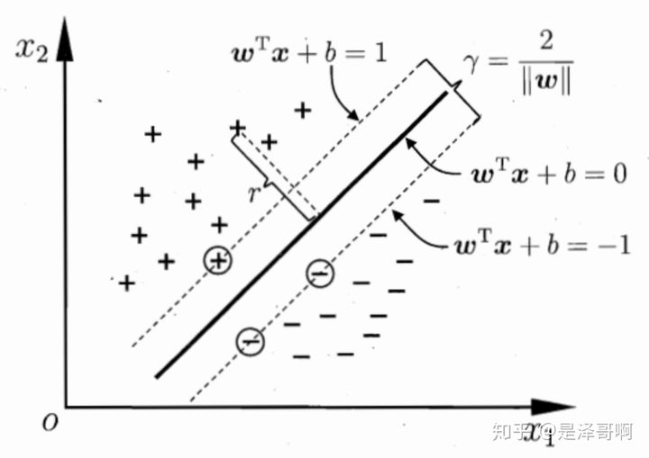
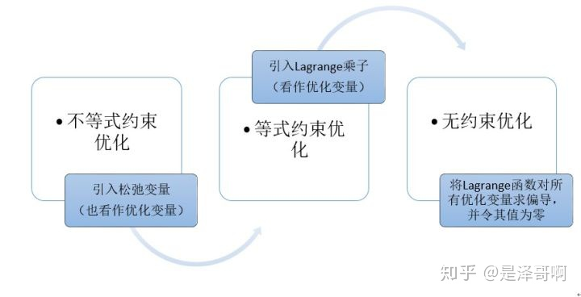

# 支持向量

## 线性可分

在二维空间上，两类点被一条直线完全分开叫做线性可分。

## 最大间隔超平面

从二维扩展到多维空间中时，将 ![[公式]](https://www.zhihu.com/equation?tex=D_0) 和 ![[公式]](https://www.zhihu.com/equation?tex=D_1) 完全正确地划分开的 ![[公式]](https://www.zhihu.com/equation?tex=wx%2Bb%3D0) 就成了一个超平面。

为了使这个超平面更具鲁棒性，我们会去找最佳超平面，以最大间隔把两类样本分开的超平面，也称之为最大间隔超平面。

- 两类样本分别分割在该超平面的两侧；
- 两侧距离超平面最近的样本点到超平面的距离被最大化了。

## 支持向量

样本中距离超平面最近的一些点，这些点叫做支持向量。

## SVM 最优化问题

SVM 想要的就是找到各类样本点到超平面的距离最远，也就是找到最大间隔超平面。任意超平面可以用下面这个线性方程来描述：

![[公式]](https://www.zhihu.com/equation?tex=w%5ETx%2Bb%3D0+%5C%5C)

二维空间点 ![[公式]](https://www.zhihu.com/equation?tex=%28x%2Cy%29) 到直线 ![[公式]](https://www.zhihu.com/equation?tex=Ax%2BBy%2BC%3D0) 的距离公式是：

![[公式]](https://www.zhihu.com/equation?tex=%5Cfrac%7B%7CAx%2BBy%2BC%7C%7D%7B%5Csqrt%7BA%5E2%2BB%5E2%7D%7D+%5C%5C)

扩展到 n 维空间后，点 ![[公式]](https://www.zhihu.com/equation?tex=x%3D%28x_1%2Cx_2%E2%80%A6x_n%29) 到直线 ![[公式]](https://www.zhihu.com/equation?tex=w%5ETx%2Bb%3D0) 的距离为：

![[公式]](https://www.zhihu.com/equation?tex=%5Cfrac%7B%7Cw%5ETx%2Bb%7C%7D%7B%7C%7Cw%7C%7C%7D+%5C%5C)

其中 ![[公式]](https://www.zhihu.com/equation?tex=%7C%7Cw%7C%7C%3D%5Csqrt%7Bw_1%5E2%2B%E2%80%A6w_n%5E2%7D) 。

如图所示，根据支持向量的定义我们知道，支持向量到超平面的距离为 d，其他点到超平面的距离大于 d。

于是我们有这样的一个公式：

![[公式]](https://www.zhihu.com/equation?tex=%5Cleft%5C%7B+%5Cbegin%7Baligned%7D+%5Cfrac%7Bw%5ETx%2Bb%7D%7B%7C%7Cw%7C%7C%7D+%26%5Cgeq+d+%5Cquad++y%3D1+%5C%5C+%5Cfrac%7Bw%5ETx%2Bb%7D%7B%7C%7Cw%7C%7C%7D+%26%5Cleq+-d++%5Cquad+y%3D-1++%5Cend%7Baligned%7D+%5Cright.+%5C%5C)

稍作转化可以得到：

![[公式]](https://www.zhihu.com/equation?tex=%5Cleft%5C%7B+%5Cbegin%7Baligned%7D+%5Cfrac%7Bw%5ETx%2Bb%7D%7B%7C%7Cw%7C%7Cd%7D+%26%5Cgeq+1+%5Cquad++y%3D1+%5C%5C+%5Cfrac%7Bw%5ETx%2Bb%7D%7B%7C%7Cw%7C%7Cd%7D+%26%5Cleq+-1++%5Cquad+y%3D-1++%5Cend%7Baligned%7D+%5Cright.+%5C%5C)

![[公式]](https://www.zhihu.com/equation?tex=%7C%7Cw%7C%7C+d) 是正数，我们暂且令它为 1（之所以令它等于 1，是为了方便推导和优化，且这样做对目标函数的优化没有影响），故：

![[公式]](https://www.zhihu.com/equation?tex=%5Cleft%5C%7B+%5Cbegin%7Baligned%7D+w%5ETx%2Bb+%26%5Cgeq+1+%5Cquad++y%3D1+%5C%5C+w%5ETx%2Bb+%26%5Cleq+-1++%5Cquad+y%3D-1++%5Cend%7Baligned%7D+%5Cright.+%5C%5C)

将两个方程合并，我们可以简写为：

![[公式]](https://www.zhihu.com/equation?tex=y%28w%5ETx%2Bb%29+%5Cgeq+1+%5C%5C)

至此我们就可以得到最大间隔超平面的上下两个超平面：

每个支持向量到超平面的距离可以写为：

![[公式]](https://www.zhihu.com/equation?tex=d%3D%5Cfrac%7B%7Cw%5ETx%2Bb%7C%7D%7B%7C%7Cw%7C%7C%7D+%5C%5C)

由上述 ![[公式]](https://www.zhihu.com/equation?tex=y%28w%5ETx%2Bb%29++%3E+1+%3E+0) 可以得到 ![[公式]](https://www.zhihu.com/equation?tex=y%28w%5ETx%2Bb%29++%3D+%7Cw%5ETx%2Bb%7C) ，所以我们得到：

![[公式]](https://www.zhihu.com/equation?tex=d+%3D++%5Cfrac%7By%28w%5ETx%2Bb%29%7D%7B%7C%7Cw%7C%7C%7D++%5C%5C+++)

最大化这个距离：

![[公式]](https://www.zhihu.com/equation?tex=%5Cmax+2%2A+%5Cfrac%7By%28w%5ETx%2Bb%29%7D%7B%7C%7Cw%7C%7C%7D++%5C%5C+++)

这里乘上 2 倍也是为了后面推导，对目标函数没有影响。刚刚我们得到支持向量 ![[公式]](https://www.zhihu.com/equation?tex=y%28w%5ETx%2Bb%29+%3D+1+) ，所以我们得到：

![[公式]](https://www.zhihu.com/equation?tex=%5Cmax+%5Cfrac%7B2%7D%7B%7C%7Cw%7C%7C%7D+%5C%5C)

再做一个转换：

![[公式]](https://www.zhihu.com/equation?tex=%5Cmin+%5Cfrac%7B1%7D%7B2%7D%7C%7Cw%7C%7C+%5C%5C)

为了方便计算（去除 ![[公式]](https://www.zhihu.com/equation?tex=%7C%7Cw%7C%7C) 的根号），我们有：

![[公式]](https://www.zhihu.com/equation?tex=%5Cmin+%5Cfrac%7B1%7D%7B2%7D%7C%7Cw%7C%7C%5E2%5C%5C)

所以得到的最优化问题是：

![[公式]](https://www.zhihu.com/equation?tex=%5Cmin+%5Cfrac%7B1%7D%7B2%7D+%7C%7Cw%7C%7C%5E2+%5C+s.t.+%5Cquad+y_i%EF%BC%88w%5ETx_i%2Bb%EF%BC%89%5Cgeq+1+%5C%5C)

## 2. 对偶问题

### 2.1 拉格朗日乘数法

2.1.1 等式约束优化问题

本科高等数学学的拉格朗日程数法是等式约束优化问题：

![[公式]](https://www.zhihu.com/equation?tex=%5Cmin+f%28x_%7B1%7D+%2Cx_%7B2%7D+%2C...%2Cx_%7Bn%7D+%29+%5C%5C+s.t.+%5Cquad+h_%7Bk%7D+%28x_%7B1%7D+%2Cx_%7B2%7D+%2C...%2Cx_%7Bn%7D+%29%3D0+%5Cquad+k+%3D1%2C2%2C...%2Cl%5C%5C)

我们令 ![[公式]](https://www.zhihu.com/equation?tex=L%28x%2C%5Clambda+%29+%3D+f%28x%29+%2B+%5Csum%5Climits_%7Bk+%3D+1%7D%5El+%5Clambda+_k+h_k+%28x%29) ，函数 ![[公式]](https://www.zhihu.com/equation?tex=L%28x%2Cy%29) 称为 Lagrange 函数，参数 ![[公式]](https://www.zhihu.com/equation?tex=%5Clambda) 称为 Lagrange 乘子**没有非负要求**。

利用必要条件找到可能的极值点：

![[公式]](https://www.zhihu.com/equation?tex=%5Cleft%5C%7B+%5Cbegin%7Baligned%7D++%5Cfrac%7B%5Cpartial+L%7D%7B%5Cpartial+x_i%7D+%3D+0+%5Cquad+i%3D1%2C2%2C...%2Cn+%5C%5C+%5Cfrac%7B%5Cpartial+L%7D%7B%5Cpartial+%5Clambda_k%7D+%3D+0+%5Cquad+k%3D1%2C2%2C...%2Cl++%5Cend%7Baligned%7D+%5Cright.+%5C%5C)

具体是否为极值点需根据问题本身的具体情况检验。这个方程组称为等式约束的极值必要条件。

等式约束下的 Lagrange 乘数法引入了 ![[公式]](https://www.zhihu.com/equation?tex=l) 个 Lagrange 乘子，我们将 ![[公式]](https://www.zhihu.com/equation?tex=x_%7Bi%7D) 与 ![[公式]](https://www.zhihu.com/equation?tex=%5Clambda_%7Bk%7D) 一视同仁，把 ![[公式]](https://www.zhihu.com/equation?tex=%5Clambda_%7Bk%7D+) 也看作优化变量，共有 ![[公式]](https://www.zhihu.com/equation?tex=%28n%2Bl%29) 个优化变量。

2.1.2 不等式约束优化问题

而我们现在面对的是不等式优化问题，针对这种情况其主要思想是将不等式约束条件转变为等式约束条件，引入松弛变量，将松弛变量也是为优化变量。

以我们的例子为例：

![[公式]](https://www.zhihu.com/equation?tex=min+f%28w%29+%3D+min%5Cfrac%7B1%7D%7B2%7D+%7C%7Cw%7C%7C%5E2+%5C%5C+s.t.+%5Cquad+g_i%28w%29+%3D+1+-+y_i%28w%5ETx_i%2Bb%29%5Cleq+0+%5C%5C)

我们引入松弛变量 ![[公式]](https://www.zhihu.com/equation?tex=a_i%5E2) 得到 ![[公式]](https://www.zhihu.com/equation?tex=h_i%28w%2Ca_i%29+%3D+g_i%28w%29+%2B+a_i%5E2+%3D+0) 。这里加平方主要为了不再引入新的约束条件，如果只引入 ![[公式]](https://www.zhihu.com/equation?tex=a_i) 那我们必须要保证 ![[公式]](https://www.zhihu.com/equation?tex=a_i+%5Cgeq+0) 才能保证 ![[公式]](https://www.zhihu.com/equation?tex=h_i%28w%2Ca_i%29+%3D+0) ，这不符合我们的意愿。

由此我们将不等式约束转化为了等式约束，并得到 Lagrange 函数：

![[公式]](https://www.zhihu.com/equation?tex=%5Cbegin%7Baligned%7D++L%28w%2C%5Clambda%2Ca%29+%26%3D+%7Bf%28w%29%7D+%2B+%5Csum%5Climits_%7Bi+%3D+1%7D%5En+%5Clambda_i+h_i+%28w%29+%5C%5C+%26%3D+%7Bf%28w%29%7D+%2B+%5Csum%5Climits_%7Bi+%3D+1%7D%5En+%5Clambda_i+%5Bg_i%28w%29+%2B+a_i%5E2%5D+%5Cquad+%5Clambda_i+%5Cgeq+0+%5Cend%7Baligned%7D++%5C%5C)

由等式约束优化问题极值的必要条件对其求解，联立方程：

![[公式]](https://www.zhihu.com/equation?tex=%5Cleft%5C%7B+%5Cbegin%7Baligned%7D++%5Cfrac%7B%5Cpartial+L%7D%7B%5Cpartial+w_i%7D+%26%3D+%5Cfrac%7B%5Cpartial+f%7D%7B%5Cpartial+w_i%7D+%2B+%5Csum%5Climits_%7Bi%3D1%7D%5E%7Bn%7D+%5Clambda_i+%5Cfrac%7B%5Cpartial+g_i%7D%7B%5Cpartial+w_i%7D%3D+0%2C+%5C%5C+%5Cfrac%7B%5Cpartial+L%7D%7B%5Cpartial+a_i%7D+%26%3D+2+%5Clambda_i+a_i+%3D+0%2C+%5C%5C+%5Cfrac%7B%5Cpartial+L%7D%7B%5Cpartial+%5Clambda_i%7D+%26%3D+g_i%28w%29+%2B+a_i%5E2+%3D+0%2C+%5C%5C+%5Clambda_i+%26%5Cgeq+0+%5Cend%7Baligned%7D+%5Cright.+%5C%5C)

（为什么取 ![[公式]](https://www.zhihu.com/equation?tex=%5Clambda_i+%5Cgeq+0) ，可以通过几何性质来解释，有兴趣的同学可以查下 KKT 的证明）。

针对 ![[公式]](https://www.zhihu.com/equation?tex=%5Clambda_i+a_i+%3D+0) 我们有两种情况：

**情形一**： ![[公式]](https://www.zhihu.com/equation?tex=+%5Clambda_i+%3D+0%2C+a_i+%5Cneq+0)

由于 ![[公式]](https://www.zhihu.com/equation?tex=%5Clambda_i%3D0) ，因此约束条件 ![[公式]](https://www.zhihu.com/equation?tex=g_i%28w%29) 不起作用，且 ![[公式]](https://www.zhihu.com/equation?tex=g_i%28w%29%3C0)

**情形二**： ![[公式]](https://www.zhihu.com/equation?tex=%5Clambda_i+%5Cneq+0%2C+a_i+%3D+0)

此时 ![[公式]](https://www.zhihu.com/equation?tex=g_i%28w%29%3D0) 且 ![[公式]](https://www.zhihu.com/equation?tex=%5Clambda_i%3E0) ，可以理解为约束条件 ![[公式]](https://www.zhihu.com/equation?tex=g_i%28w%29) 起作用了，且 ![[公式]](https://www.zhihu.com/equation?tex=g_i%28w%29%3D0)

综合可得： ![[公式]](https://www.zhihu.com/equation?tex=%5Clambda_ig_i%28w%29%3D0) ，且在约束条件起作用时 ![[公式]](https://www.zhihu.com/equation?tex=%5Clambda_i%3E0%2Cg_i%28w%29%3D0) ；约束不起作用时 ![[公式]](https://www.zhihu.com/equation?tex=%5Clambda_i+%3D+0%2Cg_i%28w%29+%3C+0)

由此方程组转换为：

![[公式]](https://www.zhihu.com/equation?tex=%5Cleft%5C%7B+%5Cbegin%7Baligned%7D++%5Cfrac%7B%5Cpartial+L%7D%7B%5Cpartial+w_i%7D+%26%3D+%5Cfrac%7B%5Cpartial+f%7D%7B%5Cpartial+w_i%7D+%2B+%5Csum%5Climits_%7Bj%3D1%7D%5E%7Bn%7D+%5Clambda_j+%5Cfrac%7B%5Cpartial+g_j%7D%7B%5Cpartial+w_i%7D%3D+0%2C+%5C%5C+%5Clambda_ig_i%28w%29+%26%3D+0%2C+%5C%5C+g_i%28w%29%26%5Cleq+0+%5C%5C+%5Clambda_i+%26%5Cgeq+0+%5Cend%7Baligned%7D+%5Cright.+%5C%5C)

以上便是不等式约束优化优化问题的 **KKT(Karush-Kuhn-Tucker) 条件**， ![[公式]](https://www.zhihu.com/equation?tex=%5Clambda_i) 称为 KKT 乘子。

这个式子告诉了我们什么事情呢？

直观来讲就是，支持向量 ![[公式]](https://www.zhihu.com/equation?tex=g_i%28w%29%3D0) ，所以 ![[公式]](https://www.zhihu.com/equation?tex=%5Clambda_i+%3E+0) 即可。而其他向量 ![[公式]](https://www.zhihu.com/equation?tex=g_i%28w%29%3C0%2C+%5Clambda_i%3D0) 。

我们原本问题时要求： ![[公式]](https://www.zhihu.com/equation?tex=min+%5Cfrac%7B1%7D%7B2%7D+%7C%7Cw%7C%7C%5E2) ，即求 ![[公式]](https://www.zhihu.com/equation?tex=minL%28w%2C%5Clambda%2Ca%29)

![[公式]](https://www.zhihu.com/equation?tex=%5Cbegin%7Baligned%7D++L%28w%2C%5Clambda%2Ca%29+%26%3D+%7Bf%28w%29%7D+%2B+%5Csum%5Climits_%7Bi+%3D+1%7D%5En+%5Clambda_i+%5Bg_i%28w%29+%2B+a_i%5E2%5D+%5Cquad+%5C%5C+%26%3D+%7Bf%28w%29%7D+%2B+%5Csum%5Climits_%7Bi+%3D+1%7D%5En+%5Clambda_i+g_i%28w%29+%2B+%5Csum%5Climits_%7Bi+%3D+1%7D%5En+%5Clambda_i+a_i%5E2+%5Cend%7Baligned%7D+%5C%5C)

由于 ![[公式]](https://www.zhihu.com/equation?tex=%5Csum%5Climits_%7Bi+%3D+1%7D%5En+%5Clambda_i+a_i%5E2+%5Cgeq+0) ，故我们将问题转换为： ![[公式]](https://www.zhihu.com/equation?tex=minL%28w%2C%5Clambda%29) ：

![[公式]](https://www.zhihu.com/equation?tex=L%28w%2C%5Clambda%29%3D%7Bf%28w%29%7D+%2B+%5Csum%5Climits_%7Bi+%3D+1%7D%5En+%5Clambda_i+g_i%28w%29++%5C%5C)

假设找到了最佳参数是的目标函数取得了最小值 p。即 ![[公式]](https://www.zhihu.com/equation?tex=%5Cfrac%7B1%7D%7B2%7D+%7C%7Cw%7C%7C%5E2+%3Dp) 。而根据 ![[公式]](https://www.zhihu.com/equation?tex=%5Clambda_%7Bi%7D+%5Cgeq+0) ，可知 ![[公式]](https://www.zhihu.com/equation?tex=%5Csum%5Climits_%7Bi+%3D+1%7D%5En+%5Clambda_i+g_i%28w%29+%5Cleq+0) ，因此 ![[公式]](https://www.zhihu.com/equation?tex=L%28w%2C%5Clambda%29++%5Cleq+p) ，为了找到最优的参数 ![[公式]](https://www.zhihu.com/equation?tex=%7B%5Clambda%7D) ，使得 ![[公式]](https://www.zhihu.com/equation?tex=L%28w%2C%5Clambda%29) 接近 p，故问题转换为出 ![[公式]](https://www.zhihu.com/equation?tex=%5Cmax%5Climits_%7B%5Clambda%7DL%28w%2C%5Clambda%29) 。

故我们的最优化问题转换为：

![[公式]](https://www.zhihu.com/equation?tex=%5Cmin%5Climits_w+%5Cmax%5Climits_%7B%5Clambda%7D+L%28w%2C%5Clambda%29+%5C%5C++s.t.+%5Cquad+%5Clambda_i+%5Cgeq+0+%5C%5C)

出了上面的理解方式，我们还可以有另一种理解方式： 由于 ![[公式]](https://www.zhihu.com/equation?tex=%5Clambda_i+%5Cgeq+0) ，

![[公式]](https://www.zhihu.com/equation?tex=%5Cmax%5Climits_%7B%5Clambda%7D+L%28w%2C+%5Clambda%29+%3D++%5Cleft%5C%7B+%5Cbegin%7Baligned%7D+%5Cinfty++%5Cquad+g_i%28w%29+%5Cgeq+0+%5C%5C+%5Cfrac%7B1%7D%7B2%7D+%7B%7C%7Cw%7C%7C%5E2%7D+%5Cquad+g_i%28w%29+%5Cleq+0+%5Cend%7Baligned%7D+%5Cright.+%5C%5C)

所以 ![[公式]](https://www.zhihu.com/equation?tex=%5Cmin%28%5Cinfty%2C++%5Cfrac%7B1%7D%7B2%7D+%7B%7C%7Cw%7C%7C%5E2%7D%29+%3D+%5Cfrac%7B1%7D%7B2%7D+%7B%7C%7Cw%7C%7C%5E2%7D) ，所以转化后的式子和原来的式子也是一样的。

### 2.2 强对偶性

对偶问题其实就是将：

![[公式]](https://www.zhihu.com/equation?tex=%5Cmin%5Climits_w+%5Cmax%5Climits_%7B%5Clambda%7D+L%28w%2C%5Clambda%29+%5C%5C++s.t.+%5Cquad+%5Clambda_i+%5Cgeq+0+%5C%5C)

变成了：

![[公式]](https://www.zhihu.com/equation?tex=%5Cmax%5Climits_%7B%5Clambda%7D+%5Cmin%5Climits_w+L%28w%2C%5Clambda%29+%5C%5C++s.t.+%5Cquad+%5Clambda_i+%5Cgeq+0+%5C%5C)

假设有个函数 ![[公式]](https://www.zhihu.com/equation?tex=f) 我们有：

![[公式]](https://www.zhihu.com/equation?tex=%5Cmin%5Cmax+f+%5Cgeq+%5Cmax%5Cmin+f++%5C%5C)

也就是说，最大的里面挑出来的最小的也要比最小的里面挑出来的最大的要大。这关系实际上就是弱对偶关系，而强对偶关系是当等号成立时，即：

![[公式]](https://www.zhihu.com/equation?tex=%5Cmin%5Cmax+f+%3D+%5Cmax%5Cmin+f++%5C%5C)

如果 ![[公式]](https://www.zhihu.com/equation?tex=f+) 是凸优化问题，强对偶性成立。而我们之前求的 KKT 条件是强对偶性的**充要条件**。

## 3. SVM 优化

我们已知 SVM 优化的主问题是：

![[公式]](https://www.zhihu.com/equation?tex=%5Cmin%5Climits_%7Bw%7D+%5Cfrac%7B1%7D%7B2%7D+%7C%7Cw%7C%7C%5E2+%5C%5C+s.t.%5Cquad+g_i%28w%2Cb%29+%3D+1+-+y_i%EF%BC%88w%5ETx_i%2Bb%EF%BC%89%5Cleq+0%2C+%5Cquad+i%3D1%2C2%2C...%2Cn+%5C%5C)

那么求解线性可分的 SVM 的步骤为：

**步骤 1**：

构造拉格朗日函数：

![[公式]](https://www.zhihu.com/equation?tex=%5Cmin%5Climits_%7Bw%2Cb%7D%5Cmax%5Climits_%7B%5Clambda%7D+L%28w%2Cb%2C%5Clambda%29%3D+%5Cfrac%7B1%7D%7B2%7D%7B%7C%7Cw%7C%7C%7D%5E2+%2B+%5Csum%5Climits_%7Bi+%3D+1%7D%5En+%5Clambda_i+%5B1-y_i%28w%5ETx_i%2Bb%29%5D+%5C%5C+s.t.+%5Cquad+%5Clambda_i+%5Cgeq+0+%5C%5C)

**步骤 2**：

利用强对偶性转化：

![[公式]](https://www.zhihu.com/equation?tex=%5Cmax%5Climits_%7B%5Clambda%7D%5Cmin%5Climits_%7Bw%2Cb%7D+L%28w%2Cb%2C%5Clambda%29+%5C%5C)

现对参数 w 和 b 求偏导数：

![[公式]](https://www.zhihu.com/equation?tex=%5Cbegin%7Baligned%7D+%5Cfrac%7B%5Cpartial+L%7D%7B%5Cpartial+w%7D+%26%3D+w+-+%5Csum_%7Bi%3D1%7D%5E%7Bn%7D%5Clambda_ix_iy_i+%3D+0+%5C%5C+%5Cfrac%7B%5Cpartial+L%7D%7B%5Cpartial+b%7D+%26%3D+%5Csum_%7Bi%3D1%7D%5E%7Bn%7D%5Clambda_iy_i+%3D+0+%5C%5C+%5Cend%7Baligned%7D+%5C%5C)

得到：

![[公式]](https://www.zhihu.com/equation?tex=%5Cbegin%7Baligned%7D+%5Csum_%7Bi%3D1%7D%5E%7Bn%7D%5Clambda_ix_iy_i+%26%3D+w%5C%5C+%5Csum_%7Bi%3D1%7D%5E%7Bn%7D%5Clambda_iy_i+%26%3D+0+%5C%5C+%5Cend%7Baligned%7D+%5C%5C)

我们将这个结果带回到函数中可得：

![[公式]](https://www.zhihu.com/equation?tex=%5Cbegin%7Baligned%7D+L%28w%2Cb%2C%5Clambda%29+%26%3D+%5Cfrac%7B1%7D%7B2%7D%5Csum_%7Bi%3D1%7D%5E%7Bn%7D%5Csum_%7Bj%3D1%7D%5E%7Bn%7D%5Clambda_i+%5Clambda_j+y_i+y_j+%28x_i+%5Ccdot+x_j%29+%2B+%5Csum_%7Bi+%3D+1%7D%5En+%5Clambda_i+-+%5Csum_%7Bi+%3D+1%7D%5En+%5Clambda_i+y_i%28%5Csum_%7Bj+%3D+1%7D%5En+%5Clambda_j+y_j+%28x_i+%5Ccdot++x_j%29+%2B+b%29+%5C%5C+%26%3D+%5Cfrac%7B1%7D%7B2%7D%5Csum_%7Bi%3D1%7D%5E%7Bn%7D%5Csum_%7Bj%3D1%7D%5E%7Bn%7D%5Clambda_i+%5Clambda_j+y_i+y_j+%28x_i+%5Ccdot+x_j%29+%2B+%5Csum_%7Bi+%3D+1%7D%5En+%5Clambda_i+-+%5Csum_%7Bi%3D1%7D%5E%7Bn%7D%5Csum_%7Bj%3D1%7D%5E%7Bn%7D%5Clambda_i+%5Clambda_j+y_i+y_j+%28x_i+%5Ccdot+x_j%29-%5Csum_%7Bi+%3D+1%7D%5En+%5Clambda_i+y_i+b+%5C%5C+%26%3D+%5Csum_%7Bj%3D1%7D%5E%7Bn%7D%5Clambda_i-%5Cfrac%7B1%7D%7B2%7D%5Csum_%7Bi%3D1%7D%5E%7Bn%7D%5Csum_%7Bj%3D1%7D%5E%7Bn%7D%5Clambda_i+%5Clambda_j+y_i+y_j+%28x_i+%5Ccdot+x_j%29+%5Cend%7Baligned%7D+%5C%5C)

也就是说：

![[公式]](https://www.zhihu.com/equation?tex=%5Cmin%5Climits_%7Bw%2Cb%7DL%28w%2Cb%2C%5Clambda%29+%3D+%5Csum_%7Bj%3D1%7D%5E%7Bn%7D%5Clambda_i-%5Cfrac%7B1%7D%7B2%7D%5Csum_%7Bi%3D1%7D%5E%7Bn%7D%5Csum_%7Bj%3D1%7D%5E%7Bn%7D%5Clambda_i+%5Clambda_j+y_i+y_j+%28x_i+%5Ccdot+x_j%29+%5C%5C)

**步骤 3**：

由步骤 2 得：

![[公式]](https://www.zhihu.com/equation?tex=%5Cmax%5Climits_%7B%5Clambda%7D+%5B%5Csum_%7Bj%3D1%7D%5E%7Bn%7D%5Clambda_i-%5Cfrac%7B1%7D%7B2%7D%5Csum_%7Bi%3D1%7D%5E%7Bn%7D%5Csum_%7Bj%3D1%7D%5E%7Bn%7D%5Clambda_i+%5Clambda_j+y_i+y_j+%28x_i+%5Ccdot+x_j%29%5D+%5C%5C+s.t.++%5Cquad+%5Csum_%7Bi%3D1%7D%5E%7Bn%7D%5Clambda_iy_i+%3D+0+%5Cquad+%5Clambda_i+%5Cgeq+0+%5C%5C)

我们可以看出来这是一个二次规划问题，问题规模正比于训练样本数，我们常用 SMO(Sequential Minimal Optimization) 算法求解。

SMO(Sequential Minimal Optimization)，序列最小优化算法，其核心思想非常简单：每次只优化一个参数，其他参数先固定住，仅求当前这个优化参数的极值。我们来看一下 SMO 算法在 SVM 中的应用。

我们刚说了 SMO 算法每次只优化一个参数，但我们的优化目标有约束条件： ![[公式]](https://www.zhihu.com/equation?tex=%5Csum%5Climits_%7Bi%3D1%7D%5E%7Bn%7D%5Clambda_iy_i+%3D+0) ，没法一次只变动一个参数。所以我们选择了一次选择两个参数。具体步骤为：

1. 选择两个需要更新的参数 ![[公式]](https://www.zhihu.com/equation?tex=%5Clambda_i) 和 ![[公式]](https://www.zhihu.com/equation?tex=%5Clambda_j) ，固定其他参数。于是我们有以下约束：

这样约束就变成了：

![[公式]](https://www.zhihu.com/equation?tex=%5Clambda_i+y_i%2B%5Clambda_j+y_j+%3D+c+%5Cquad+%5Clambda_i+%5Cgeq+0%2C%5Clambda_j+%5Cgeq+0+%5C%5C)

其中 ![[公式]](https://www.zhihu.com/equation?tex=c%3D-%5Csum%5Climits_%7Bk+%5Cne+i%2Cj%7D%5Clambda_ky_k) ，由此可以得出 ![[公式]](https://www.zhihu.com/equation?tex=%5Clambda_j%3D%5Cfrac%7Bc-%5Clambda_iy_i%7D%7By_j%7D) ，也就是说我们可以用 ![[公式]](https://www.zhihu.com/equation?tex=%5Clambda_i) 的表达式代替 ![[公式]](https://www.zhihu.com/equation?tex=%5Clambda_%7Bj%7D) 。这样就相当于把目标问题转化成了仅有一个约束条件的最优化问题，仅有的约束是 ![[公式]](https://www.zhihu.com/equation?tex=%5Clambda_i+%5Cgeq+0) 。

\2. 对于仅有一个约束条件的最优化问题，我们完全可以在 ![[公式]](https://www.zhihu.com/equation?tex=%5Clambda_%7Bi%7D) 上对优化目标求偏导，令导数为零，从而求出变量值 ![[公式]](https://www.zhihu.com/equation?tex=%5Clambda_%7Bi_%7Bnew%7D%7D) ，然后根据 ![[公式]](https://www.zhihu.com/equation?tex=%5Clambda_%7Bi_%7Bnew%7D%7D) 求出 ![[公式]](https://www.zhihu.com/equation?tex=%5Clambda_%7Bj_%7Bnew%7D%7D) 。

\3. 多次迭代直至收敛。

通过 SMO 求得最优解 ![[公式]](https://www.zhihu.com/equation?tex=%5Clambda%5E%2A) 。

**步骤 4** ：

我们求偏导数时得到：

![[公式]](https://www.zhihu.com/equation?tex=w+%3D+%5Csum_%7Bi%3D1%7D%5Em+%5Clambda_i+y_i+x_i++%5C%5C)

由上式可求得 w。

我们知道所有 ![[公式]](https://www.zhihu.com/equation?tex=%5Clambda_i+%3E+0) 对应的点都是支持向量，我们可以随便找个支持向量，然后带入： ![[公式]](https://www.zhihu.com/equation?tex=y_s%28wx_s%2Bb%29+%3D+1) ，求出 b 即可，

两边同乘 ![[公式]](https://www.zhihu.com/equation?tex=y_s)，得 ![[公式]](https://www.zhihu.com/equation?tex=y_s%5E2%28wx_s%2Bb%29+%3D+y_s)

因为 ![[公式]](https://www.zhihu.com/equation?tex=y_s%5E2%3D1) ，所以： ![[公式]](https://www.zhihu.com/equation?tex=b%3Dy_s+-+wx_s)

为了更具鲁棒性，我们可以求得支持向量的均值：

![[公式]](https://www.zhihu.com/equation?tex=b+%3D+%5Cfrac%7B1%7D%7B%7CS%7C%7D%5Csum_%7Bs+%5Cin+S%7D+%28y_s+-wx_s%29+%5C%5C)

**步骤 5**：w和b都求出来了，我们就能构造出最大分割超平面： ![[公式]](https://www.zhihu.com/equation?tex=w%5ETx%2Bb%3D0)

分类决策函数： ![[公式]](https://www.zhihu.com/equation?tex=f%28x%29%3Dsign%28w%5ETx%2Bb%29)

其中 ![[公式]](https://www.zhihu.com/equation?tex=sign%28+%5Ccdot+%29) 为阶跃函数：

![[公式]](https://www.zhihu.com/equation?tex=sign%28x%29+%3D+%5Cleft%5C%7B+%5Cbegin%7Baligned%7D++-1+%5Cquad+x%3C0+%5C%5C+0+%5Cquad+x%3D0+%5C%5C+1+%5Cquad+x%3E0+%5Cend%7Baligned%7D+%5Cright.+%5C%5C)

将新样本点导入到决策函数中既可得到样本的分类。