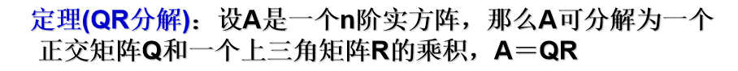

# 特征值特征向量

# 正交矩阵

$$
\boldsymbol{R^{-1}}=\boldsymbol{R^{T}}
$$

# 投影矩阵

向量 $\boldsymbol{a}$

$$
\boldsymbol{a}=\begin{bmatrix}
a_1 \\
a_2 \\
\vdots \\
a_n
\end{bmatrix}
$$

这就是向量长度的平方

通常对它进行一下处理（归一化）：

$\boldsymbol{P}$称为$\boldsymbol{a}$的投影矩阵

对任意一个向量$\boldsymbol{b}$，它投影到$\boldsymbol{a}$上的向量一定是：

# QR分解

[QR分解 - 知乎 (zhihu.com)](https://zhuanlan.zhihu.com/p/112327923)

 

## 1.Householder变换

