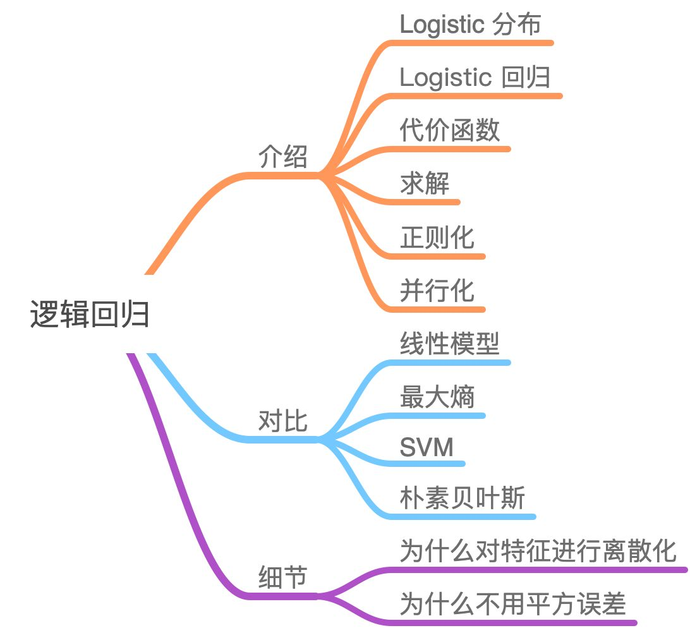
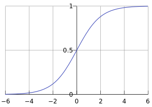
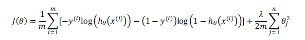

# Logistic Regression

虽然被称为回归，但其实际上是分类模型，常用于二分类。

Logistic 回归的本质是：假设数据服从这个分布，然后使用极大似然估计做参数的估计。

## 假设函数

Sigmoid函数，也称为逻辑函数（Logistic function）：

![[公式]](https://www.zhihu.com/equation?tex=g%28z%29%3D+%5Cfrac%7B1%7D%7B1%2Be%5E%7B-z%7D%7D)

逻辑回归的假设函数形式如下：

![[公式]](https://www.zhihu.com/equation?tex=h_%5Ctheta%28x%29+%3D+g%28%5Ctheta%5ET+x%29%2C+g%28z%29%3D+%5Cfrac%7B1%7D%7B1%2Be%5E%7B-z%7D%7D)

所以：

![[公式]](https://www.zhihu.com/equation?tex=h_%5Ctheta%28x%29%3D+%5Cfrac%7B1%7D%7B1%2Be%5E%7B-%5Ctheta%5ETx%7D%7D)

其中 ![[公式]](https://www.zhihu.com/equation?tex=x) 是我们的输入， ![[公式]](https://www.zhihu.com/equation?tex=%5Ctheta) 为我们要求取的参数。

## 决策边界

在逻辑回归中，我们预测：

当ℎ𝜃(𝑥) >= 0.5时，预测 𝑦 = 1。 

当ℎ𝜃(𝑥) < 0.5时，预测 𝑦 = 0 。

根据上面绘制出的 **S** 形函数图像，我们知道当

𝑧 = 0 时 𝑔(𝑧) = 0.5 

𝑧 > 0 时 𝑔(𝑧) > 0.5 

𝑧 < 0 时 𝑔(𝑧) < 0.5 

又 𝑧 = 𝜃𝑇𝑥 ，即：

𝜃𝑇𝑥 >= 0 时，预测 𝑦 = 1 

𝜃𝑇𝑥 < 0 时，预测 𝑦 = 0

（待修改

*用极大释然估计来估计$\theta$*

*极大似然估计*

*极大似然估计，通俗理解来说，就是利用已知的样本结果信息，反推最具有可能（最大概率）导致这些样本结果出现的模型参数值。*）

## 代价函数

逻辑回归中的代价函数 ![[公式]](https://www.zhihu.com/equation?tex=J%28%5Ctheta%29) :

![[公式]](https://www.zhihu.com/equation?tex=J%28%5Ctheta%29+%3D+-%5Cfrac%7B+1+%7D%7B+m+%7D%5B%5Csum_%7B+i%3D1+%7D%5E%7B+m+%7D+%28%7By%5E%7B%28i%29%7D+%5Clog+h_%5Ctheta%28x%5E%7B%28i%29%7D%29+%2B+%281-y%5E%7B%28i%29%7D%29+%5Clog+%281-h_%5Ctheta%28x%5E%7B%28i%29%7D%29%7D%29%5D)

代价函数𝐽(𝜃)是一个凸函数，并且没有局部最优值。

**梯度下降算法**

**Repeat** { 
$$
\theta _j=\theta _j-\frac{\partial J(\theta )}{\partial \theta _j}
$$
(**simultaneously update all** 𝜃𝑗 ) 

}

## 多类别分类

多个二分类，取最高概率的类别作为结果

## 正则化

### 定义：

是机器学习中对原始损失函数引入额外信息，以便防止过拟合和提高模型泛化性能的一类方法的统称。也就是目标函数变成了**原始损失函数+额外项**，常用的额外项一般有两种，中文称作**L1正则化**和**L2正则化**，或者L1范数和L2范数（实际是L2范数的平方）。

- L1正则化和L2正则化可以看做是**损失函数的惩罚项**。所谓**惩罚**是指对损失函数中的**某些参数做一些限制**。对于线性回归模型，**使用L1正则化的模型叫做Lasso回归，使用L2正则化的模型叫做Ridge回归（岭回归）**。
- 线性回归L1正则化损失函数：

$$
\min [\sum\limits_{i = 1}^N {{{({w^T}{x_i} - {y_i})}^2} + \lambda {{\left\| w \right\|}_1}} ]
$$

- 线性回归L2正则化损失函数：
  $$
  \min [\sum\limits_{i = 1}^N {{{({w^T}{x_i} - {y_i})}^2} + \lambda {{\left\| w \right\|}_2}^2} ]
  $$

- L1正则化是指权值向量 $w$ 中各个元素的绝对值之和，通常表示为${{{\left\| w \right\|}_1}}$。
- L2正则化是指权值向量 $w$ 中各个元素的平方和然后再求平方根（可以看到Ridge回归的L2正则化项有平方符号），通常表示为${{{\left\| w \right\|}_2^2}}$。

### 正则化的作用

L1正则化可以使得参数稀疏化，即得到的参数是一个**稀疏矩阵**，可以用于特征选择。

#### 稀疏矩阵

- **稀疏性**，说白了就是模型的很多参数是0。通常机器学习中特征数量很多，例如文本处理时，如果将一个词组（term）作为一个特征，那么特征数量会达到上万个（bigram）。在预测或分类时，那么多特征显然难以选择，但是如果代入这些特征得到的模型是一个稀疏模型，很多参数是0，表示只有少数特征对这个模型有贡献，绝大部分特征是没有贡献的，即使去掉对模型也没有什么影响，此时我们就可以只关注系数是非零值的特征。这相当于对模型进行了一次特征选择，只留下一些比较重要的特征，提高模型的泛化能力，降低过拟合的可能。

L2正则化可以防止模型过拟合（overfitting）；一定程度上，L1也可以防止过拟合。

### L1正则化与稀疏性

- 事实上，**”带正则项”和“带约束条件”是等价的**。
- 设L1正则化损失函数：$J = {J_0} + \lambda \sum {\left| w \right|} $，其中$J_0=\sum\limits_{i = 1}^N {{{({w^T}{x_i} - {y_i})}^2} } $是**原始损失函数**，加号后面的一项是L1正则化项，$\lambda$是**正则化系数**。
- 注意到L1正则化是权值的绝对值之和，JJ是带有绝对值符号的函数，因此JJ是不完全可微的。机器学习的任务就是要通过一些方法（比如梯度下降）求出损失函数的最小值。当我们在原始损失函数$J_0$后添加L1正则化项时，相当于对$J_0$做了一个约束。令$L={\lambda \sum {{\left| w \right|}}}$，则$J=J_0+L$，此时我们的任务变成在$L$约束下求出$J_0$取最小值的解。
- 考虑二维的情况，即只有两个权值$w_1$和$w_2$，此时$L=|w_1|+|w_2|$,对于梯度下降法，求解J0J0的过程可以画出等值线，同时L1正则化的函数L也可以在$w_1$、$w_2$的二维平面上画出来。如下图：
- 
- 上图中等值线是$J_0$的等值线，黑色方形是$L$函数的图形。在图中，当$J_0$等值线与$L$图形首次相交的地方就是最优解。上图中$J_0$与$L$在$L$的一个顶点处相交，这个顶点就是最优解。注意到这个顶点的值是(w1,w2)=(0,w2)(w1,w2)=(0,w2)。可以直观想象，因为$L$函数有很多**突出的角**（二维情况下四个，多维情况下更多），$J_0$与这些角接触的机率会远大于与$L$其它部位接触的机率，而在这些角上，会有很多权值等于00，这就是为什么L1正则化可以产生稀疏模型，进而可以用于特征选择。
- 同理，又L2正则化损失函数：$J = {J_0} + \lambda \sum { w ^2} $,同样可画出其在二维平面的图像，如下：
- 
- 二维平面下L2正则化的函数图形是个圆，与方形相比，被磨去了棱角。因此$J_0$与$L$相交时使得$w_1$或$w_2$等于零的机率小了许多，这就是为什么L2正则化不具有稀疏性的原因。

### L2正则化为什么可以防止过拟合

以线性回归中的梯度下降法为例。假设要求的参数为$\theta$，$h_θ(x)$是我们的假设函数，那么线性回归的代价函数如下：
$$
{J_\theta } = \frac{1}{{2n}}\sum\limits_{i = 1}^n {{{({h_\theta }({x_i}) - {y_i})}^2}}
$$
在梯度下降中$\theta$的迭代公式为：
$$
{\theta _j} = {\theta _j} - \alpha \frac{1}{n}\sum\limits_{i = 1}^n {({h_\theta }({x_i}) - {y_i}){x_j}}
$$
其中$\alpha$是learning rate。 上式是没有添加L2正则化项的迭代公式，如果在原始代价函数之后添加L2正则化，则迭代公式为：
$$
{\theta _j} = {\theta _j}(1 - \alpha \frac{\lambda }{n}) - \alpha \frac{1}{n}\sum\limits_{i = 1}^n {({h_\theta }({x_i}) - {y_i}){x_j}}
$$

### 正则化项的参数选择

- **L1、L2的参数$\lambda$如何选择好**?
- 以L2正则化参数为例：从公式(8)可以看到，λ越大，$\theta_j$衰减得越快。另一个理解可以参考L2求解图， **λλ越大，L2圆的半径越小，最后求得代价函数最值时各参数也会变得很小**；当然也不是越大越好，太大容易引起欠拟合。
- **经验**
  从0开始，逐渐增大$\lambda$。在训练集上学习到参数，然后在测试集上验证误差。反复进行这个过程，直到测试集上的误差最小。一般的说，随着$\lambda$从0开始增大，测试集的误分类率应该是先减小后增大，交叉验证的目的，就是为了找到误分类率最小的那个位置。建议一开始将正则项系数λ设置为0，先确定一个比较好的learning rate。然后固定该learning rate，给$\lambda$一个值（比如1.0），然后根据validation accuracy，将λ增大或者减小10倍，增减10倍是粗调节，当你确定了λλ的合适的数量级后，比如$\lambda$=0.01，再进一步地细调节，比如调节为0.02，0.03，0.009之类。
